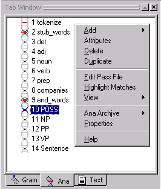
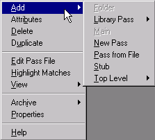
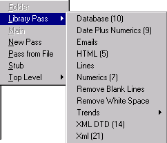
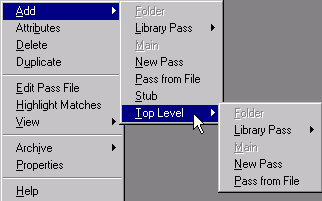
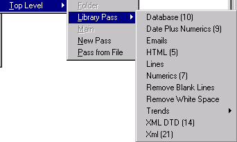
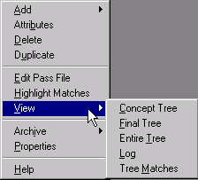
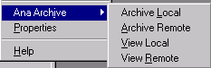
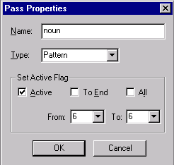

# Ana Tab Popup

The Ana Tab Popup menu is launched by right clicking in the Ana Tab Window.

| **Menu Item** | **Description** |
| --- | --- |
| **Add** | Submenu for adding a pass to the analyzer sequence*. *(See below.) |
| **Attributes** | Launches the Attribute Editor dialog and displays the attributes belonging to the selected pass' concept in the KB. (Note that the entire analyzer sequence is in the KB.) User has option to delete, add or change names of attributes and values. It is recommended not to alter system attributes such as algo, data, active and type. |
| **Delete** | Deletes the selected pass from the analyzer sequence. |
| **Duplicate** | Creates a new pass immediately following and identical to a selected pass in the analyzer sequence. |
| **Edit Pass File** | Opens the pass file of the selected pass in the Workspace. (This is the same as double clicking on a pass in the analyzer sequence.) You should not try to edit automatically generated rules in a pass file. The edits will not be saved when you regenerate the rules. |
| **Highlight Matches** | Highlights words or phrases in a text file matching selected pass in the Ana Tab or selected concept in the Gram Tab. Must be selected before an analyzer is run over text. |
| **View** | Submenu for viewing parse trees and other windows relating to the current pass. (See below.) |
| **Ana ****Archive** | Submenu for archiving the analyzer sequence and pass files. (See below.) |
| **Properties** | Launches the Pass Properties dialog for non-system passes. (See below.) |
| **Help** | Launches the VisualText Help documentation. |

## Add Submenu

| **Menu Item** | **Description** |
| --- | --- |
| **Folder** | Creates a folder for organizing passes. (Currently unavailable.) |
| **Library Pass** | Submenu for selecting a pass file from an existing library of passes. (See below.) |
| **Main** | Creates a pass that will be executed first. (Currently unavailable.) |
| **New Pass** | Creates a new pass and empty pass file. |
| **Pass from File** | Launches an Open dialog to navigate to and select existing pass file. Creates a new pass in the analyzer sequence associating the existing pass file with it. |
| **Stub** | Creates a stub region, simultaneously adding a stub concept in the Gram Tab. |
| **Top Level** | Submenu for adding passes. (See below.) |

## Add Library Pass Submenu

The Library Pass Submenu allows users to add a new pass and to associate it with a pre-built pass file (or "library pass"). The contents of this submenu adjust dynamically, depending on pass files that have been placed in the release folder **TextAI\VisualText\data\spec**. Users may add their own favorite or generic pass files to this folder.  The number next to the library pass indicates the number of passes in the library pass sequence.  For more information on the default library passes provided with VisualText, see [Library Passes](VisualText_Basics/Library_Passes.md).

## Add Top Level Submenu

The available menu items in **Add > Top Level** function identically with those of the **Add **submenu. This menu provides "hooks" for embedding sequences of passes within folders.

## Add Top Level Library Pass Submenu

This is identical with the **Add > Library Pass** submenu. It provides a hook for placing a library pass within a folder. This will be in an upcoming release of VisualText™.  The library passes in this submenu are discussed in [Library Passes](VisualText_Basics/Library_Passes.md).

## View Submenu

| **Menu Item** | **Description** |
| --- | --- |
| **Concept Tree** | Displays the concept tree of a parsed document in the Workspace. (Same as the View Concept Tree button.) |
| **Final Tree** | Displays the parse tree after the final pass of an analyzer sequence. |
| **Entire Tree** | Displays the full parse tree, starting at the root, assuming that the current selection in the Text Tab has been analyzed. |
| **Log** | Displays the text version of Entire Tree, the parse tree for the currently selected pass. |
| **Tree Matches** | Displays portion of the parse tree matching selected pass in the analyzer sequence. |

## Ana Archive Submenu

**Ana Archive** is used to view and create archives of the analyzer sequence either on remote servers or on local machines.  Archiving is used to create quick backups of your work and to facilitate communication between developers working on the same analyzers.  To set archiving preferences, select **Preferences** under the File Menu and click on the **Archiving** tab.

| **Menu Item** | **Description** |
| --- | --- |
| **Archive Local** | Launches a dialog box to create a local archive of the pass files in a zip file. The name of the archive defaults to the name of the current analyzer, suffixed with the current date and time. |
| Archive Remote | Launches a dialog box to create a remote archive of the current analyzer sequence in the Ana Tab. The name of the archive defaults to the name of the current analyzer suffixed with the current date and time. Archive is created on the remote server. |
| **View Local** | Displays local archives in the Ana Archive > View Local dialog. Presents options to delete, rename, upload (send to server) or load into current analyzer Workspace. Listings in the archive can be sorted by clicking on column headers. |
| **View Remote** | Displays server archives in the Ana Archive > View Remote dialog. Presents options to delete, rename, download (send to local archive) or load into current analyzer Workspace. Listings in archive can be sorted by clicking on column headers. |

## Pass Properties Dialog

| **Item** | **Description** |
| --- | --- |
| **Name** | Name of the pass file associated with the pass in the analyzer sequence. |
| **Type** | Type of algorithm for the pass. Type can be either Pattern (for PAT algorithm) or Recursive (for REC algorithm) |
| **Active** | By default, a pass is active indicating that it will not be skipped in the analyzer sequence. Unselecting Active will cause the pass to be skipped during analysis. |
| **To End** | Makes passes after the current pass either active or inactive. |
| **All** | Makes all passes either active or inactive. |
| **From X to X** | Specifies a range of passes to make active or inactive. |
| **OK** | Confirms changes to the Pass Properties dialog. |
| **Cancel** | Closes the Pass Properties dialog. |
