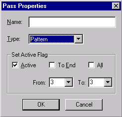

[← Help Contents](../index.md) | [📘 NLP++ Textbook](../NLP++_Textbook.md)

# Pass Properties Dialog

The Pass Properties Dialog is used to specify what kind of pass you would like to create in the analyzer sequence.  This dialog is also used to provide a name for the pass and to control whether the pass is active or skipped over during the analysis process.

The Pass Properties dialog is launched automatically when you add a new pass to the analyzer sequence.  You can also access the Pass Properties dialog by selecting an existing pass in the Ana Tab, right-clicking and selecting **Properties**.

| **Item** | **Description** |
| --- | --- |
| **Name** | Name of the pass file associated with the pass in the analyzer sequence. |
| **Type** | Type of algorithm for the pass. Type can either be Pattern (for PAT algorithm) or Recursive (for REC algorithm) |
| **Active** | By default, a pass is active indicating that it will not be skipped in the analyzer sequence. Unselecting Active will cause the pass to be skipped during analysis. See Inactivating Passes. |
| **To End** | Makes passes after the current pass either active or inactive. |
| **All** | Makes all passes either active or inactive. |
| **From X to X** | Specifies a range of passes to make active or inactive. |
| **OK** | Confirms changes to the Pass Properties dialog. |
| **Cancel** | Closes the Pass Properties dialog. |
