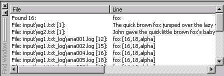

# Find Window

The **Find Window** displays search results when a search is performed over multiple files. Clicking on a line in the Find Window displays the file where the search target was found in the Workspace.

Searches can be initiated by selecting** Find in Files **from the **Edit Menu** or by clicking on the **Find in Files** button  on the **Main Toolbar**.

Either action launches the **[Find in Files](VisualText_Interface/Windows/Find_in_Files_Dialog.md)** dialog box which contains a number of search control parameters.
