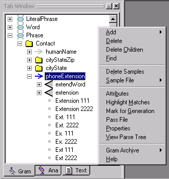
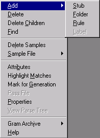
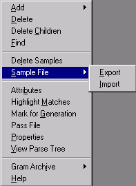
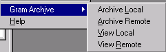

[← Help Contents](index.md) | [📘 NLP++ Textbook](NLP++_Textbook.md)

# Gram Tab Popup

The Gram Tab Popup menu is launched by right clicking in the Gram Tab Window.

The Gram Tab is used to construct a concept (or sample) hierarchy and to sample data from input files to the concept hierarchy.

| **Menu Item** | **Description** |
| --- | --- |
| Add | Submenu for adding concepts to the sample hierarchy. (See below.) |
| **Delete** | Deletes selected concept from the sample hierarchy. |
| **Delete Children** | Deletes the children of a selected concept but keeps the concept itself. |
| **Find** | Finds selected concept across multiple files. Results are displayed in the Find Window. |
| **Delete Samples** | Deletes the sample concepts associated with a rule concept or label concept. |
| Sample File | Submenu for importing and exporting sample files. (See below.) |
| **Attributes** | Launches the Attribute Editor dialog and displays the attributes belonging to the selected item. User has option to delete, add or change names of attributes and values. |
| **Highlight Matches** | Highlights words or phrases in a text file matching selected concept in the sample hierarchy. |
| **Mark for Generation** | Manually sets an attribute called Dirty on a concept so that Generate Dirty will apply to that concept and its descendants. |
| **Pass File** | Displays content of the pass file associated with selected concept. Same effect as double clicking the concept. |
| **Properties** | Displays Gram Concept Properties dialog showing rule generation properties for selected concept in the sample hierarchy. When an attribute is set for a particular concept, the attribute is inherited by all the descendants of the concept given the attribute. For example, when the Dirty attribute is set for a folder concept, all concepts under the folder concept inherit the Dirty attribute. |
| **View Parse Tree** | Displays the parse tree of the currently selected text in the Workspace. Same effect as selecting **Display Entire Tree** from the Parse Tree Menu and View Parse Tree button from the Debug Tool. |
| Gram Archive | Submenu for archiving the sample hierarchy. (See below.) |
| **Help** | Launches VisualText Help documentation. |

## Add Submenu

| **Menu Item** | **Description** |
| --- | --- |
| **Stub** | Adds a stub at the top (i.e., leftmost) level of the sample hierarchy. A stub concept is associated with a region of automatically generated passes in the analyzer sequence. |
| **Folder** | Adds a folder concept to the current stub concept or folder concept. Folders are used to help organize the sample hierarchy. |
| **Rule** | Adds a rule concept to the current folder concept or stub concept. |
| **Label** | Adds a label concept to current rule concept. Labels are used to organize subsamples of a given sample. |

## Sample File Submenu

| **Menu Item** | **Description** |
| --- | --- |
| **Export** | Creates a file containing all the samples of the currently selected rule concept. Samples are added one per line. |
| **Import** | Reads a file containing samples into the currently selected rule concept. Each line in the file should contain only one sample text. |

## Gram Archive Submenu

**Gram Archive** is used to view and create archives of the Gram Hierarchy either on remote servers or on local machines.  Archiving is used to create quick backups of your work and to facilitate communication between developers working on the same analyzers.  To set archiving preferences, select **Preferences** under the File Menu and click on the **Archiving** tab.

| **Menu Item** | **Description** |
| --- | --- |
| **Archive Local** | Launches a dialog box to create a local archive of the current sample hierarchy, including rule concepts and samples. The name of the archive file defaults to the name of the current analyzer suffixed with the current date and time. |
| Archive Remote | Launches a dialog box to create a remote archive of the current sample hierarchy, including rule concepts and samples. The name of the archive file defaults to the name of the current analyzer suffixed with the current date and time. Archive is created on the remote server. |
| **View Local** | Displays local archives in the Gram Archive > View Local dialog. Presents options to delete, rename, upload (send to server) or load into current analyzer Workspace. Listings in the archive can be sorted by clicking on column headers. |
| **View Remote** | Displays server archives in the Gram Archive > View Remote dialog. Presents options to delete, rename, download (send to local archive) or load into current analyzer Workspace. Listings in the archive can be sorted by clicking on column headers. |
