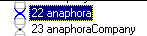
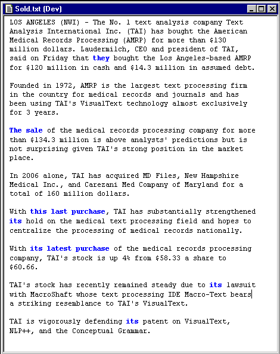
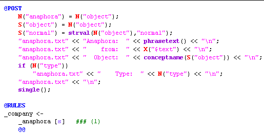
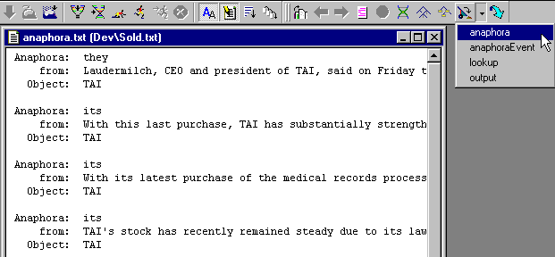
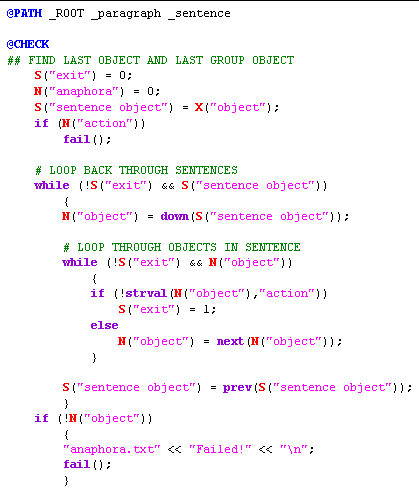

|  Companies | CORPORATE ANALYZER** Anaphora** | Company Conj  |
| --- | --- | --- |

**Ana Tab Window: Passes 22 & 23**

This section describes the analyzer passes "anaphora" and "anaphoraCompany".

**Anaphora Pass**

Anaphora is a fancy linguistic word for words and phrases that refer to other words and phrases in a text. One common anaphora relates to pronouns such as "they" and "its". Other phrases include words that reference actions such as "the sale", "this last purchase", etc. Below are highlights from the "anaphora" pass:

**AnaphoraCompany Pass**

First, we simply match an _anaphora node. If we find a suitable company candidate in previous sentences (shown further below), then we change our _anaphora to be a _company and point to the company found previously in the text.

For debugging purposes, we write the results to a dump file called "anaphora.txt". Here is the final output of this pass:

**Searching Through Sentences**

Once the rule finds an _anaphora node, we can now use our "parse" concept in the KB to search backward for the company being referred to. This finally shows the power behind our KB-based analyzer design.

Let us remember where we are. We are matching this rule in the context of the @PATH, which is set to match in sentences and therefore we can directly access the sentence object we have created under the "parse" concept of the KB. In our @CHECK area, we will loop through the previous sentences in the KB, and through the objects we created under those sentences, in order to find the first object that matches the desired type of anaphora.

For example, if the anaphora is "it", then we will look backward for the first "company" type. If the anaphora is an "action" type such as "this last purchase", then we will back up to find the first "action" type. Although this example is simplified, it can be designed to deal with much more complicated and subtle linguistic constructions.

We loop through the sentences and through the objects within each sentence. We know by design that there will only be two types of objects: "company" and "action" so we search for a match accordingly. When we find a match, we set S("exit") to 1 and that exits our while loops. If we find no object, we call **fail**, a special function for the @CHECK area that aborts the rule match altogether.

**Next Section:** [Company Conj ](../CompConj/CompConj.md)
