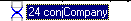
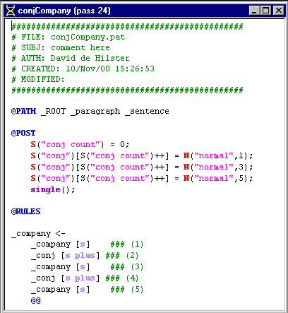
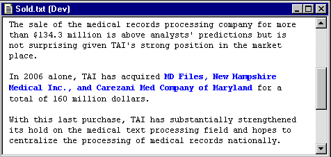

[← Help Contents](../../../index.md) | [📘 NLP++ Textbook](../../../NLP++_Textbook.md)

| Anaphora | CORPORATE ANALYZER** Company Conjunction** | Events  |
| --- | --- | --- |

**Ana Tab Window: Pass 24**

This section describes the analyzer pass "conjCompany".

**ConjCompany Pass**

This pass is another example of conjunctions (see "Money" section) but this time we are dealing with companies. It is constructed in the same manner as the conjMoney pass:

The conjunction rule was built primarily to handle the following sentence. A more general treatment might use a recursive pass to gather conjunctions one at a time.

**Next Section:** [Events ](../Events/Events.md)
