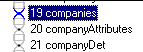
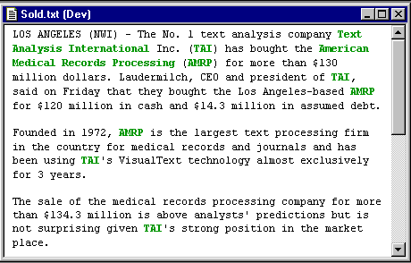
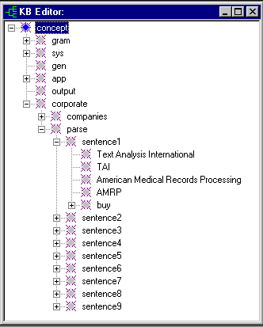
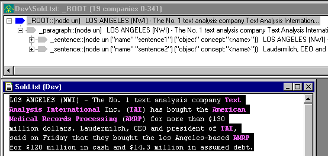
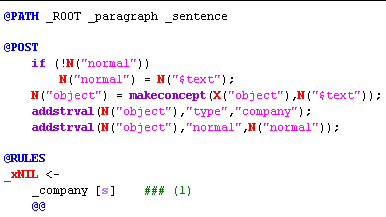
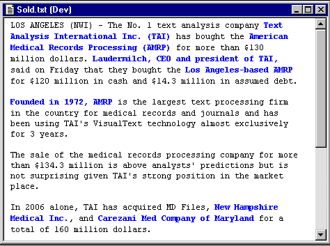
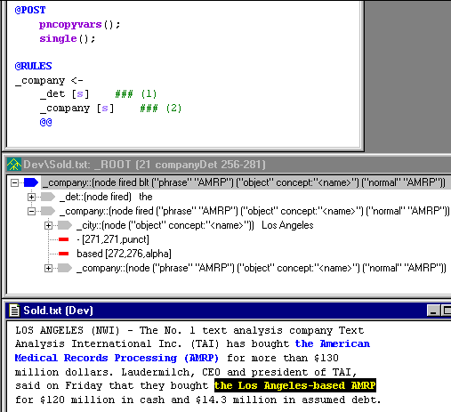

[← Help Contents](../../../index.md) | [📘 NLP++ Textbook](../../../NLP++_Textbook.md)

|  Money | CORPORATE ANALYZER** Companies** | Anaphora  |
| --- | --- | --- |

**Ana Tab Window: Passes 19 - 21**

This section describes the analyzer passes "companies", "companyAttributes", and "companyDet".

**Seeing Green**

There are currently two colors that appear when highlighting rule matches in the input text: blue and green. Usually, the text will highlight in blue, representing newly built nodes. When a rule matches without building new nodes, the text corresponding to the rule match is highlighted in green.

**Companies Pass**

Below is the highlighting for the company pass in our corporate analyzer, pass 19:

The rule in this pass finds company nodes, but does not alter the parse tree. Rather, it updates the KB "parse" area's tracking of company instances found in the text, within each sentence of the text. The "parse" area was introduced in the initKB pass.

Also, the "sentences" pass creates a numbered sentence concept (e.g., "sentence1") for every sentence that it detects in the parse tree, as well as having the "_sentence" node in the parse tree refer to its corresponding name in the "parse" area. We can see this using our handy "View>Tree of Selected" and displaying any portion of the text as seen below. The sentence object is written as ("name" "sentence1") ("object" concept "<name>"):

With this in mind, we now want to create "company objects" and attach them to the sentence object in the "parse" area of the KB. Notice below the @PATH command. This directs the rule matcher to search for matches only in "_sentence" nodes. In addition, we can access the "_sentence" context node from a matched rule with the special NLP++ **X** function. X(varname) and X(varname, 3) refer to a variable in the last and third component of the @PATH, respectively. Below, we create a new company concept with the **makeconcept** function and attach it to the sentence "object". We also add the attributes "type" and "normal" to the new company concept:

**Green Highlighting**

Now that we understand this pass better, let us look at why the company rule displays its matches in green.

In the above rule, note two things: the use of _xNIL and the absence of tree building functions in the @POST area.

(1) _xNIL is not really a special nonliteral, but it is a convention that documents when a rule is intended NOT to create a new, or suggested, node.

(2) In NLP++, an empty @POST region uses the **single** reduction by default. But as soon as any code is placed in a @POST region, that default is overridden. To get a rule to create a new node, an action such as **single** must be specified explicitly in that case.

With a non-empty @POST area that lacks a reduce action, this rule fires, but does not change the structure of the parse tree. Because the rule fired without modifying the tree, the highlighting appears in green.

**CompanyAttributes Pass**

Remembering the money pass discussion involving noun phrases, we use the same technique to gather attributes in the text surrounding companies. Below are the rules that matched company attribute phrases such as "TAI (Text Analysis Int'l)", "Founded in 1998, TAI", "California company", etc. We leave it to you to investigate the companyAttributes pass:

**CompanyDet Pass**

The companyDet pass stands for company "determiner" pass. Determiner is a linguistic term for those function words we put in front of nouns and their adjectives, e.g., "the", "a", "this", "that". In keeping with our idea of grabbing the entire company phrase, we add this pass to simply attach the determiner to the company phrase we are building in our passes 19-21.

One interesting function you may have noticed in the previous pass (pass 20) is **pncopyvars**. This function is a handy function that copies all the variables from a matched node to the newly created node. In this case, we can think of it as passing all the meaning or semantic information from the _company item in the rule below, to the new _company tree node being constructed by this rule. Also notice the presence of the **single** action. This builds the new node for the rule. We also include the partial parse tree for the phrase "the Los Angeles-based AMRP". The tree shows the semantic information passed up from the _company node below to the _company node above:

**Next Section:** [Anaphora ](../Anaphora/Anaphora.md)
