[← Help Contents](../../../index.md) | [📘 NLP++ Textbook](../../../NLP++_Textbook.md)

|  Company Conj | CORPORATE ANALYZER** Events** | Meta Events  |
| --- | --- | --- |

**Ana Tab Window: Pass 25**

This section describes the analyzer pass "events".

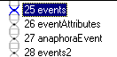

**Important:**

This is by far the most important section of our corporate analyzer tour. Here, everything we have done so far will come together.

**Events**

In language, it is usual to have some kind of action as the center of meaning within a sentence. John *kicked* the ball. The ball was *kicked* by John. Actions are associated with verbs. The corporate world deals with sales, mergers, acquisitions, and statements of fact about a company, e.g., "Founded in 1972". Below, we can see the events that our analyzer recognizes in pass 25:

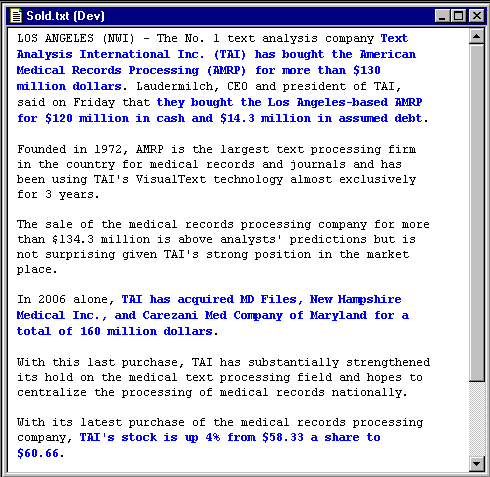

**Event Rule 1**

Our "events" pass 25 contains two rules. One is for a stock "event", the second for "buy" and "acquire" events. The second rule is :

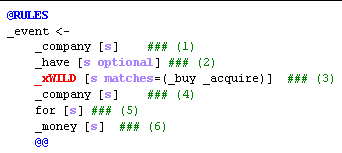

There are several remarkable things going on here. First, if you look at the graphic above containing the highlighting, you will see that many events are highlighted, yet there are only two rules in this pass. The second rule is generic enough to match three quite distinct sentences.

This follows from the way in which the analyzer is constructed up to the current pass. Remember that we gathered not only company names and money values, but also the attributes in the text surrounding these constructs. That is, we gathered complex noun phrases to distill the domain-critical objects from the text. Once we gather all the subphrases into one neat concept such as _company or _money, we can build abstract rules for events, as in the second rule above. The idea that "companies buy companies for money" is clearly expressed by rules at the event level of abstraction.

In this way, an information extraction system can become a powerful tool for accurately and deeply extracting critical content from a text.

**Generate Rule**

The "Generate Rule" menu item is a super-accelerator for building rules by hand. You invoke it from the right-click popup menu of a text window. It automatically generates rules from text in much the same way that RUG generates rules.

**NOTE:** Generate Rule only works if you have previously run the analyzer on the text with the "Generate Logs" toggle turned on:

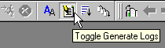

Using our other handy function "View>Tree of Selected", we can take a look at the tree for pass 25 for sentence 5:

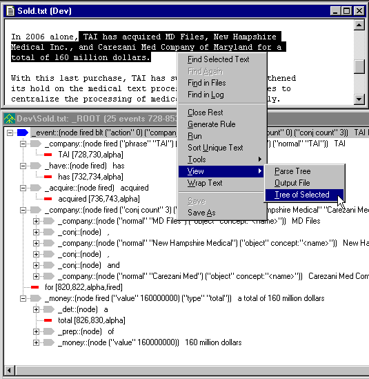

Examining the top-level nodes of the parse tree above, you will see your rule! I.e., "_company have _acquire _company for _money". This is what Generate Rule does for you automatically, as follows.

Below, choose the same text and instead of viewing the tree, select "Generate Rule".  (Note that the period is not included in the selected text.)  Generate Rule goes to the events pass, opens it up, and places a new rule at the bottom of the file. You can see the new rule on the left, in the image below:

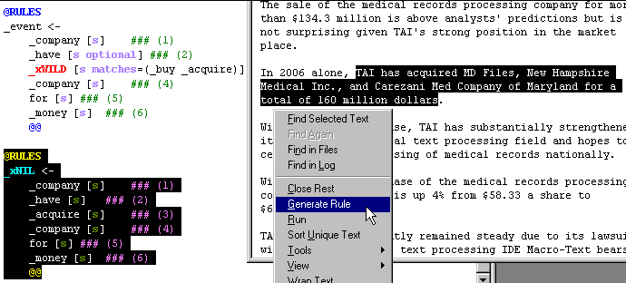

We can also use Generate Rule to generate another rule for a second sentence, with an interesting result in this case:

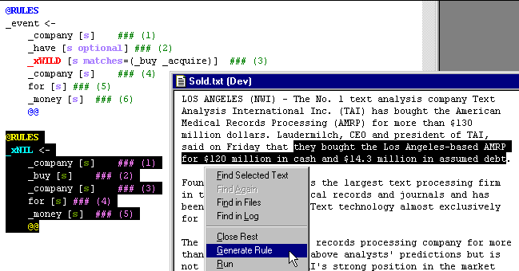

Note that the two generated rules differ only by the concept "_have", even though the sentences appear to be very different. Also, notice that we have left in the "real" rule above the generated rule to show you the final form. The final rule shows that "_have" is "optional" and that the verb or action for the event is a list that matches either _buy or _acquire concepts. In fact, this rule matches three sentences that on the surface appear to be very different, but linguistically, turn out to be very similar in structure. And the corporate analyzer has helped uncover the similarity!

**Action Concept**

When the event rules fire, we want to create an action object in the sentence under the "parse" concept. In the first part of our @POST area for the above rule, we add the object in the same way we added our object for company in a previous section. The following code in the @POST area creates the object in the KB "parse" area:

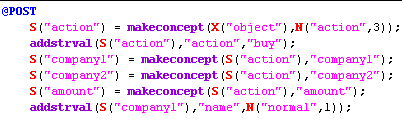

You can see the resulting KB structure below after the @POST action code has executed:

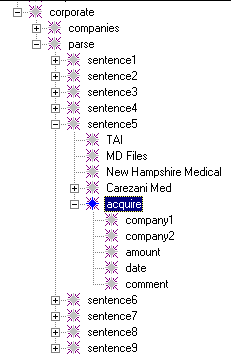

**Conjunctions**

The second part of the @POST area for the second rule is where we recover our company and money conjunctions. Again, conjunctions are groupings of similar items in a list and are normally tedious to deal with in text analysis systems. Remembering that we gathered up _money and _company concepts into arrays, we can now easily loop through those arrays to create the concepts in our "parse" area of the Knowledge Base. Below, you can see the two "while" loops where we loop through the arrays for company and money. The functions **addstrval** and **addnumval** add multiple values to a concept's attribute. The first adds a string value and the second an integer value.

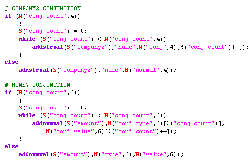

One important note here is the use of the special NLP++ function **N**. Notice that in the first conjunction area for companies, we are using N("conj count",4) and in the second, for money, we are using N("conj count",6). The reason for this is that the _company concept is the 4th matching element of the rule, and the _money concept is the 6th. We repeat the rule here for convenience:

**Stock Event**

The stock event is found as the first rule in the "events" pass file and keys off the word "stock" and the verb "to be". It works just like the "buy" and "acquire" rule described above, but does not process conjunctions. It creates a "stock" event in the sentence.

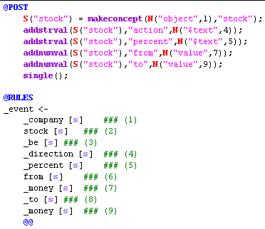

This rule constructs a slightly different structure in the KB than the "buy" or "acquire" event. Whereas the second rule constructs an event concept under its sentence, the first rule constructs a "stock" concept under the associated company and adds related information as attributes under the "stock" concept:

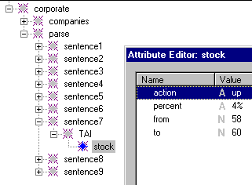

**Next Section:** [Meta Events ](../MetaEvents/MetaEvents.md)
