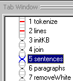
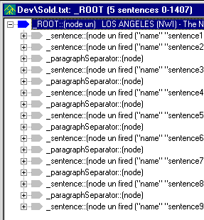
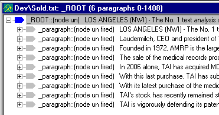
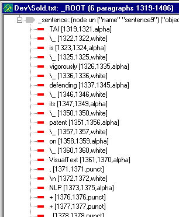
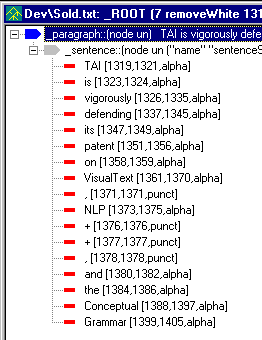
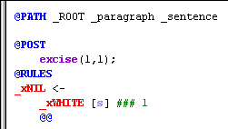

[← Help Contents](../../../index.md) | [📘 NLP++ Textbook](../../../NLP++_Textbook.md)

|  Join | CORPORATE ANALYZER** Formatting** | Rule Generation  |
| --- | --- | --- |

**Ana Tab Window: Passes 5, 6, 7**

This section describes the analyzer passes "sentences", "paragraphs", and "removeWhite".

**Formatting**

It is often useful for an analyzer to track the formatting of the input text as part of characterizing it. Pass 5 groups words into sentences. It assumes that prior passes, e.g., pass 4 (join), have removed or hidden periods (and semicolons, question marks, etc.) that are not likely to be end-of-sentence markers in the current text. The resulting parse tree is shown below:

Pass 6 groups the sentences into paragraphs:

Another convenient step, which helps simplify rules in subsequent passes, is to excise white space from the parse tree. In this way, subsequent rules need not consider white space. Below is a display of a tree before and after spaces are removed. Before:

The parse tree below results from running Pass 7, called "removeWhite":

**Precision Processing**

An advantage of grouping the text into sentences and paragraphs is that it makes for a more precise and efficient text analyzer. Subsequent passes can be instructed to process only within particular contexts, such as sentences or paragraphs. In this way, spurious matches in unintended areas of the parse tree are minimized.

The @PATH selector, as shown in the pass file for pass 7 below, instructs the rule matcher to start at the root of the parse tree (named "_ROOT"), then find children named "_paragraph", then find their children named "_sentence". Only when such a "_sentence" node is found does the rule matcher attempt to match the rules of the current pass.

**Next Section:** [Rule Generation ](../GramTab/GramTab.md)
