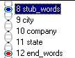
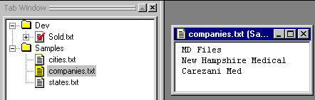
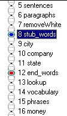
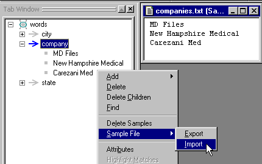
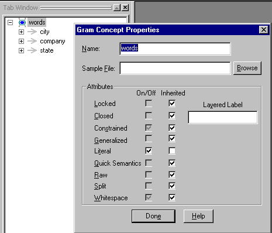
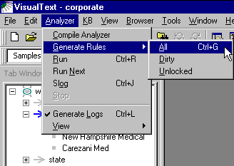
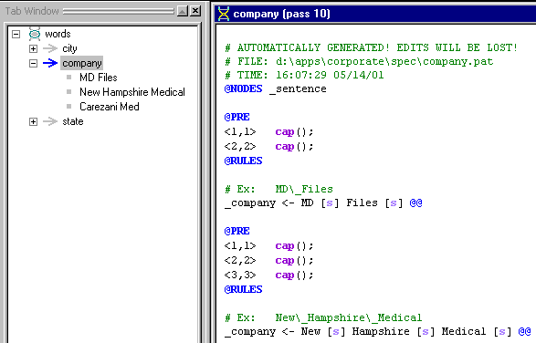
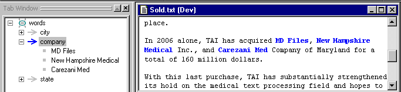

|  Formatting | CORPORATE ANALYZER** Rule Generation** | KB & Dictionary  |
| --- | --- | --- |

**Ana Tab Window: Passes 8 - 12**

This section describes the analyzer passes "city", "company", and "state" in the "words" stub region.

**Sample Files**

We have included a few automatically generated (or "RUG") passes in the corporate analyzer, for the purpose of "dictionary" lookup. We describe how we set up this capability in the corporate analyzer.

First, we added a folder called "Samples" under which we have created three files: "cities.txt", "companies.txt", and "states.txt". Below is "companies.txt". Note that each text sample (company name in this case) appears on a separate line. Only multi-word phrases are added to the companies.txt file, for reasons that will become apparent later.

**Stubs**

Next, we created a "stub", or placeholder in the analyzer sequence, for automatically generated passes. This allows us to control where in the sequence of passes these automatically generated passes will occur. Since we are using RUG for a dictionary-like function, the stub comes early on in the analyzer flow, right after formatting:

**Gram Tab**

The Gram Tab is where we set up a hierarchy of text samples. We created a stub concept called "words" and under it, we created rule concepts for city, company, and state. The Gram Tab allows us to quickly add text samples to the rule concepts, e.g., by importing the sample files built above. You can also add samples to the hierarchy manually by highlighting a text region and selecting the rule concept in which to place it.

**Setting Auto-Generation Flags**

Before using RUG to generate our rules for us, we may need to provide constraints and instructions that control the rule-construction process. In the case of literal constructs such as company names, we use the Gram Concept Properties window to specify that "literal" rules are to be generated.

**Invoking RUG**

To automatically generate the passes, we now choose "All" under "Generate Rules" under the "Analyzer" menu:

**Automatically Generated Rules**

Now we can double-click on the rules in the Gram Tab to see the corresponding passes that have been built. Note, in pass file 10, the warning about editing automatically generated files. Currently, any edits made to such a pass file will be overwritten the next time RUG is invoked.

Second, notice the form of the rules. RUG creates rules that match the phrase and rewrites them to "_company". The rules also include a "@PRE" area that restricts the words to be capitalized or not. The form of the rules in this pass file is determined by the flags set in the "Properties" window above.

**Highlighting Matches**

These pass files are like any other pass files in that you can highlight pass matches. In the Gram Tab, you can click on any rule icon and display the highlights as show below:

**Next Section:** [KB & Dictionary ](../HandDict/HandDict.md)
