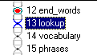
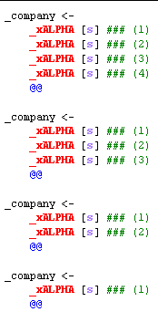
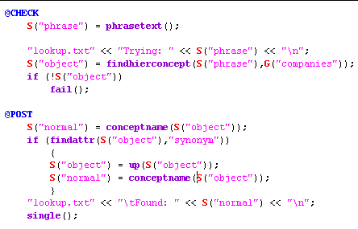
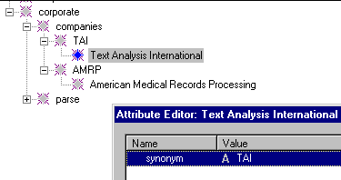
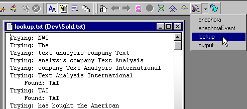
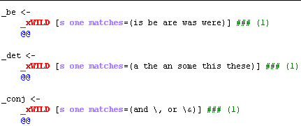
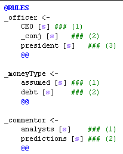

|  Rule Generation | CORPORATE ANALYZER** KB & Dictionary** | Money  |
| --- | --- | --- |

**Ana Tab Window: Passes 13 - 15**

This section describes the analyzer passes "lookup", "vocabulary", and "phrases".

**Lookup Pass**

In the last section, we saw how we can automatically generate a dictionary. In this section, we show how to use the Knowledge Base as a dictionary. The reason for doing this is that, unlike the current version of the RUG passes, we cannot attach additional information to the automatically generated rules.

First, look at the @RULES area below. You will notice that we are looking for phrases of length one through four. We do this simply by writing 4 rules, attempting to match the longest phrase first:

Next, we examine the @CHECK area, which allows us to accept or reject a match based on criteria we specify. The objective of this pass is to look up the matched phrase in the "companies" area of our KB, which we assume was set up before we built our analyzer. To perform the lookup, we first fetch the text of the phrase using the **phrasetext** function, assigning the text to a variable called "phrase". We search for the phrase within the "companies" KB concept (defined in the **initKB** pass), using the **findhierconcept** function. If no such phrase was found in the KB, we reject the rule match with the special **fail** function that exits the current rule match.

In the @POST area, we "normalize" the phrase whose concept was found in the KB. Recall that we set up our KB such that we placed alternative wordings for our companies under a "normalized" form. So, we use the **findattr** function to look for the "synonym" attribute, as above. If it is there, we need to set the concept's parent as the normalized form of the phrase. We repeat our graphic from KB initialization here for clarification:

**Debug Printouts**

To help debug the corporate analyzer, we created a dump file called "lookup.txt". The C++ -like "<<" operator conveniently pipes values to an output file. Below is a screen shot of the lookup.txt file.

**Vocabulary Pass**

The "vocabulary" pass illustrates how we can quickly build vocabulary lookups by hand.

**Phrases Pass**

We can also build a pass for phrases by hand. Note that separating the "vocabulary" and "phrases" passes enables rules in the later pass to use nonliterals built in the earlier pass. For example, the first rule below uses the nonliteral "_conj", or conjunction token, to handle things like "CEO and president" or "CEO & president".

**Next Section:** [Money ](../Money/Money.md)
