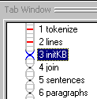
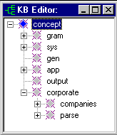
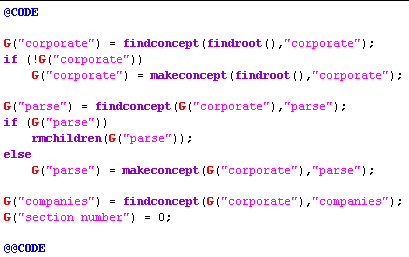

[← Help Contents](../../../index.md) | [📘 NLP++ Textbook](../../../NLP++_Textbook.md)

|  Intro | CORPORATE ANALYZER** Initial KB** | Join  |
| --- | --- | --- |

**Ana Tab Window: Pass 3**

This section describes the analyzer pass "initKB".

**Constructing the KB**

Because the corporate analyzer is expected to analyze more than one text, we need to make sure the "parse" area is cleaned out each time. More generally, we need to initialize or reset any parts of the KB that the analyzer manages dynamically. If the KB happens to not have a "corporate" concept, the analyzer can recover by creating that area of the KB from scratch.

**NLP++ Knowledge Base Functions**

To initialize the KB, we'll use predefined knowledge base functions supplied with NLP++. The initKB pass consists purely of code, with no rules, as shown in the screen shot below.

The function **findroot** returns the root node of the KB hierarchy. The first call to **findconcept** looks for a concept named "corporate" directly under the root. A global variable named "corporate" is assigned the corporate concept, if found (or 0, otherwise). The special function **G** refers to a global variable.

If the corporate concept was not found, then **makeconcept** is used to create it as a child of the root of the hierarchy. (Since the corporate concept is absent, that means there is no "companies" area with synonyms for company names. Even so, the analyzer can still execute, though it may not correlate things like "TAI" and "Text Analysis International".)

If the "parse" concept is found in the knowledge base, then its descendants are removed with **rmchildren**. This clears the parse area so that the new article can be processed with a clean slate.

When initKB is executed, the global variables "corporate", "parse", and "companies" point to their respective concepts in the KB. A global variable called "section number" is also initialized to 0 here.

**Next Section:** [Join ](../Join/Join.md)
