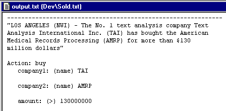
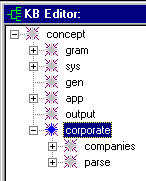
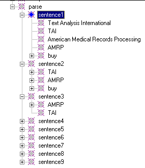

[← Help Contents](../../../index.md) | [📘 NLP++ Textbook](../../../NLP++_Textbook.md)

|  TOC | CORPORATE ANALYZER** Intro** | Initial KB  |
| --- | --- | --- |

**Intro**

Although VisualText may be the most powerful text processing tool around, it may not be obvious to the first time user how to build an analyzer. You may know what you want to do, but how do you go about doing it? This demonstration analyzer gives a first-time user of VisualText an idea of exactly how an analyzer is built.

**Notes:** This demonstration analyzer is meant to stimulate ideas in the VisualText user. It does not represent in any way a complete or exemplary example of analyzer building. We expect that you've at a minimum studied the [Quick Tour](Intro.md) and the [Tutorials](../../../Tutorials/Tutorial_Introduction.md) in order to follow the Corporate tour.

 Now is a good time to open the corporate analyzer, as described in the Quick Tour, and examine the input file named "Sold.txt" in the Dev folder of the Text Tab.

**Our Analyzer**

Before we can build an analyzer, we must have a task in mind. In our corporate analyzer, we want to pull out information about companies from newswires. We can pull out information like "who bought whom for how much", "who's stock changed and by how much", and other information about companies such as current CEO, founding date, and contact information.

Our corporate analyzer will build records that could be used to feed a database. This type of analyzer is called an "information extraction" system. Here is a peek at the corporate analyzer's first output record for our sample text:

**VisualText Features and Tips**

Key features that make VisualText powerful, flexible, and easy to use and debug are tabulated in the [Quick Tour Introduction](Intro.md). Some areas we'll focus on in this deeper tour of the Corporate analyzer are:

1.  **Multi-Pass Processing**

1. ** Knowledge Base**

1. ** Automatic Rule Generation**

Some useful guidelines gleaned from building information extraction systems are:

1.  **Do high confidence work first**

1. ** Group text into chunks to process**

1. ** Don't process everything**

1. ** Don't worry about mistakes if they don't hurt you**

We will see examples of these ideas at work in our corporate analyzer example.

**Plan of Attack**

The next step is to sketch a way to build this analyzer. Building a text analyzer is art, not science, and every developer will write a unique analyzer.

An initial decision to make is whether your analyzer will gather localized information only (i.e., do "shallow" processing), or correlate information from various parts of a text (or multiple texts). The deeper and more accurate the analyzer, the more correlation you will need to do, and the more you will rely on the knowledge base (KB) to store information about the domain (e.g., "corporate events") and the current text.

The corporate analyzer will utilize the KB in order to demonstrate "going deep."

**Knowledge Based Analyzers**

The first step in building our analyzer is to create a dedicated area for it within the KB. We start by making a concept named "corporate", as below. Under that, we create two concepts: "companies" and "parse". The "companies" concept holds the companies we are interested in and their alternative wordings, as reference knowledge for the analyzer. The "parse" concept stores information that the analyzer creates and uses dynamically.

**KB Lookup and Normalization**

The knowledge base can support looking up and normalizing words and phrases. For example, to store the fact that "Text Analysis International, Inc." and "TAI" are synonyms, you can construct a hierarchy with "TAI" as parent and place its alternative phrasings below it. Under the "companies" concept, we'll place a normalized form of a company name, e.g., its abbreviation when it's unique. Under the normalized form, we place major textual variants. To explicitly specify the relationship between concepts, we add a "synonym" attribute to each variant. The screen shot of the KB and Attribute Editor below depicts this scheme.

The "companies" area under our "corporate" concept is one we construct beforehand, either by hand or by writing another VisualText analyzer to populate the knowledge base for us from a file. The "parse" area, on the other hand, is managed dynamically by the corporate analyzer while it is processing an input article. We assume, for our demo system, that TAI and AMRP are the only companies the analyzer needs to know about!

**Parse Concept**

In the corporate analyzer, we need to gather information across sentences, because information about a given company may be spread throughout the article. For instance, "TAI buys AMRP" occurs in the first sentence, while the phrase "The sale" in the fourth sentence" refers back to the first sentence. If the fourth sentence adds useful information, we need to relate the two. Therefore, we use the knowledge base to build a model of the article as we process it, enabling correlations across sentences. Below is a screen shot of the parse area built by the final version of the analyzer for our sample input article.

**Next Section:** [Initial KB ](../InitKB/InitKB.md)
