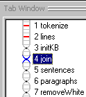
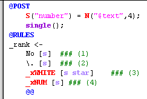
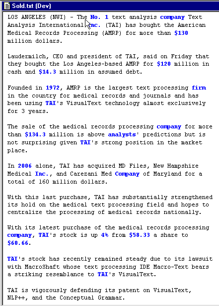
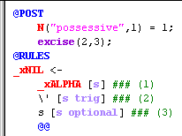

[← Help Contents](../../../index.md) | [📘 NLP++ Textbook](../../../NLP++_Textbook.md)

|  Initial KB | CORPORATE ANALYZER** Join** | Formatting  |
| --- | --- | --- |

**Ana Tab Window: Pass 4**

This section describes the analyzer pass "Join".

**Tokenization**

The **tokenize** pass, which is the first pass of every VisualText analyzer, performs an initial segmentation of characters in the input text to alphabetic, numeric, punctuation, and white space tokens. However, in practice, we may want to treat constructs such as "$9.99" and "No. 1" as tokens. VisualText makes it convenient to "join", or "retokenize", a phrase as a single token.

The example rule below illustrates how we might handle phrases such as "No. 1". The rule itself appears after the @RULES marker. It matches a phrases that starts with "No", continues with ".", then any amount of white space (denoted by "star"), and finally a numeric token. When such a phrase is matched, a new node named "_rank" is built to dominate the matched phrase. The @POST action specifies what will be done when the rule has been matched. In this case, the suggested node, named "_rank", will get a variable named "number" with the numeric token's text as its value. That is, "No. 33" will lead to creation of a variable named "number" with value "33", attached to the "_rank" node. The **single** action specifies that a default reduction of the matched phrase is to be executed. The rule below can be used to bleed, or hide, periods that we don't want treated as ends of sentences.

**Seeing the Matches**

VisualText allows you to quickly see the matches for any given pass. The blue text corresponds to nodes built by rule matches in the "join" pass.

Note that the apostrophe-s in possessive constructs is not highlighted in blue. That is because the rule that identifies possessives, shown below, excises the apostrophe and "s" from the parse tree.

**Next Section:** [Formatting ](../Format/Format.md)
