[← Help Contents](../../../index.md) | [📘 NLP++ Textbook](../../../NLP++_Textbook.md)

|  Events | CORPORATE ANALYZER** MetaEvents** | Output  |
| --- | --- | --- |

**Ana Tab Window: Pass 26-28**

This section describes the three analyzer passes: eventAttributes, anaphoraEvent, and events2.

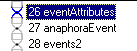

**EventAttributes Pass**

Some phrases describe entire events. Below is one of them. The phrase "In 2006 alone," describes the "acquisition" event that follows. Notice that it is in green. We will explain below.

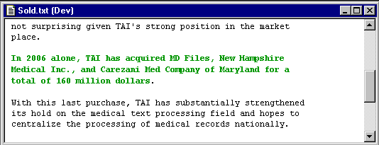

This pass takes care of attaching the date to the "acquire" event via an attribute. If we look at the resulting information in the KB, we can see the final format:

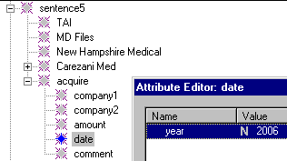

Notice in the rule itself that the _event item is already matched. This pass (26) must come after pass 25 because the rules in pass 26 expect that events have already been processed. We create a "date" concept below the action concept and add a "year" attribute and value to the new date concept. But we do not gather these items under a new node. Remember that if we have a @POST area associated with a @RULES area, we need to specifically call an NLP++ action in order to "reduce" or create a new node under which all the items are gathered. There is no "single()" function and the suggested node name is "_xNIL", which is a convention telling us that we are not interested in building a new node for this rule match. That is why VisualText displays the match for this rule in "**green**" (see text above).

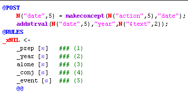

**AnaphoraEvent Pass**

Pass 27 is much like pass 23, the anaphoraCompany pass. The purpose of this pass is to find all the _anaphora concepts and loop back through the sentences under the "parse" area of our KB to find a match. Only this time, we are looking for "actions" to match, not "companies". Below, you can see that phrases that reference other events in the text are highlighted:

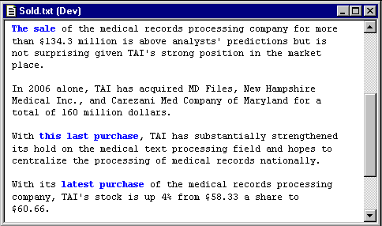

Below you can see the rule and the @POST area for this rule. We are matching _anaphora and creating a new parent node _eventAnaphora. Notice that since we have a @POST area, we must call the function "single()" to create the _eventAnaphora node:

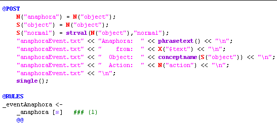

In the above @POST region, we also print out some information to the dump file "anaphoraEvent.txt" for debugging purposes. This way we can easily monitor what this pass is choosing as its reference to the anaphora:

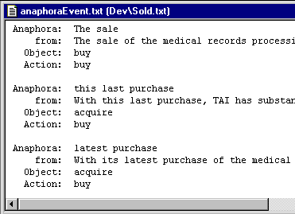

**Looping Through the Sentences & Objects **

As in pass 23, we will loop back through the sentence concepts we built under "parse" in the KB to find the "action" objects we constructed earlier. In layman's terms, we are looking for "action" events that match phrases like "The sale", "this last purchase", etc. The code below is almost identical with pass 23 with the exception of our check for "action" instead of "company":

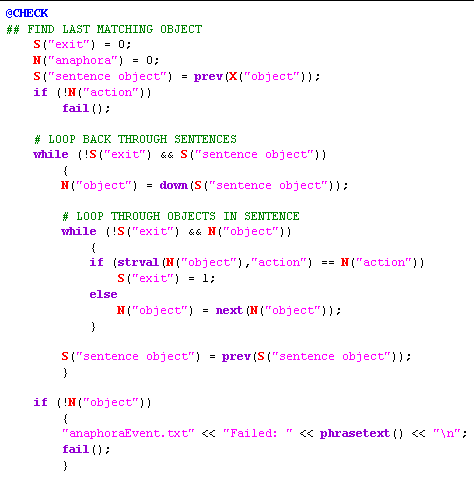

**Events2 Pass (28)**

This pass uses the previous pass in two ways. One, it looks for the presence of an _eventAnaphora concept in a particular pattern. Two, once it finds it, it makes a "comment" concept under the object that _eventAnaphora is pointing to. Remember that in the previous pass (27), we looped back through the "parse" area until we found an "action". In this case, the phrase "The sale" in the 4th sentence ends up attaching a "comment" concept under the "buy" action in the second sentence:

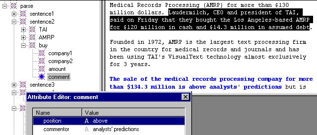

Below is the rule that does this:

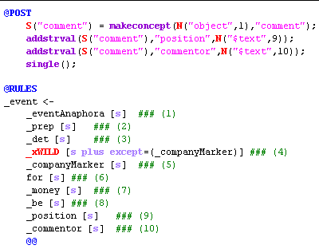

The second rule in pass 28 does something similar:

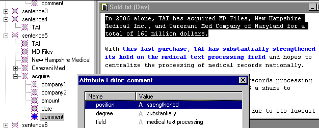

**Next Section:** [Output ](../Output/Output.md)
