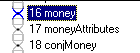
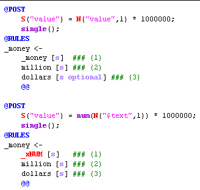
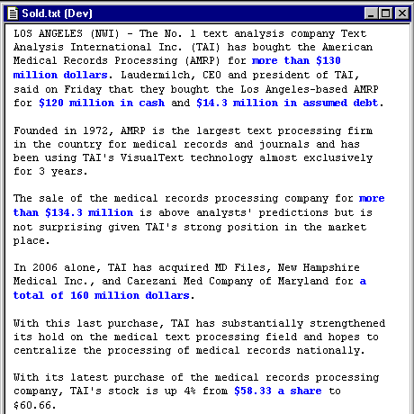
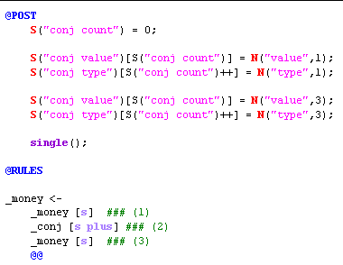
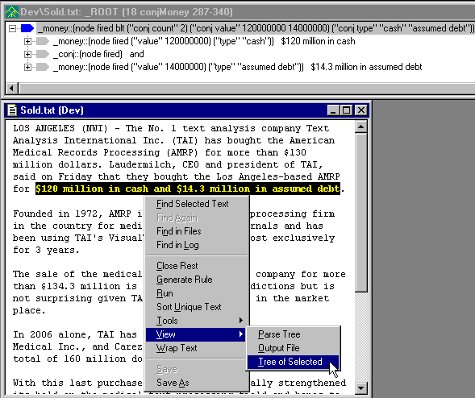

|  KB & Dictionary | CORPORATE ANALYZER** Money** | Companies  |
| --- | --- | --- |

**Ana Tab Window: Passes 16 - 18**

This section describes the analyzer passes "money", "moneyAttributes", and "conjMoney".

**Lessons in Phrases**

In diagramming sentences in English class, you may have come across **noun phrases** (NP). These come in many many forms and basically represent nouns (persons, places, things) and attributes about those nouns (color, amount, type). Knowing this, we can write a more organized text analyzer.

In passes 16 - 18, we process money phrases. First we gather the root money noun (money), then process its attributes (moneyAttributes), and then gather lists of money constructs (conjMoney).

**Money**

In the money phrase, we key off the word "dollars". Since this is a demonstration analyzer, we will only write rules for those patterns we are matching in our "Sold.txt" article. The rules below match constructs such as "$30 million dollars" and "30 million dollars".

In the @POST area, we perform our "normalization", multiplying the numeric value in the text by 1,000,000 to compute the number of dollars.

**Money Attributes:**

Next, we gather the attributes in the text surrounding the money phrases. Study the moneyAttributes pass for yourself. Below is the highlighting for this pass. You can easily see the attribute phrases: "more than X", "X in cash", "X in assumed debt", "a total of X", etc.:

**Conjunctions**

In analyzing text, conjunctions can be very painful to handle. Not so in VisualText. NLP++ includes an array construct that can simplify the problem of conjoining similar phrases. To illustrate, we will elaborate one case.

In the conjMoney pass, we take the money and value and put it in the arrays S("conj value") and S("conj type") using the counter S("conj count"). These will be used in future passes to loop through and recover the money values.

**Tree of Selected**

Below is the matched conjunction phrase and the tree for that phrase. Two useful features of VisualText should be pointed out here. One is that the semantic information is displayed in the trees. Below, you can see the result of firing the above conjunction rule: ("conj count" 2) ("conj value" 120000000140000000) ("conj type" "cash" "assumed debt").

The second convenient function is found in the right-click menu of the processed text window. Select the pass you are interested in (usually it is already selected), then select any portion of text you want. Using the right-click menu, choose "View>Tree of Selected" and the partial parse tree for that text will appear in the context of the chosen pass. This is a handy function to remember.

**Next Section:** [Companies ](../Companies/Companies.md)
