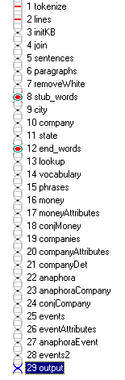
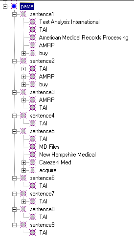
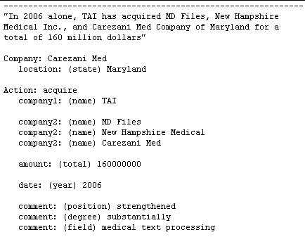

|  Meta Events | CORPORATE ANALYZER** Output** |   |
| --- | --- | --- |

**Ana Tab Window: Pass 29**

This section describes the last analyzer pass, "output". (The complete Corporate Analyzer sequence is shown below.)

**Output**

One of the beauties of using a KB-based text analyzer is that once you have everything processed, the output is a simple matter of looping through the "sentence" concepts in the "parse" area in the KB and printing out the results. If we open up the sentences under the "parse" concept, we can easily see what we want to output to the file. The rule is, if there is a child concept of the object under the sentences, print it out. If not, don't output anything. Below, this is clearly illustrated by looking at the concept for "TAI". Those with a "+" have something to output, those without do not:

We leave it to you to look at the details of the code for this pass. Please note, however, that there is no rule for this pass, just a @CODE area. The last rule-matching pass was pass 28, and all that remains is to output our results. Notice, when inspecting the output file, that information from later sentences has been copied back to earlier sentences. This is due to our analyzer's treatment of "anaphora". Namely, information later in the text has been correlated to references earlier in the text. Below is one of the more interesting outputs, taken from sentence 5:

**Go forth and build better analyzers!**
