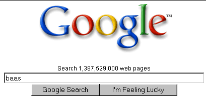
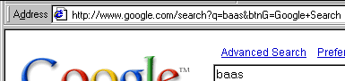
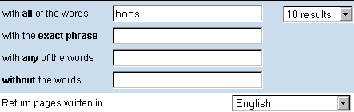
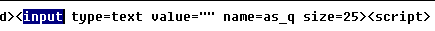
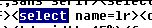
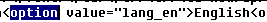

[← Help Contents](../../index.md) | [📘 NLP++ Textbook](../../NLP++_Textbook.md)

# URLs for Dictionary Lookup

The Dictionary Lookup Tool is a very handy tool for building and refining lexicons.  This tool allows users to easily access dictionary sites on the Web and to display search results within VisualText.

To access online dictionaries, the paths to these sites must be set in VisualText preferences located under the File Menu.

## List of Commonly Used Online Dictionary Sites

A list of commonly used online dictionary sites and the paths to their search pages is given below.  To get access to one of these dictionaries, create an entry in the Dictionary Lookup preferences under Name and copy the URL path into URL input panel.   To create URL paths for other dictionaries, follow the steps outlined below.

| Online Site | URL Path |
| --- | --- |
| **Wordnet** | http://www.cogsci.princeton.edu/cgi-bin/webwn/?stage=1&word= |
| **Merriam Webster** | http://www.m-w.com/cgi-bin/dictionary?book=Dictionary&va= |
| **Dictionary.com** | http://www.dictionary.com/cgi-bin/dict.pl?term= |
| **Google** | http://www.google.com/search?btnG=Google+Search&lr=lang_en&as_q= |

| **Note**: The Google path returns pages for English only. |
| --- |

Once set, the dictionaries can be accessed from the main Tools Menu, and from the Tools menu in both the Text Tab Popup Menu and the Text File Popup Menu.  Dictionaries can also be accessed from the Attribute Editor.

## **Constructing Simple URLs**

Constructing the URL for an online dictionary requires some knowledge of CGIs, HTML and FORMS.  If you are familiar with these topics, constructing the URL path for an online source is fairly routine.  You may want to familiarize yourself with these topics before trying to construct a URL path.

To construct the URL path that can be used by Dictionary Lookup, you need to do three things:

1. Discover the CGI path of the online source;

1. Discover the names of the variables that need to accompany the CGI to do the lookups;

1. Put the word variable at the end of the URL you are constructing.

These steps are outlined below using the Google website (http://www.google.com) as an example.

### **Discover the CGI Path**

The simplest way to discover the CGI path is to do a search for a word on the desired site, and then look at the resulting page's URL path found at the top of your browser.

- Type in the word **baas** on the Google search page, and hit the **Google Search** button.

In the Address portion of the browser, the desired URL is displayed.

The syntax for a CGI path specifies the name for a CGI program just before the ? sign.  In this case, we find the CGI name to be "search".

### Discover Variable Names to Accompany CGI

Variables for word lookup are specified after the question mark "?".   Key-value pairs can be found separated by the ampersand character "&". Each key-value pair is further separated by an equal sign "=".

The first key-value pair (q=baas) is our search term "baas" and the second key-value pair (btnG=Google+Search) is the Google convention used to indicate an unknown key-value pair.

From the URL in the Address portion of the browser above, we have determined the following:

- **URL Path**: http://www.google.com/

- **CGI Path Name**: search

- **Word key-value pair:** q=bass

- **Unknown key-value pair:** btnG=Google+Search

The plus sign "+" in the last key-value pair is a CGI convention for a "space" or "blank" character.

### Put Word Variable at End of URL

To construct the URL in a format that can be used by Dictionary Lookup, we need to rearrange the order of the key-value pairs.  The value for the word key-value pair must be removed and it must be placed at the end of path.

In our Google example, we discovered that the word key-value pair is q=bass.  The "bass" portion of the key-value pair must be removed, and "q=" should be placed at the end of our URL.  The unknown key-value pair along with the CGI  name can stay in the same position.  The resulting URL looks like this:

http://www.google.com/search?btnG=Google+Search&q=

| **Note**: Remember to put the question mark after the CGI Path Name and an ampersand "&" between the key-value pairs. |
| --- |

When you copy the URL into the Dictionary Lookup preference and give it the name Google, Google becomes one of the dictionaries listed in the list of dictionary choices, allowing you access Google directly from within VisualText.

## **Constructing Advanced URLs**

To construct URLs for advanced or more complicated searches such as returning only pages in English, you will have to add additional information to the URL path.  This information can be extracted from the HTML and FORMS used to create the webpage.  Often it is necessary to use HTML and FORMS since it is difficult to extract key-value pair information as we did above for simple searches.

To illustrate how you can extract this information, we will use the same Google example and create a URL for searches that are restricted to English pages only.  (The Google search page is located at http://www.google.com)

## Google Advanced Search and CGI Path

1. From the Google search page, click on "Advanced Search".

1. Type in the word **baas** and restrict the search to return only pages written in **English**.  (We have also restricted the search to 10 results.)

1. Submit the query and inspect the Address portion of the browser.

The CGI path is quite long and trying to discover what key-value pairs are needed to restrict the search to English pages only will be very difficult.  To find out what part of the CGI path is used to specify only English pages, you can use the View Source option on the browser to inspect the HTML source code.

## Using View Source

The HTML source code can be viewed for the webpage by right-clicking on the webpage and selecting View Source from the menu options.  You can search for the specific FORM items you are trying to restrict.

- Right-click on the browser window and Select **View Source**.  The source code for the webpage is displayed.

First, we need to verify the key name for the search word. Sometimes, it will be the same as for the simple search. However, depending on the CGI, the name may be different.

- Search for the FORM item, **INPUT**.

The key name for the word field is **as_q**.  Recall, that the key name used for the simple search is simply **q**.

Next, we need to find the SELECT form item for the pulldown menu that will specify a particular language.

- Search for **SELECT**.**  **(The first SELECT form item deals with the number of results.  The SELECT item for language is second.)

The key name for the language SELECT form is **lr**.

To find out what key is used to specify English as the desired language we must search for OPTION.

- Under SELECT look for **OPTION** value that specifies English.

This gives us the needed value for restricting our search to English: **lang_en**. We put this together with the SELECT key name "lr" and we get: **lr=lang_en**.

With these three pieces of information, advanced search value, select language value, language option value, you can specify a URL in Dictionary Lookup which specifies pages in English for Google.

http://www.google.com/search?btnG=Google+Search&lr=lang_en&as_q=
