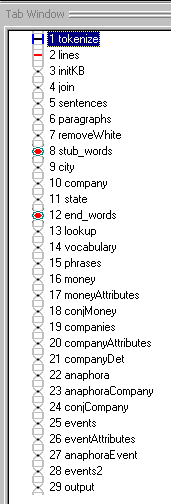
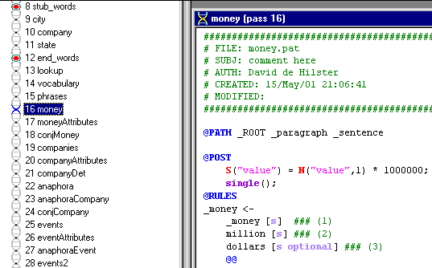
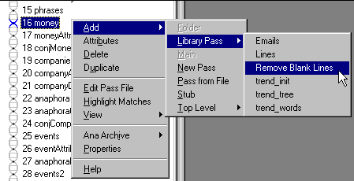
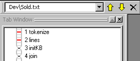

|  Parse Tree | Quick Tour** Ana Tab** | Pass Files  |
| --- | --- | --- |

**The Analyzer**

 Click on the Ana Tab button to display the Ana Tab Window.

This window maintains the ordered sequence of passes that define the current text analyzer. System or built-in pass types (e.g., tokenize) are represented by flat "DNA" icons. Passes with associated pass files have twisted DNA icons. Our corporate analyzer has 29 passes:

**Stubs**

You may have noticed that there are two passes with red circles. These represent "stubs" or placeholders in which automatically generated passes are deposited. We'll talk about automatic rule generation and the [Gram Tab](../GramTab/Tour_GramTab.md) in a later section:

**Double Click**

The most common action in the Ana Tab is to open up a pass file by double-clicking on the desired pass:

**Right-Click and Toolbar**

The Ana tab has an extensive right-click menu as well as arrows in the Tab Toolbar that serve for deleting or moving analyzer passes:

**Next Section:** [Pass Files ](../PassFiles/Tour_PassFiles.md)
