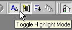
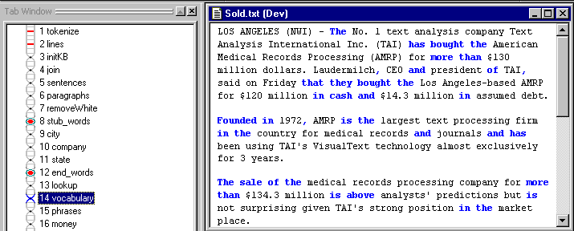
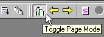
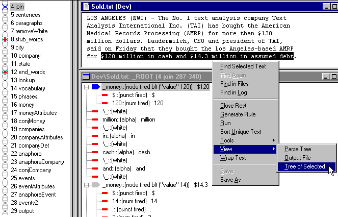

[← Help Contents](../../../index.md) | [📘 NLP++ Textbook](../../../NLP++_Textbook.md)

|  Gram Tab | Quick Tour** Debugging** | KB  |
| --- | --- | --- |

**Examining the Analyzer Under Construction**

There are numbers of tools and methods for debugging analyzers, including highlighting and what is called "Page Mode".

**Highlighting**

 Highlighting is a simple and intuitive tool for debugging analyzers. Turn on the highlighting toggle in the toolbar:

 Then open up Sold.txt and select the Ana Tab window. Single click on various analyzer passes. The matched text for each pass will be highlighted in blue and green, letting you know which words and phrases matched in that pass:

**Page Mode**

Another important debugging tool is called "Page Mode":

Among other things, it allows you to examine the change in parse trees for each pass.

 With the "Page Mode" on, choose the phrase "$120 million in cash and $14.3 million in assumed debt" and view its tree. Then in the Ana Tab, click on pass 4, "join", and travel down the analyzer passes observing the changes in the parse tree:

**Next Section:** [KB ](../Kb/Tour_KB.md)
