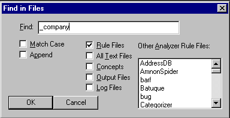
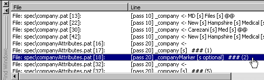
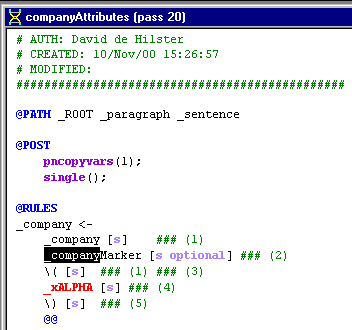

[← Help Contents](../../../index.md) | [📘 NLP++ Textbook](../../../NLP++_Textbook.md)

|  KB | Quick Tour** Find** |   |
| --- | --- | --- |

**Find Window**

One other important window in the VisualText interface is the Find window. You can search for a word or phrase in specified files and in other analyzers. Below, we search for the concept "_company" using Find in Files :

**Double-Click**

Once you have searched on a word, the find window allows you to go directly to an instance of the word or phrase by double-clicking on the line of interest:

This will take you directly to the window and highlight the instance:

**Hope you enjoyed the tour of VisualText!**
