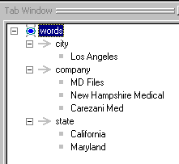
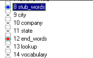
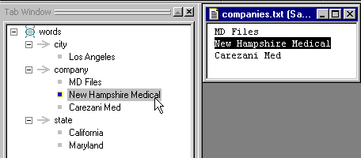
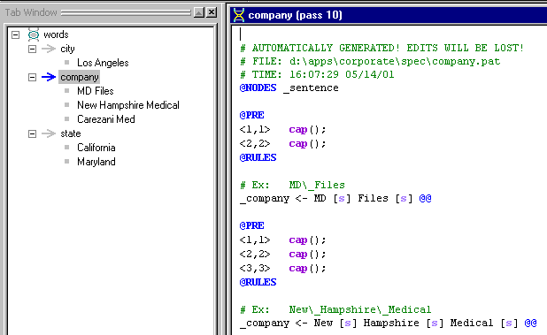

[← Help Contents](../../../index.md) | [📘 NLP++ Textbook](../../../NLP++_Textbook.md)

|  Pass Files | Quick Tour** Gram Tab** | Debugging  |
| --- | --- | --- |

**Automatic Rule Generation (RUG)**

In VisualText, rules can be automatically generated from text samples. In our corporate analyzer, we use the Gram Tab much like a "dictionary". More complex samples with subsamples can also be managed in the Gram Tab.

**Stubs**

Stubs are place holders where the automatically generated rules will appear in the Analyzer Sequence. Notice that the icon for words above matches the "stub_words" pass below, taken from the Analyzer Tab:

**Double-Click**

If you double-click on a sample such as "New Hampshire Medical", the text file of the sample will pop up in the Workspace. In our corporate analyzer, we are using sample files for our dictionaries. One can imagine using large lists of words and phrases in files that can be converted into rules automatically:

If you double click on a rule concept (one with a right-pointing arrow) such as "company", you can see its corresponding pass file containing automatically generated rules:

**Next Section:** [Debugging ](../Debug/Tour_Debug.md)
