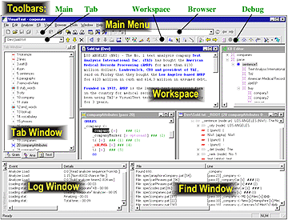
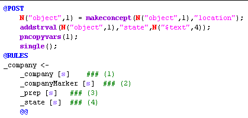
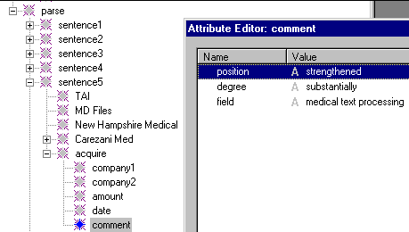
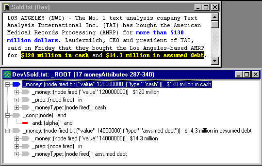

|  TOC | Quick Tour** Intro** | Screen Layout  |
| --- | --- | --- |

**VisualText Features and Benefits**

VisualText™ is an Integrated Development Environment for building deep text analysis applications. It is like Visual C++(R), but with specializations for Natural Language Processing. Some features and benefits of VisualText:

| **FEATURE** | **BENEFIT** |
| --- | --- |
| Integrated development environment (IDE) | Reduces resources needed to build text analyzers |
| Rich, integrated GUI tool set and data views | Accelerates development of deep, accurate analyzers |
| NLP++ Programming Language | Anything thinkable can be programmed! Users focus on the task and heuristics rather than programmatic detail |
| Hierarchical Knowledge Base Management System | Easy to build ontologies, dictionaries, semantics, and any other desired schemas. |
| Automatic Rule Generation (RUG) | Easy and quick to maintain and enhance analyzers merely by highlighting text. |
| NLP++ integrates code, rules, parse trees, and KB | Easy to access/modify knowledge. |
| Interpreted NLP++ execution | Blazing fast modify-and-test development cycle |
| Compilation of analyzer and KB | Fast execution in runtime environment |
| Excellent GUI support for debugging analyzers | Reduced time and effort to debug analyzers |
| Multi-pass analyzers | Modular, maintainable, readable, extensible |
| Single parse tree | No combinatorial explosion; results in efficient analyzers. |
| Paradigm independent, integrates multiple paradigms and styles of text analysis | Enables developer to use and combine the most appropriate methods for the task at hand |
| User project for adding C++ code | Open architecture for easy integration with 3rd party software, extension of the core capability by the customer. |
| Rules operate in specific contexts | Higher precision, faster execution. |
| Built-in confidence operator | Easy to compute and assess confidence |
|   |   |

**Sample Applications**

- ***Information Extraction* **- Systems that accurately extract, correlate, and standardize the important content of text.

- ***Shallow Extraction*** - Systems that accurately identify names, locations, dates, and other atomic features of text.

- ***Search* **- Quality search capabilities on the World Wide Web and other electronic text sources.

- ***Filtering*** - Systems that are both accurate and fast, to determine if a document is relevant.

- ***Categorization*** - Systems to determine the topic of documents.

- ***Data Mining* **- Finding important nuggets of information in voluminous texts.

- ***Test Grading* **- Reading and matching prose tests with idealized answers.

- ***Summarization*** - Building a brief, accurate description of the contents of a text.

- ***Database Entry* **- E.g., resumé processing, medical reports, and police reports.

- ***Natural Language Query* **- The ability to ask a computer questions using plain text.

- ***Dissemination* -** Routing documents to people or locations that require them.

**GUI**

VisualText's comprehensive interface allows you to focus on the main goal: quickly building an accurate and complete text analyzer.

**NLP++ Language**

NLP++™ is a new C++ -like programming language specially designed for building deep text analyzers:

**Knowledge Base**

VisualText integrates a powerful and flexible Knowledge Base that allows analyzers to be as smart as you want them to be:

**Debugging Tools**

A suite of debugging tools lets you highlight rule matches, examine parse trees, and study your analyzer one step at a time:

**Flexible, Easy to Maintain, and Fast**

VisualText is not tied to one style or paradigm of text analysis. If you can imagine a text analyzer, then VisualText can build it!

Being "visual" means easy to build and maintain. VisualText displays text analyzers in such a way as to make it easy for anyone to modify or extend existing analyzers.

And finally, VisualText is fast. It can substantially cut the cost and time needed to build text analyzers. Text analyzers under development are run in interpreted mode, so that you can quickly modify and test your analyzer. Once a text analyzer is built, you can compile it to run faster.

**Next Section:** [Screen Layout ](../Screen/Tour_Screen.md)
