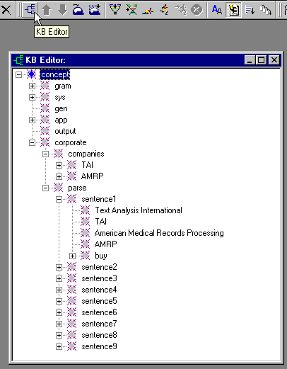
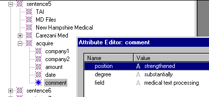

|  Debugging | Quick Tour** Knowledge Base** | Find  |
| --- | --- | --- |

**Knowledge Base**

A Knowledge Base or "KB" is like a database but differs in several respects: it is hierarchical and is managed *dynamically* by the analyzer. Databases are designed first, then used by programs. Knowledge Bases are used dynamically with text analyzers and change as the analyzer processes a text.

 Open the KB by selecting the KB Editor toolbar button. Open concepts by clicking the + to their left:

**Double-Click**

The corporate analyzer makes heavy use of the KB. Above, there are two areas under the "corporate" concept: "companies", and "parse". The companies area is static and is used in looking up synonyms of company names. The "parse" area is used by the analyzer to reconstruct the "corporate" world by creating concepts under each sentence concept, in tandem with processing an input text.

Below, we show the result of double-clicking on the "acquire" concept under sentence 5, then double-clicking on the "comment" concept. Note that the analyzer has created attributes that describe the "acquire" event:

**Next Section:** [Find ](../Find/Tour_Find.md)
