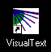
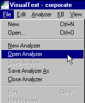
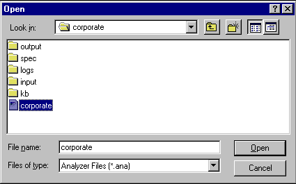
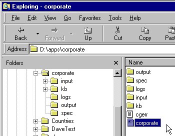

[← Help Contents](../../../index.md) | [📘 NLP++ Textbook](../../../NLP++_Textbook.md)

|  Screen Layout | Quick Tour** Loading the Analyzer** | Log Window  |
| --- | --- | --- |

**Open the "Corporate" Analyzer**

 (Actions for you to take are flagged by a yellow arrow at the start of a line.) Now it's time for you to load the Corporate Analyzer, which can be done in two ways. The first starts with double-clicking the desktop icon for VisualText:

The second is by double-clicking the icon for a particular VisualText analyzer. The icon for the Corporate analyzer looks like:

**Method One: Loading an analyzer within VisualText**

 Open VisualText. Next, choose "Open Analyzer" under the main menu "File":

 You are then prompted to choose an analyzer. Browse to c:\Program Files\TextAI\VisualText\apps\corporate and open the file named corporate.ana (it may be listed as corporate):

**Method Two**

 Locate the corporate analyzer in your Windows File Explorer window. Then double-click on the VisualText analyzer file (.ana). This will invoke VisualText and load the corporate analyzer:

**You are Now Ready to Start!**

Once you have VisualText and the Corporate Analyzer loaded, we can continue our tour.

**Next Section:** [Log Window ](../Log/Tour_Log.md)
