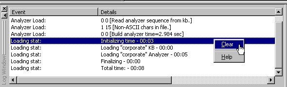

[← Help Contents](../../../index.md) | [📘 NLP++ Textbook](../../../NLP++_Textbook.md)

|  Load Analyzer | Quick Tour** Log Window** | Text Tab  |
| --- | --- | --- |

**Log Window**

In the bottom left-hand corner resides the Log Window, which monitors the status of the currently loaded analyzer. Analyzer load and run errors are shown in the Log Window.

**Next Section:** [Text Tab ](../TextTab/Tour_TextTab.md)
