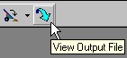
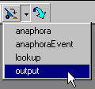
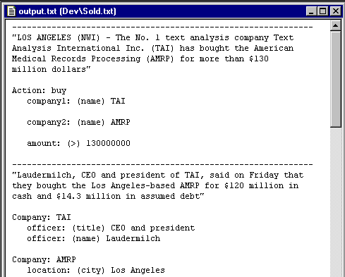

[← Help Contents](../../../index.md) | [📘 NLP++ Textbook](../../../NLP++_Textbook.md)

|  Running | Quick Tour** Output** | Parse Tree  |
| --- | --- | --- |

**Examining the Output**

 After running the corporate analyzer on the input text, you can now examine the output in either of two ways. One is to click on the "Output" button in the Debug Toolbar:

The second is to click the button next to the Output button and choose the "output" file from the available dump files:

**The Output File**

The output below shows the purpose of the Corporate analyzer, which is to extract and correlate key business information from the Sold.txt file. The name "output.txt" is a special file name in VisualText, that has its own button on the toolbar. If the analyzer does not output to a file called "output.txt", the button will be greyed out. Below is a portion of the output file from our Corporate analyzer. Take some time to examine the entire content of the output file in VisualText.

**Next Section:** [Parse Tree ](../ParseTrees/Tour_ParseTrees.md)
