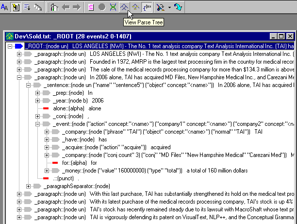
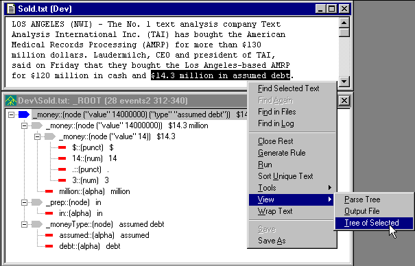

|  Output | Quick Tour** Parse Trees** | Ana Tab  |
| --- | --- | --- |

**Parse Trees**

VisualText builds multiple pass analyzers in which each pass uses the **parse tree** as modified by the previous pass. A parse tree is a data structure that records and groups patterns discovered in the input text. The elements of a parse tree are called nodes. Each line in the parse tree display below represents one node, or phrase, within the parse tree. Nodes may carry information in the form of node variables and values.

**Tree Buttons**

 Select the "events2" pass in the Ana Tab, then click the "View Parse Tree" button in the Debug Toolbar, as shown below.

In this way, you can view the parse tree for the pass that is currently selected in the Ana Tab. (Note: If the text has been analyzed with Generate Logs off, then the final parse tree is displayed.) The display shows patterns and groupings identified in the input text, as well as the node variables and their values as parenthesized lists of the form ("variable_name" "value1" "value2" ...).

Viewing Partial Trees:

VisualText also allows users to display partial parse trees for selected parts of the text. The phrase "$14.3 million in assumed debt" is highlighted in the text window and displayed in a parse tree window, below.

**Next Section:** [Ana Tab ](../AnalyzerTab/Tour_AnalyzerTab.md)
