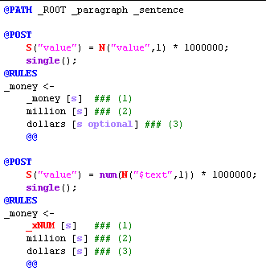
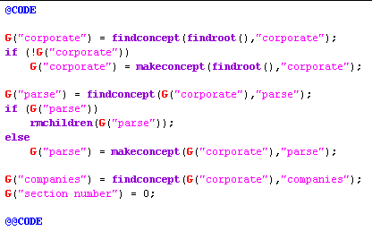

[← Help Contents](../../../index.md) | [📘 NLP++ Textbook](../../../NLP++_Textbook.md)

|  Ana Tab | Quick Tour** Pass Files** | Gram Tab  |
| --- | --- | --- |

**Heart of the Analyzer**

The heart of the text analyzer lies in the pass files, which contain NLP++ code and rules.

**Pass File Zones, Regions, and Selectors**

Pass file areas are marked by words that are blue, all-caps, and start with an "@". Three commonly used regions are detailed below.

| **AREA** | **DESCRIPTION** | **EXAMPLE BELOW** |
| --- | --- | --- |
| **@PATH** | A Selector that defines the context in which rules will be tried. | In the corporate analyzer, most paths are defined as applying to sentences under paragraphs,under the root node of the parse tree. |
| **@RULES** | Marks the start of a Rule Region. An NLP++ rule consists of a pattern (called a phrase) that is matched against the parse tree. | Below, the rules match patterns for constructs such as $120 million or 160 million dollars. **NOTE:** words with underscores (_money) are nonliterals, or abstract tokens, while those without match raw text ("dollars"); |
| **@POST** | When a rule matches, NLP++ code in the Post Region tells the rule matcher what actions to take. See the _money rules below. | Below, the numeric value for the money phrase is calculated and stored on the suggested node. |

**Code Region**

An NLP++ pass file includes a CODE Region that is independent of any rule matching. One example of this is in the third pass "initKB", where the analyzer constructs needed concepts in the Knowledge Base before processing the text:

**Next Section:** [Gram Tab ](../GramTab/Tour_GramTab.md)
