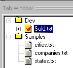
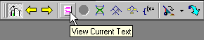
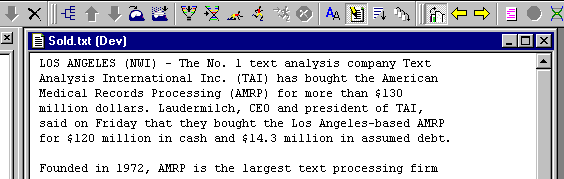
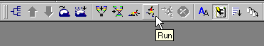
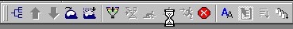
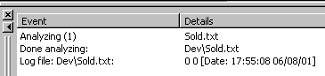

[← Help Contents](../../../index.md) | [📘 NLP++ Textbook](../../../NLP++_Textbook.md)

|  Text Tab | Quick Tour** Running the Analyzer** | Output  |
| --- | --- | --- |

**Running the Analyzer on Text**

 First, select the text you want to process, in the Text Tab:

 To view the text, either double-click on the text icon (above) in the Text Tab, or go to the Debug Toolbar and click on the "paper" button:

The text window pops up in the workspace:

**The Run Button**

 To run the analyzer on the selected input text, choose the running-man button in the Workspace Toolbar:

The cursor becomes an hour glass and the stop button is activated:

The Log Window will display stats about the run, including any syntax errors it discovered:

You have successfully run the corporate analyzer on our "Sold.txt".

**Next Section:** [Output ](../Output/Tour_Output.md)
