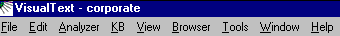
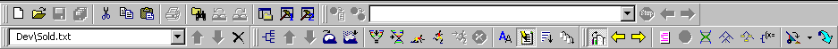
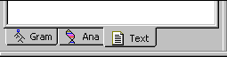
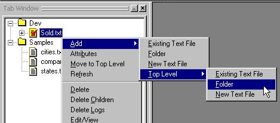

|  Intro | Quick Tour** Screen Layout** | Loading  |
| --- | --- | --- |

**Screen Layout**

The general screen layout of VisualText includes Toolbars, the Main Menu, the Tab Window, the Workspace, and the Log and Find Windows:

The principal controls are the Main Menu, the Toolbars, and the Tabs.

**Main Menu**

The main menu is a superset of the buttons available in the Toolbars:

**Toolbars**

VisualText has 5 toolbars: Main, Browser, Tab, Knowledge Base, and Debug:

The table below describes each Toolbar:

| **TOOLBAR** | **DESCRIPTION** |
| --- | --- |
| **Main** | Standard functions found in all GUI applications, including open, close, cut, and paste |
| **Browser** | Functions for managing web browser windows |
| **Tab** | Functions for managing the Gram, Ana, and Text Tabs |
| **Workspace** | Functions for the Analyzer and Knowledge Base |
| **Debug** | Tools for examining the input text file, trees, pass file, etc. |

**Tab Window**

The Tab Window area accesses three key windows: the Gram Tab, Ana Tab, and Text Tab.

The table below describes each:

| **TAB WINDOW** | **DESCRIPTION** |
| --- | --- |
| **Gram** | Manage user-added text samples for automatic rule generation |
| **Ana** | Manage the analyzer sequence and pass files |
| **Text** | Manage input files, output files, and other folders and files |

**Right Click Menus**

Right-click popup menus play an important role in VisualText. The Gram Tab, Ana Tab, Text Tab, Knowledge Base, Pass File Windows, Parse Tree Windows, Text Windows all employ right-click menus to provide context-sensitive functions quickly. Below is the right-click menu for the Text Tab:

**Next Section:** [Loading ](../Load/Tour_Load.md)
