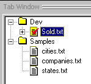
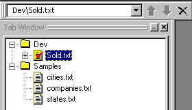
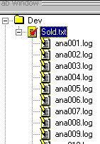

|  Log | Quick Tour** Text Tab** | Running  |
| --- | --- | --- |

**Choosing the Text to Process**

 Click the Text Tab and open the Dev folder within there.

 If Sold.txt has no red checkmark, then click Generate Logs in the Analyzer menu and select Run from the Analyzer menu.

The Text Tab is a repository for texts to be processed by your analyzer. You can organize text files in folders and run the analyzer on individual files or on entire subtrees of folders and files. Inside the "Dev" folder, we've selected the text file "Sold.txt" for processing:

**Choosing Previously Processed Text Files**

In the Tab Toolbar,a recent-text pulldown provides quick access to the most recently selected texts. This is useful when the Text Tab holds many files:

**Processed Text**

When a text has been processed, a "+" will appear in front of the icon and the icon will have a checkmark. You can open the text file icon and see the log files produced during the analysis (or "run") of the text:

**Next Section:** [Running ](../Run/Tour_Run.md)
