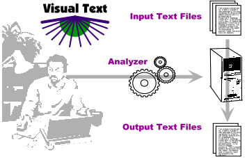

# What is VisualText?

VisualText™ is an integrated development environment (IDE) for creating text analyzers. What is a text analyzer? Any program that takes as input text data and produces an output result. Examples include programs that extract information to populate structured business databases, web page categorizers, email routers and autoresponders, chat managers, analyzers for text-from-speech, grammar checkers, and spell checkers. VisualText is very well suited to **information extraction** systems, that is, systems that find and correlate the critical information in a text. Information extraction systems typically produce records (e.g. XML) suitable for populating a database.

The figure below shows the development process using VisualText. A developer, using the VisualText IDE, creates a text analyzer. An input text file is given to the text analyzer, which processes the text and outputs a result.

VisualText encompass several language-processing methods as well as mixtures of methods. VisualText is an open architecture, enabling users to extend its core algorithms and functions. This flexibility enables users to conveniently and quickly develop text analyzers suited to their own purposes.
