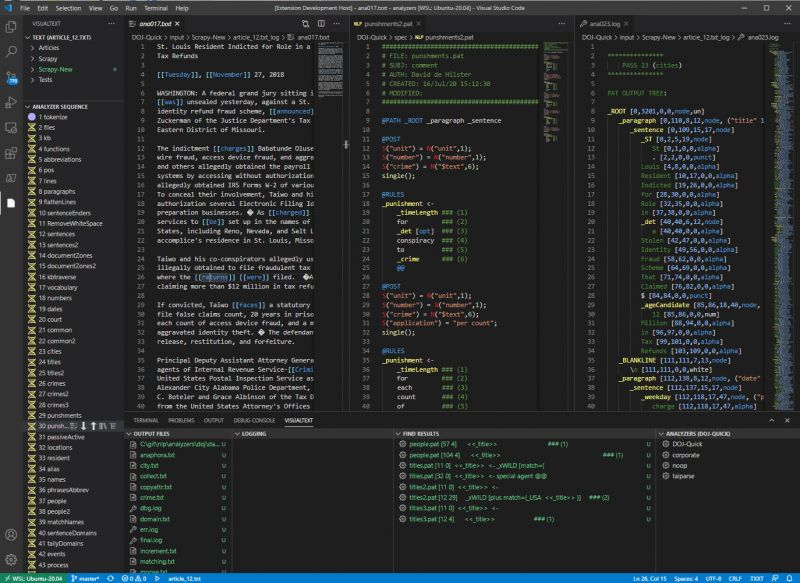

[← Help Contents](../index.md) | [📘 NLP++ Textbook](../NLP++_Textbook.md)

# What is VisualText?

VisualText™ is an integrated development environment (IDE) for building text analyzers
with **NLP++**. It began as a Microsoft Windows application more than two decades ago and
is now available as a VSCode language extension that runs on **Linux, Windows, and macOS**.

▶ **Quick start video:** [Getting started with VisualText](https://youtu.be/xGbGYj9ixv4)

A text analyzer is any program that takes text as input and produces a structured result.
Using VisualText you can create digital "human readers" that apply linguistic and world
knowledge to **parse, tag, interpret, and extract information from text** in a deterministic
way.

## The Only Language Dedicated to Natural Language Processing

NLP++ is the only computer language in the world exclusively dedicated to natural language
processing. Unlike statistical systems and large language models (LLMs), NLP++ does not
need training data. Instead, it relies on the ingenuity of the programmer to write code —
like any other programming language — that can parse text and extract information reliably
and repeatably. This makes NLP++ a strong choice to replace LLMs in agentic flows where
deterministic, inspectable behavior matters.

The first textbook on the NLP++ programming language is now available world-wide. See the
[NLP++ Textbook](../NLP++_Textbook.md) page for details.

## What You Can Build

NLP++ programmers commonly write analyzers that perform:

- Tagging of text
- Extraction of emails, dates, addresses, and similar items from unstructured text
- Entity extraction
- Full NLP parsing
- Sentiment analysis
- OCR cleanup
- Extraction of data from messy text
- Auto-generation of snippets from documentation

VisualText is especially well suited to **information extraction** — finding and
correlating the critical information in a text and producing records (for example, XML)
suitable for populating a database.

## Features

The VisualText IDE enables fast development of NLP++ analyzers and lets you:

- Quickly generate and edit NLP++ code
- Display the syntax (parse) tree in insightful ways
- Highlight text that has matched rules in each pass
- Display the knowledge base at strategic places in the analyzer sequence
- Easily edit and modify the pass sequence and the texts being analyzed
- Display NLP++ syntax errors
- Compile analyzers and knowledge bases to C++ libraries for faster execution and
  source-code protection in customer deployments
- Auto-generate rules
- Use extensive code snippets
- Look up help documentation

## The NLP Engine

VisualText is powered by the **NLP-ENGINE**, written in C++. It ships with the language
extension but is also available separately and can run as a stand-alone executable. The
engine supports **Unicode (UTF-8 via the ICU C++ package)**, including emojis.

## Compiling Analyzers

Beginning with Version 3, analyzers and the knowledge base (KB) can be compiled to C++
libraries. This provides two major advantages:

- **Faster execution.**
- **Protection of native NLP++ source code** when delivering analyzers to customers who
  do not have access to the NLP++ source.

Analyzers can be compiled either locally (using a C++ toolchain on your machine) or in the
cloud (no local toolchain required).

## Learning Resources

- **Quick start video:** [Getting started with VisualText](https://youtu.be/xGbGYj9ixv4)
- **NLP++ tutorial videos:** [tutorials.visualtext.org](http://tutorials.visualtext.org)
- **VisualText tutorial videos:** [vttutorials.visualtext.org](http://vttutorials.visualtext.org)
- **NLP Discourse forum:** [nlp.discourse.group](https://nlp.discourse.group)
- **Natural Language Understanding Global Initiative:** [nluglob.org](http://nluglob.org)

NLP++ and VisualText are 100% open source under the MIT license.
