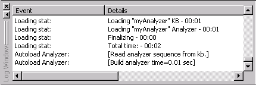

[← Help Contents](index.md) | [📘 NLP++ Textbook](NLP++_Textbook.md)

# Log Window

The Log Window displays basic information about an analyzer when an analyzer is opened as well as information about passes as they are processed and applied. It can be a valuable tool when debugging your analyzer.

## Types of Messages

Log Window messages are divided into [Informational Messages](VisualText_Interface/Log_Window_Messages.md#info_messages) and [Error Messages](VisualText_Interface/Log_Window_Messages.md#error_messages). Both types of messages provide a brief description of the activity in the "Event" column. A more detailed description of the activity is given under "Details". When an Error (or warning) Message is displayed, the pass file number and the line containing the error in the pass file is provided in the Details column.

One feature of the Log Window is the ability to open a pass file that has been flagged by an Error (or warning) Message. You do this by simply clicking on the Error line in the Log Window. The pass file is opened in the Workspace and the cursor is placed at the exact spot in the file with the error.

The Log Window display can be cleared by right-clicking in the Log Window and selecting **Clear**.

For more on messages displayed in the Log Window, see [Log Window Messages](VisualText_Interface/Log_Window_Messages.md).
