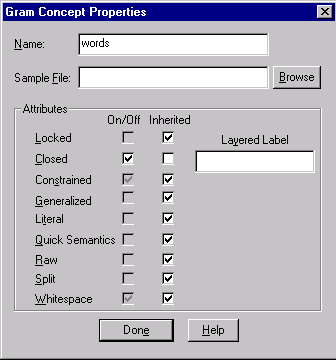

# Setting Rule Generation Properties

You can control the generation of particular rule sets by setting attributes for concepts in the Gram (or sample) hierarchy. These attributes control aspects of rule generation and specify actions to associate with generated rules.

## Gram Concept Properties

Properties are set using the **Gram Concept Properties** dialog (below). The dialog box is accessed from the Gram Tab by selecting **Properties** from the context menu. The various attributes in the Gram Concept Properties are outlined below.

| **Item** | **Description** |
| --- | --- |
| Name | Name of the current concept. |
| Sample File | Associated file of samples to import/export, if any. |
| Attributes | Controls for rule generation (see tables below.) |
| Done | Closes the Gram Concept Properties dialog. |
| Help | Launches Help documentation. |

## Attributes for Rule Sets

The user can choose to preserve or discard sets of rules that are automatically generated from samples. Some sets are useful primarily for debugging the rule generation process. They might also be useful in very highly specialized contexts within a text.

The Constrain rule set is by far the most generally useful set of rules.

| **ATTRIBUTE** | **VALUES** | **DESCRIPTION** |
| --- | --- | --- |
| RAW | **true/false/<NONE>** | Keep rules that collect each token of a sample into a list of all its suggested concepts. E.g., _abbrev <- _xWILD [s one match=(_city _state NY)] @@ |
| LIT | **true/false/<NONE>** | Keep rules that collect the most literal possible form of each token. NOTE: If parts of a sample are already reduced by prior rules, then the rule will not look as literal as expected. |
| CONSTRAIN | **true/false/<NONE>** | Keep rules that merge samples with same length and general composition, constrained as far as possible. E.g., given samples "1261 Starlit Dr." and "3 Elm St.", build a rule like @PRE <3,3> cap() <5,5> cap() @RULES _street <- _xNUM [s layer=(_number)] _xALPHA [s layer=(_name)] _poROAD [s layer=(_road)] \.[s] @@ |
| SPLIT | **true/false/<NONE>** | Keep unconstrained rules that merge samples as in GEN, with consistent labeling (i.e., layering). E.g. _street <- _xNUM [s layer=(_number)] _xALPHA [s layer=(_name)] _xALPHA [s layer=(_road)] \.[s] @@ |
| GEN | **true/false/<NONE>** | Keep rules that merge samples with same length and general composition. E.g., _street <- _xNUM [s] _xALPHA [s] _xALPHA [s] \.[s] @@ |

Each literal rule is labeled as completely as possible, depending on other samples that the rule merged with.

## Miscellaneous Attributes

| **ATTRIBUTE** | **VALUES** | **DESCRIPTION** |
| --- | --- | --- |
| CLOSED | **true/false/<NONE>** | (Operates on LABEL concepts. If set for a nonlabel concept, applies to every element of every rule in the subhierarchy). Merge the literal values due to each sample, rather than building generalized elements such as **_xALPHA** and **_xNUM**. |
| LAYER | **string** | Create a **layer** key-value pair in the suggested concept for rules in the Gram subhierarchy. E.g, layer=_Caps will create rules like _city [layer=(_Caps)] <- New [s] York [s] @@ |
| QUICKSEM | **true/false/<NONE>** | Create semantic variables in the suggested concept of rules, using label concepts to name the variables. E.g., if the Gram hierarchy has a rule concept humanName and under it the label concepts firstName and lastName, then the rules built for humanName will create variables called firstName and lastName with the appropriate text as their value. Generates NLP++ POST Actions such as S("firstName") = N("$text",1); S("lastName") = N("$text",2); |
| LOCKED | **true/false/<NONE>** | If true, keeps the rule generator from traversing the locked subtree. If there are new samples, the rule generator will override the lock on the concepts owning the samples. |
| DIRTY | **true/false/<NONE>** | [INTERNALS] True if the subtree will have rules for it regenerated with a ***Generate Dirty*** menu item. To set this manually in VisualText, use the ***Mark For Generation*** menu item. |
| XWHITE | **true/false/<NONE>** | Expand any whitespace present in a rule to an element like **_xWHITE [s star]**. (That is, zero or more white spaces.) |

**Inherited attributes** - By setting attributes at a concept, the entire subtree under that concept inherits those attribute values. In this way, the user can quickly control the way rules will be generated for an entire sub-hierarchy. This method also enables the user to override the settings wherever desired.

**Default attribute values** - The CONSTRAIN attribute and the XWHITE attribute are true except where overridden in the Gram Hierarchy. Similarly, all other attributes are empty or FALSE, as appropriate.
