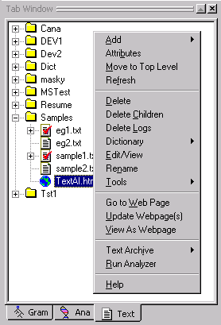
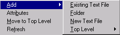
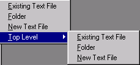
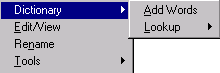
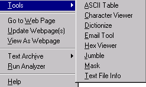
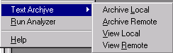

[← Help Contents](index.md) | [📘 NLP++ Textbook](NLP++_Textbook.md)

# Text Tab Popup

The Text Tab Popup menu is launched by right clicking in the Text Tab Window.

| **Menu Item** | **Description** |
| --- | --- |
| Add | Submenu for adding new or existing text files to a project, a new folder under a selected folder, or a new top level folder. (See below.) |
| **Attributes** | Launches the Attribute Editor dialog and displays the attributes belonging to the selected file or folder in the Text Tab. User has option to delete, add or change names of attributes and values. |
| **Move to Top Level** | Moves selected folder to the top level (i.e. leftmost edge) of the Text Tab. |
| **Refresh** | Refreshes the Text Tab display. |
| **Delete** | Deletes selected file or folder in the Text Tab. |
| **Delete Children** | Deletes the children of a selected folder but keeps the folder itself. |
| **Delete Logs** | Deletes selected log file. Each log file contains a representation of one pass of the analyzer sequence. When archiving an analyzer by creating a zip file, there's no need to save the intermediate parse files since these files can always be regenerated. Delete Logs can be used to remove these files before archiving. |
| Dictionary | Submenu to perform dictionary related functions. (See below.) |
| **Edit/View** | Displays selected file in the Workspace. Same effect as double clicking on the file. |
| **Rename** | Launches a dialog box to rename selected file or folder. |
| Tools | Submenu for accessing VisualText tools. (See below.) |
| Go to Web Page | Opens a browser for selected html file. |
| **Update Webpage(s)** | Updates selected URL(s). |
| View As Webpage | Displays selected html file as a web page. |
| Text Archive | Submenu for archiving Text Tab files and folders. (See below.) |
| **Run Analyzer** | Runs analyzer on selected file. Same function as selecting the Run button on the Workspace Toolbar and **Run** from the Analyzer Menu. |
| **Help** | Launches VisualText Help documentation. |

## Add Submenu

| **Menu Item** | **Description** |
| --- | --- |
| **Existing Text File** | Displays Open dialog to select path and name of existing file. |
| **Folder** | Displays prompt to enter new folder name. |
| **New Text File** | Displays prompt to enter new file name. |
| **Top Level** | Submenu for adding a folder or file to the top level (i.e. leftmost edge) of the Text Tab. |

## Add Top Level Submenu

Add an existing file, a new file, or a folder to the top level of the Text Tab. The items in this menu are analogous to the items in the **Text Tab Popup > Add **menu.

## Dictionary Submenu

The Dictionary menu option allows you to perform dictionary related functions.

| **Menu Item** | **Description** |
| --- | --- |
| **Add Words** | Adds the words in a selected file to the dict hierarchy in the Knowledge Base. Only single words can be added to the dictionary. (If a word list contains a phrase, only the first word of the phrase is added.) File name and words added to the dict hierarchy are displayed in the Log Window. |
| Lookup | Selecting Lookup displays the online dictionaries specified in the Dictionary Lookup Preferences tab. Selecting an option in the Lookup menu starts a search in the online dictionary source. See Dictionary Lookup for more information on using this tool. |

## Tools Submenu

| **Menu Item** | **Description** |
| --- | --- |
| **ASCII Table** | Displays the ASCII Table. ASCII Table displays the decimal and hexadecimal numbers and their corresponding ASCII characters. |
| Character Viewer | Displays the Character Viewer for the selected file. Character Viewer shows the line number, cumulative count of total characters seen per line, characters on a line, and ASCII characters for each line of text in selected file. Under each line is the hexadecimal value of each character above it. |
| **Dictionize** | Activates the Dictionize Tool. |
| Email Tool | Launches the Email Tool. Email Tool enables sending email directly from the VisualText interface. |
| Hex Viewer | Launches the Hex Viewer. |
| **Jumble** | Activates the Jumble Tool. This tool jumbles the letters in words in a text file. This tool is useful when looking for structural clues in a text, since it removes distracting content. Paragraph and sentence structure are preserved. |
| **Mask** | Activates the Mask Tool. This tool takes alphabetic content of a text with strings of the single letter 'a', but leaves the form, the non-alphabetic structure, including punctuation and white spaces. This tool is useful when looking for structural clues in a text, since it removes distracting content. |
| Text File Info | Displays the Text File Info dialog. This tool provides statistics about the selected text file, including creation date, character, word and line counts. |

## Text Archive Submenu

**Text Archive** is used to view and create archives of the text files in the Text Tab either on remote servers or on local machines.  Archiving is used to create quick backups of your work and to facilitate communication between developers working on the same analyzers.  To set archiving preferences, select **Preferences** under the File Menu and click on the **Archiving** tab.

| **Menu Item** | **Description** |
| --- | --- |
| **Archive Local** | Launches a dialog box to create a local archive of the current files and folders in the Text Tab hierarchy. The name of the archive defaults to the name of the current analyzer suffixed with the current date and time. |
| Archive Remote | Launches a dialog box to create a remote archive of files the Text Tab. The name of the archive file defaults to the name of the current analyzer suffixed with the current date and time. Archive is created on the remote server. |
| **View Local** | Displays local archives in the Text Archive > View Local dialog. Presents options to delete, rename, upload (send to server) or load into current analyzer Workspace. Listings in archive can be sorted by clicking on column headers. |
| **View Remote** | Displays server archives in the Text Archive > View Remote dialog. Presents options to delete, rename, download (send to local archive) or load into current analyzer Workspace. Listings in the archive can be sorted by clicking on column headers. |
