# Tutorial 1 - Creating a New Analyzer

In Tutorial 1, you create and run a simple text analyzer. You give the analyzer a name and a location, select an initial template, and save the analyzer. Then you exit VisualText™ and reload the analyzer you created. We also introduce the Tab Window and the Log Window portions of the interface and explain how to create an input file. Finally, you run the analyzer and view the parse tree, which holds the patterns matched in a text.

## Startup

 Launch VisualText by double clicking on the VisualText icon on your desktop (or from Start button > TextAI > VisualText).  You should see the following screen:

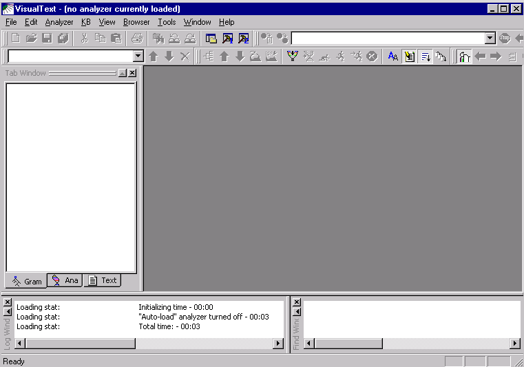

 If your toolbar area does not look like the above, right-click the mouse in the toolbar area, then enable all the toolbars.  We recommend rearranging them as shown.

Take a moment to familiarize yourself with the interface, which divides into three general areas: toolbars, windows, and a workspace.

The various** **toolbars** **give you access to commonly used functions. In Tutorial 1 you will mostly be working with the Main Toolbar. (See the [Interface Overview](../../VisualText_Interface/Interface_Intro.md#Interface_Overview) section for the naming of the VisualText components).

At the bottom of the Main Window, you'll see the Log Window and the Find Window (VisualText 2 separates these into tabs). This is where you will be creating and monitoring your analyzer. You will learn more about the Main Window later in this tutorial. The Workspace is where you can view and manipulate files and tools for building and running text analyzers. For more details on the function of all of the windows, toolbars and menus, see the [Interface](../../VisualText_Interface/Interface_Intro.md) section of this manual.

## Create Analyzer

Now, let's create a new analyzer.

 Select **File > New Analyzer **from the Main Menu. Note the title bar "VisualText - (no analyzer currently loaded)" below:

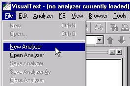

A New Analyzer dialog box appears.

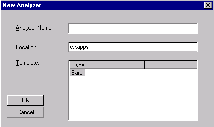

 Give the analyzer the name **myAnalyzer**.

 For location, give the following path **C:\apps\myAnalyzerFolder**

 For template, choose** Bare.**

A template is a starter or skeletal analyzer that you can copy and modify. The Bare template analyzer is a minimal analyzer and with a single* *pass calle*d tokenize. *The tokenize pass is discussed later in this tutorial.

* *Click **OK**. You now see a VisualText splash screen appear on the screen.

After a few seconds, the VisualText title bar reads "VisualText - myAnalyzer."

When new analyzers are created, VisualText makes a directory structure in the working directory. For this analyzer, VisualText created the following directory structure in c:\apps*:*

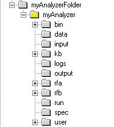

This folder structure houses all the information needed to run the analyzer, including folders for input and output, a folder for the knowledge base, etc. The analyzer you just created, myAnalyzer, refers to this entire directory structure. The set of related files and directories under myAnalyzer is called a **project** in VisualText and other development environments. For a detailed description of an analyzer project, see [Structure of Analyzer Projects](../../VisualText_Basics/Structure_of_Analyzer_Projects.md).

One important file automatically generated in the myAnalyzer folder is **myAnalyzer.ana**, which organizes your project. When you load an analyzer, you do so by opening the myAnalyzer.ana file.

## Exit and Load Analyzer

Now we exit the program.  (Note that the Help should stay as-is, as a separate program.)  Launch VisualText again to continue with Tutorial 1.

 Select **File > Exit **from the Main Menu.

 To load the analyzer you just created, invoke VisualText and select **File > Open Analyzer**.


 Use the Open dialog to navigate to **C:\apps\myAnalyzerFolder\myAnalyzer**:

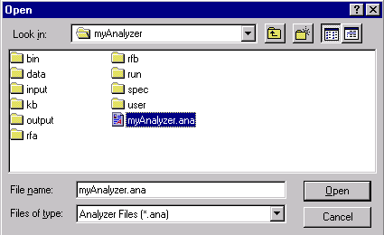

 Select **myAnalyzer.ana**, then select **Open**.

This step loads the analyzer.

Once an analyzer is open, be careful to distinguish between **File > Open...** which opens a file into the Workspace area, and **File > Open Analyzer, **which enables you to close the current analyzer project and browse to an .ana file of another project.

## Main Windows

Three large windows comprise the analyzer work area: the Log Window, located in the lower left corner of the VisualText interface, the Tab Window located in the upper left portion of the interface and the Find Window** **located in the lower right corner. You can resize, dock and dismiss these windows as you choose.  If you close a window and want to reopen it, use the toggle buttons on the main menu toolbar:


The leftmost button toggles the Tab Window.

The left hammer toggles the Log Window while the right hammer toggles the Find Window.

## Log Window

The Log Window gives you some basic information about an analyzer when you open it. It also displays information about rules as they are processed and applied to text you are analyzing.

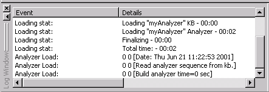

Here it displays the time it took to load the minimal analyzer (myAnalyzer) and its associated knowledge base (KB).

When an error occurs or other information needs to be reported to the user, it is displayed in the Log Window. For typical messages displayed in the Log Window, refer to [Log Window Messages](../../Log_Window.md).

## Tab Window

There are three tabs in the Tab Window: Gram, Ana and** **Text.

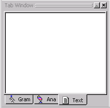

- **Gram** is where you manage samples taken from input texts.

- **Ana** is where you control the text analyzer sequence, passes, and pass files.

- **Text** is where you manage text input and output files.

VisualText is an integrated development environment (IDE) for creating text analyzers. It gives you access to all the machinery you need to create an analyzer in a single framework. The Gram, Text and Ana tabs are essential parts of the machinery. Generally speaking, you view and manage the input and output files through the Text Tab; the text analyzer sequence, passes, and manually-edited rules in the Ana Tab; and the automatically-generated rules in the Gram Tab.

The Tab Window can be resized by dragging the right edge of the window towards the left. When resizing the window hides one of the tabs, you can use the toggle arrows to find it.

 Familiarize yourself with each of the tabs in the Tab Window, by selecting the tab (Ana, Gram or Text) and with the cursor in the window (not directly on the tab), right clicking to bring up the popup menu.

You'll be working with a few of these popup menu items in this tutorial. But for a detailed list of the various functions available in the Tab Window, see [Popup Menus](../../VisualText_Interface/Popups/Popup_Menus.md) in the Interface section of this guide.

 Click on the **Gram Tab** and then on the **Text Tab**.

Notice that nothing is contained in either of these tabs. By default, these two tabs are left empty. As you add input texts, analyze them, and sample information from the texts, you will create data in these two areas.

 Now click on the **Ana Tab.**

Notice that it is not empty.** **The** **Ana Tab comes with a built-in default pass, the **tokenize** pass.  A pass is a discrete step in the text analyzer, with its own **pass algorithm**. The main pattern-matching pass type in VisualText (called **pat**) uses a **pass file**, which consists of NLP++™ code and rules. NLP++ is a general purpose programming language that is integrated with both a grammar and a hierarchical knowledge base management system (KBMS). This tight, three-way coupling is ideal for developing text analysis applications. NLP++ code can manipulate the parse tree and attach information to it, as well as access and modify knowledge used during text analysis.

The **tokenize** pass algorithm is a system pass and does not have an associated pass file. **Tokenize** executes first, traversing the input text to convert it to a structure called a **parse tree**.  As you add new passes to the Ana Tab, they become part of the stepwise sequence executed when the text analyzer runs on an input text. Each pass typically updates the parse tree with patterns that it identifies. As we'll see, NLP++ enables a pass to also manipulate the information in the parse tree and the KB.

## Find Window

The last of the Main Windows is the [Find Window](../../Find_Window.md#Find_Window). It is used to display search results when running a search on texts. Since we don't have any text to search yet, we won't be able to use this window now.

## Add Text File

Now we need some text to analyze.  In VisualText you have the option to use existing text files or to create new text files. For this tutorial, we'll create a text file from scratch.

 Click the **Text Tab**.

Then, with the cursor in the white area of the Text Tab, right click in the window to bring up the Text Tab Popup Menu.

 Select **Add > New Text File**:

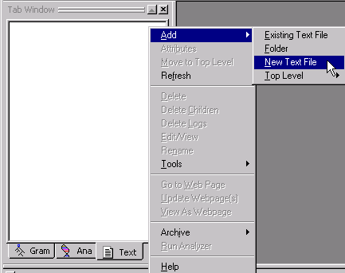

 Name the file **eg1** (and don't include an ending such as **.txt**).

 Click **OK**.

Notice that a file called **eg1.txt** has been added to the Workspace and that the file has also been added in the Text Tab. The default extension .txt is automatically added to the file name. "**input**" after the file name indicates the file is located in the input folder.

In addition to text files, you can use binary or formatted text files such as html as input.

Your Tab Window and Workspace should look like this:

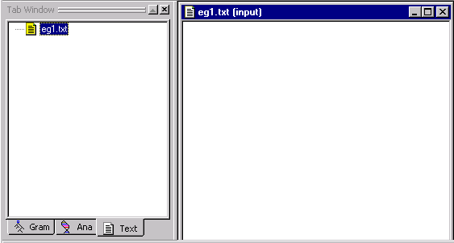

 Now, type the following text in the **eg1.txt** file:

```
The quick brown fox jumped over the lazy yellow dog.

John gave the book to Mary.

Susan kissed the little baby's cheek.
```

An asterisk ***** is added to the top of the file indicating the file has changes which have not been saved.

 To save the file, put the cursor in the body of the text file and right click to launch the Text File Popup Menu:

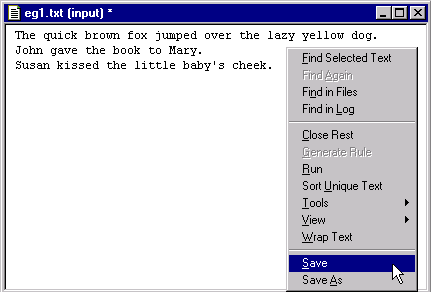

 Select **Save**.

You can also save files in the Workspace with the **Save** button  located on the Main Toolbar.

The file is written to the following directory:

```
C:\apps\myAnalyzerFolder\myAnalyzer\input
```

When you are supplying your own files, you would copy them into this same directory.

If you do add existing text files to the directory, it will be necessary to refresh the Text Tab. You can refresh by putting your cursor inside the Text Tab Window, right clicking and selecting **Refresh** from the Text Tab Popup Menu. Note that in this case you will get a dire-looking message saying that "all knowledge associated with text files" will be lost if you refresh. You can safely ignore that message and continue to refresh. (It refers to attribute knowledge that one could add to text-file concepts in the knowledge base.)

## Run Analyzer

Now that we have some text, we are ready to run the analyzer. Recall that the analyzer at this point is made up of one default rule pass:** **tokenize.

So that you can see each step in the analyzer sequence, select** Generate Logs** button  on the [Workspace Toolbar](../../VisualText_Interface/Toolbars/Toolbar.md#KB_Toolbar). (When the button is depressed, it appears indented.) When you run an analyzer with Generate Logs on, log files will be created so that you can get detailed information about each step of the analyzer sequence, which can help you debug your analyzer. You'll learn more about generating logs in later tutorials.

 Select **eg1.txt** in the Text Tab**.**

 Click the **Run** button  on the Workspace Toolbar to "run" the analyzer.

Notice that information about the application of rule passes is displayed in the Log Window.** **Here it lets you know the name of the text being analyzed and the date the file is processed.

We recommend keeping the **Verbose Mode** 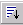 button TURNED OFF, as it has no useful function at present. It is always a good idea to check the Log Window when creating your analyzer since this is where error messages will show up.

## View Parse Tree

Now that we applied the tokenize pass to the input file,  we can look at one output of the analysis, called the **parse tree**.

When the analyzer is run on a text, it first converts the sequence of characters to "tokens" or "lexemes" and places them under a root.  This constitutes the initial parse tree.  Subsequent passes modify the parse tree as they match new patterns within it.  A parse tree is similar to the sentence diagramming taught in elementary school where you break a sentence down into parts such as nouns, verbs, noun phrases, verb phrases, subjects, objects, etc.  Each pass in a VisualText analyzer takes as input the accumulated parse tree built by all the prior passes.

There'll be a lot more information about passes and trees later on in these tutorials, but for now, let's take a look at the parse tree you just built for the eg1.txt file.

 Select **eg1.txt** in the Workspace.

 Right click to bring up the **[Text File Popup Menu](../../VisualText_Interface/Popups/Text_File_Popup.md)**.

 Select **View > Parse Tree:**

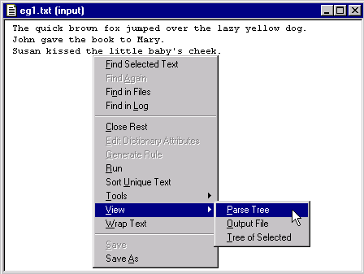

VisualText displays a parse tree for the text file in a new window.


Notice the title of the window, 'eg1.txt: _ROOT [1 tokenize 0-119]' and the graphic that precedes the title, the parse tree graphic. The title lets you know that this is the parse tree for the file eg1.txt and it corresponds to the first pass in our analyzer sequence (1 tokenize) and also that 119 characters were tokenized. If you don't have 119 this just means that there may have been some extra spaces or carriage returns in your file.

The parse tree consists of **nodes**. Each line in the parse tree represents a single node. Our parse tree starts with the **node** _ROOT. The root of the parse tree covers the entire input text.

Nodes 'contain' text and other nodes and are said to be either terminal or non-terminal. A node is non-terminal if it dominates other nodes and terminal if it does not. As you can see, there is only one non-terminal node in our parse tree, _ROOT. All of the elements in our sentences, right down to the punctuation are dominated by _ROOT. The other nodes in our parse tree are terminal nodes. The terminal nodes are like the 'leaves' or end point of the tree and do not dominate anything else.

Each terminal node contains the following: the node name, the token type and the text from the file. The first terminal node under ROOT is 'The::[alpha] The'. This means that the input text has as its first terminal node 'The' and that the text 'The' is a sequence of alpha characters. The next terminal node in the file is \_ which means a white space, ie the white space after the word 'The'. (More on the literal use of \ will be discussed in later tutorials.)

As you may have found, you can distinguish between terminal and non-terminal nodes by the symbols used in the parse tree. The non-terminal nodes are indicated by an arrow and the terminal nodes are indicated by a thin, rectangular bar. A non-terminal node will be blue when selected and grey otherwise. A terminal node is red unless it is selected at which time it will turn blue. You can collapse and expand nodes by clicking on the + and - symbols.

If you want to see the details of the analyzer run, you can look at the log files located under the eg1.txt file in the Text Tab Window.

 Click the "**X**" in the upper right-hand corner of the eg1.txt and parse tree files to close them.

 Exit the analyzer by selecting **File > Exit.**

 (In some versions) answer **No **at the confirmation prompt for saving the knowledge base.

## Summary

In this tutorial, we created an analyzer, gave it a name and a location, selected a template, saved it, exited and reloaded it. We introduced the Tab Window with the Text Tab, Ana Tab and Gram Tab. We looked at the Log Window, then gave our analyzer some text to analyze. Finally, we analyzed the text using the default system pass tokenize and viewed the resultant parse tree.
