[← Help Contents](../../index.md) | [📘 NLP++ Textbook](../../NLP++_Textbook.md)

# Tutorial 2 - Rules From Sample Data

In Tutorial 1, you saw an analyzer with a single pass, the tokenize pass. Recall that the tokenize pass is nothing more than a set of rules and instructions that tell the analyzer what to do. In Tutorial 2, we will learn more about generating rules in VisualText™ to create passes in the analyzer sequence.

VisualText supports two basic ways of generating rules in pass files: hand-built and automatic.  In this tutorial, we introduce automatic rule generation. Automatic rule generation results in the automatic creation of passes in the analyzer sequence. In order to do this, we will also learn about adding and sampling texts. Any text analyzer can be easily enhanced by adding samples as shown in this tutorial. Here are the steps for setting up this capability:

- Create **a placeholder, or stub, for the automatically generated passes

- Create a set of concepts, each representing a set of rules

- Populate the concepts with samples

- Generate rules from the sample data

After we have VisualText generate our rules, we will analyze our text and inspect the results.

Let's start with the analyzer we finished in Tutorial 1.

 Double click on the VisualText icon on your desktop.

 Load the analyzer you built in Tutorial 1, this time by selecting File > Recent Analyzers and selecting

```
C:\apps\myanalyzerfolder\myanalyzer
```

If you want to start with the ready-made analyzer in the docs folder, unzip the contents of:

```
C:\Program Files\TextAI\VisualText\docs\tutorial1\myAnalyzer1.zip
```

and place the myAnalyzer folder in the working directory:

```
C:\apps\myAnalyzerFolder
```

## Create a Stub

Our first step is to create a stub. A stub is a placeholder for a sequence of passes that will be generated automatically. You are setting aside an area for the automatic rule generator to create the rules for you.

 In the [Tab Window](../../VisualText_Interface/Tab.md), click on the Ana Tab and select the tokenize pass. (The stub will be inserted after the pass you select in this step.)

 Now go the Gram Tab, move cursor into the window and right mouse click to bring up the [Gram Tab Popup Menu](../../Gram_Tab_Popup.md).

 Select Add > Stub.

This will create a new stub in the sequence of passes after tokenize. (You have to select the tokenize pass in the Ana Tab to make sure the stub will be inserted in the correct place.)

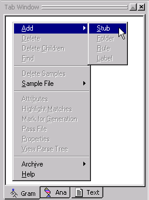

 In the dialog box, name the stub words.

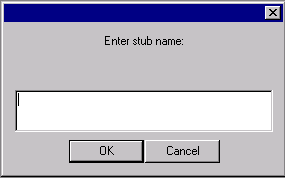

 Click OK.

The stub words has been created in the Gram Tab.

When a stub is selected in the Gram Tab, it will appear in blue. Stubs which are not selected will appear in green.

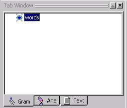

When you create analyzers, you can choose whatever name you like for a stub. We called our stub words because we are going to take the *words* from the sentences in our eg1.txt file and use them as samples to generate our rules.

## Add Rule Concepts

Now that we have a words stub, our next step is to create a set of rule concepts under words. A rule concept is a concept that "owns" a set of related samples, from which the rule generator will generalize, merge, and generate rules.

The rule concepts we will create correspond to the classic syntactic categories of noun, verb, determiner, adjective, etc.

 (Make sure the words concept selected.) Right click In the Gram Tab, to bring up the [Gram Tab Popup Menu](../../Gram_Tab_Popup.md).

 Select Add > Rule.

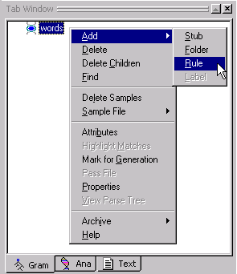

 In the Dialog box, add the rule names det, adj, noun, verb, prep like the image below:

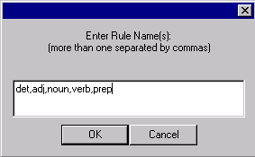

 Click OK.

Your Gram Tab should look like this:

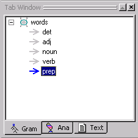

When you create analyzers, you can create any type of rule concept you want or need.  For example, if you have text that contains urls or email addresses and you want your analyzer to recognize them, you could create a rule concept for urls and another one for email addresses. Being able to create rule concepts as they are needed is one of the nice features of VisualText.

## Add Folder Concept

We only have five rule concepts in this example. But as you begin to create analyzers, your analyzer may require many more rules.

In order to organize rule concepts, VisualText uses a special concept called a folder concept. Folder concepts allow you to organize collections of rule concepts.

Our rule concepts, det, adj, noun, verb and prep can be classified as parts of speech. We'll create a folder to organize our rule concepts.

 In the Gram Tab, click on the words stub to highlight it.

 Right-click to bring up the Gram Tab Popup Menu and select Add > Folder:

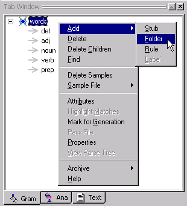

 Name the folder pos (for part of speech).

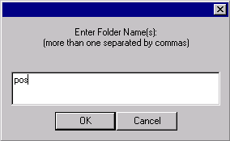

 Click OK.

You should see the following structure:

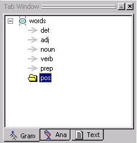

 Select each rule concept one by one and drag it into the pos folder.  (Easiest to drag the bottom rule concept first, starting with prep.)

The rule concepts should be under the pos folder (*under* meaning *below and indented* with respect to pos) as in the image below.

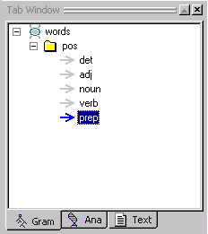

 Use the yellow up and down arrows on the Tab Toolbar to move the concepts in the pos folder so that they look like the image here.

 You can save your work with File > Save Analyzer...

 ...and answer Yes at the confirmation prompt.

 Also Yes to save the knowledge base, as the Gram Tab information resides in the knowledge base.

## Sample the Data

Now we are ready to start populating our concepts with samples from eg1.txt. By "populate" we mean "fill in" or provide each of the rule concepts with example text ("samples") of what each rule concept is. The samples you add are called sample concepts.

CAVEAT!  It is a good time to make sure your text file doesn't have any errors in it. ONCE YOU START SAMPLING DATA FROM A FILE, DO NOT EDIT THAT FILE.  The Gram Tab depends on the offsets of text samples in files, so that it can use the context of the samples to build proper rules.  Even adding a blank line will invalidate the samples following it.  (Adding material to the very end of such a file, or editing so as to preserve exactly the same number of characters, are doable if needed.)  In a "real" analyzer, we recommend putting files to be sampled in specially designated folders and making them READ-ONLY.

 Once you have created eg1.txt, CLOSE THE FILE.  VisualText strips linefeed characters from text files when it reads them, and this needs to happen *before* you start highlighting samples.

 In the Text Tab, double click on the eg1.txt file to open it in the Workspace. Make sure everything is correct in the file.

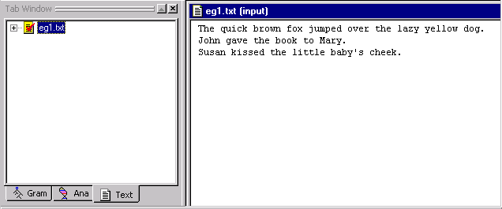

First we'll add samples of nouns to populate the noun rule concept.

 In the Gram Tab, select the noun rule concept. Notice that the arrow turns blue.

The first noun in our text file, is fox.

 Highlight fox and right click to bring up the popup menu.

Notice how the noun rule concept has been added to the bottom of the popup menu. It appears in the popup menu because noun has been selected in the Gram Tab Window.

 Select noun.

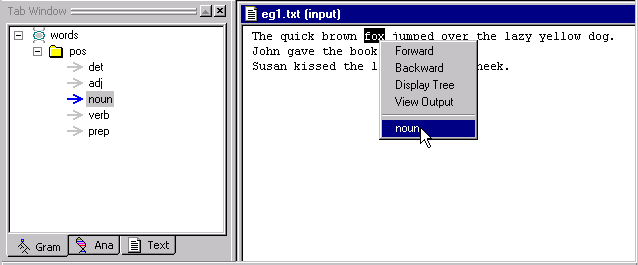

Look at the noun rule concept in the Gram Tab. The noun fox has been added as a sample concept *under* the noun rule concept. Sample concepts are indicated by the little square icon.

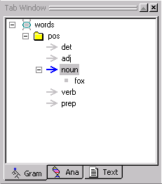

To add samples to the other rule concepts in the pos folder, simply select the rule concept in the Gram Tab and follow the same procedure.

There is an alternative to selecting samples by selecting individual rule concepts in the Gram Tab. By selecting the pos folder instead, all of the rule concepts in the pos folder will be listed when you right click after highlighting a word in the text.

 Select the pos folder in the Gram Tab.

 Select dog in the text and right click to bring up the menu.

Notice that all of the rule concepts, det, adj, noun, verb and prep appear in the popup menu. It may be easier for you to sample text this way.

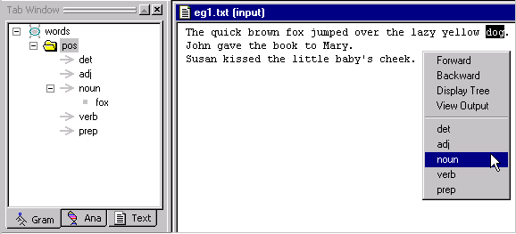

 Select noun.

 Continue adding samples to the rule concepts until all the words in eg1.txt have been added to the appropriate rule concept.

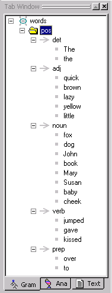

| Note: Make sure you select baby and not baby's. |
| --- |

You have just created a sample hierarchy. (This is also referred to as the Gram hierarchy since you can view it in the Gram Tab.) The sample hierarchy organizes our rule concept samples.

It is a good idea to get in the habit of saving your analyzer often. Now in particular, since the creation of the words stub has modified the analyzer sequence, is a good time to save the analyzer.

 To save the analyzer, select File > Save Analyzer.  (And/or KB > Save KB, as available.)

 Answer Yes at the confirmation prompt.

Since data has been added to the concepts in the Gram Tab, our Knowledge Base (KB) has changed. When you save the analyzer, you are also saving the Knowledge Base.

## Set Concept Properties

In VisualText you can control the way rules are generated. You do this by setting certain properties for rule concepts in the Gram Tab.

In this tutorial, we are concerned with setting only one of the properties, the Closed attribute. The Closed attribute specifies that automatically generated rules will consist of a closed set of words, as collected from the samples you, the user, provided. By setting this attribute you are controlling the way rules get generalized.

(For more information about Gram concept properties, see [Setting Rule Generation Properties](../../Setting_Rule_Generation_Properties.md).)

 Select the words stub in the Gram Tab.

 Right click to bring up the [Gram Tab Popup Menu](../../Gram_Tab_Popup.md).

 Choose Properties.

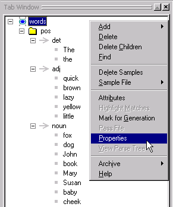

 In the Gram Concept Properties dialog, uncheck the Inherited box for the Closed attribute.

 Now place a check in the On/Off box.

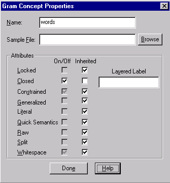

 Click Done when you are finished.

## Generate Rules

Now let's have VisualText automatically generate some rules for us from the sampled data.

If we take a look at our analyzer sequence in the Ana Tab, you will see the following:

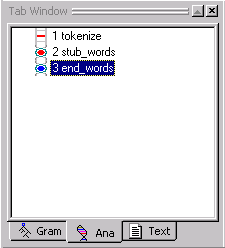

Notice that our stub concept words has a start, stub_words and an end point, end_words. This is called the stub region. We would call this stub region the words stub region. Remember that we created the stub region because we needed a place for the automatically generated passes to be inserted. Once we generate rules, the stub region will get filled in.

 From the Analyzer Menu, select Generate Rules > All.

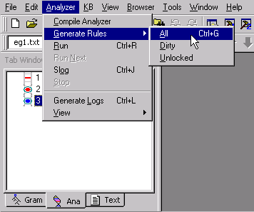

Now look at the stub region.

Additional passes appear in our analyzer sequence. Each of the new passes contains rules generated from the rule concepts we created earlier in this tutorial. VisualText did this by taking the samples we provided in each of the rule concepts.

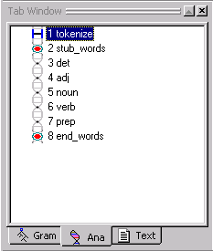

Notice that the [Log Window](../../Log_Window.md) has also changed.  It says Generating rules: start then Generating rules: done. This window is just telling you that VisualText has started and completed the task of generating rules. If there had been problems generating the rules, error messages would have been displayed here.

Let's take a look at the rules VisualText created.

 Select the noun pass.

The link in front of 5 noun turns blue and the text gets a grey box indicating that it is selected.

 Double click on the noun pass to open the pass file.

The noun pass file, automatically generated from the samples you added to the Gram Tab, is displayed in the Workspace. This pass file (also called rule file since it contains rules) is stored in the spec folder of the myAnalyzer directory. The name of the pass file is noun.pat. You'll learn more about pass file names in Tutorial 3.

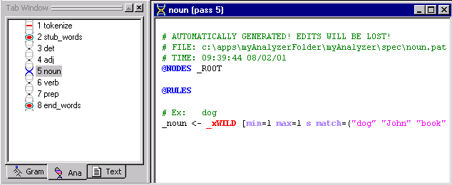

The form of the pass file is discussed in a later tutorial, too. But generally what the above rule "says" is that every time the analyzer runs across one of the words listed in parentheses (e.g. "dog", "John", etc.), these words should be classified as "noun". In Tutorial 3, you'll see how this automatically-generated rule can be helpful.

## Run Analyzer & Inspect Parse Tree

Now that we have some extra passes in our analyzer sequence, let's run the analyzer to see how our parse tree changes.

 Double click eg1.txt in the Text Tab to bring the file to the front of the Workspace.

| Note: This step is optional if eg1.txt appears in the current text panel within the Tab Toolbar. This will let you know what text will be analyzed. |
| --- |

 Start the analyzer by either clicking on the Run button 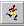 or by selecting Analyzer > Run from the Main Menu.

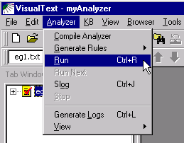

Now that we have run the analyzer, let's view the resulting parse tree.

 Click on the View Parse Tree button.  or select the eg1.txt in the Workspace, right mouse click, and select View > Parse Tree from the[Text File Popup Menu.](../../VisualText_Interface/Popups/Text_File_Popup.md)

Your parse tree should look like this:

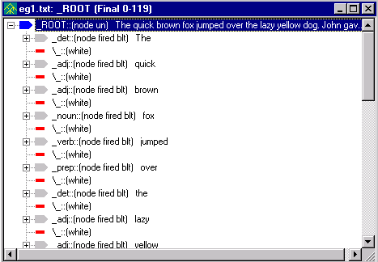

| Note: If you ran the analyzer with Generate Logs on, the title bar in your parse tree may not match the image. The title bar will show the name of the selected pass in the Ana Tab. |
| --- |

 You can expand nodes labeled with a + by selecting them.  Note that node labels (_noun, _adj, etc.) have been added to most lexical items in the file.  All non-terminal node labels start with an underscore ('_'). 'fired' indicates that a rule matched and 'blt' indicates that a node was built.

 Close the open files in the Workspace by selecting the X in the upper right-hand corner of the file.

Exit the analyzer.

 From the Main Menu, select File > Exit.

 Answer Yes at the confirmation prompt for *both* saving the analyzer and the knowledge base.

## Summary

In this tutorial, we added sample data to VisualText in order to generate rules automatically.  We created a stub concept named words, some rule concepts for the classical syntactic categories, and a folder concept to organize the rule concepts. We sampled text data for these concepts and generated rules. Finally, we ran the analyzer against a text file and inspected the resulting parse tree. Adding samples and automatically generating rules demonstrate a simple way to maintain and enhance text analyzers with VisualText.  In Tutorial 3, we'll show you how to create simple hand-built rules to parse the sentences in the text we worked with in tutorials 1 and 2.
