[← Help Contents](../../index.md) | [📘 NLP++ Textbook](../../NLP++_Textbook.md)

# Tutorial 3 - Rules by Hand

In Tutorial 2, we saw how to automatically generate rules by highlighting samples in our text files. In this tutorial, we will use the other method of generating rules, and that is to build them by hand. An in-depth text analyzer will typically include rules made by both of these methods.

In the last tutorial, we looked at the noun pass file that was automatically generated by VisualText™. In this tutorial, we will work with pass files like this one but this time we will write the rules ourselves. In particular, we will write rules for finding noun phrases (NP), verb phrases (VP), prepositional phrases (PP), and possessive phrases (POSS).

We'll use the analyzer built in Tutorial 2.

 Launch VisualText.

 From the Main Menu, select **File > Recent Analyzers** and choose:

```
C:\apps\myAnalyzerFolder\myAnalyzer
```

If you want to start with the ready-made analyzer in the docs folder, unzip the contents of:

```
C:\Program Files\TextAI\VisualText\docs\tutorial2\myAnalyzer2.zip
```

and place the **myAnalyzer** folder in the working directory:

```
C:\apps\myAnalyzerFolder
```

## Create New Pass in Analyzer Sequence

Each 'bead' on the analyzer sequence is a pass. For the typical rule-based pass, the analyzer engine traverses the input text (actually, the parse tree representing the text) once before proceeding to the next pass.

 Click on the **Ana Tab **and take a look at the pass sequence.

Our analyzer right now has eight passes, namely **tokenize**, the automatically generated passes **det**, **adj**, **noun**, **verb** and **prep**, and the two stub region markers.

Now we'll add a new pass following the **words** stub region. In this case, we want to add our next pass to the end of the current analyzer sequence.

 Select the end-of-stub marker **end_words** and right-click to display the **Ana Tab Popup Menu**.

 Select **Add > New Pass**.

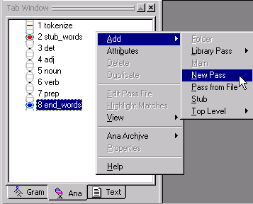

 In the **Pass Properties** dialog, name the pass **NP** (for 'noun phrase').

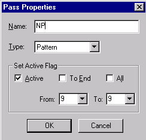

 Leave Type: as the default value, **Pattern**. (This is the **pat** pass algorithm type mentioned previously.) Leave the Set Active Flag information as is. (The Set Active Flag box is used to activate or inactivate a pass in the analyzer sequence.)

 Click **OK**.

VisualText creates a new pass in the analyzer sequence after **end_words**, named **NP**.

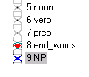

 Now, double click the **NP** pass to open it in the Workspace.

We are now ready to start hand building some rules in our pass file.

## Edit Default Rules

VisualText creates a pass file with some default structure to get you started. This is just a starter template and it can be edited to create the code and rules you need.

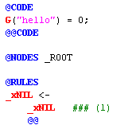

Now is a good time to review some definitions and learn a little more about building rules.

A **pass** is one step in the analyzer sequence. It corresponds to one 'bead' in the **Ana Tab**.  There are several types of passes. The most prevalent type of pass is called **pat** (for 'pattern'), or a rule-based pass. Each pat pass has an associated **pass file** (also called a** rule file**). The **pass file** that corresponds to the noun pass for example, is called **noun.pat**. When you hand-build rules, you are writing NLP++™ (code and rules) within the pass file itself. For a detailed description of the pass file syntax, see [About Pass Files](../../NLP_PP_Stuff/About_Pass_Files.md) in the NLP++ section of this Help. Later tutorials will also go into more detail.

Let's take a closer look at our default NP pass file.

Anything to the right of the pound sign,** #**, is a comment and is not part of the actual rule. The file header uses pound-sign comments to name and describe the current pass.

The actual rule file begins at the @CODE marker.  This is the beginning of a region called the CODE Region.  The CODE Region optionally ends with an @@CODE marker. Code placed here executes prior to any rule matching in the current pass. A pass may consist entirely of code written within the CODE Region. In these tutorials, we won't be editing the CODE Region.

The @NODES marker tells the analyzer which nodes to apply the subsequent rules to.  The line

```
@NODES _ROOT
```

means that the rules will be applied only to nodes 'dominated by' the non-terminal node **_ROOT**.  Recall from Tutorial 1 that the nodes dominated by **_ROOT** include all of the words and characters in the eg1.txt file. You can see the list of nodes that will be traversed by rules of this file by viewing the parse tree for eg1.txt. This is what our parse tree looked like at the end of Tutorial 1.

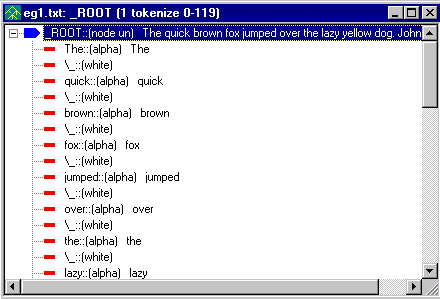

Next is the @RULES marker, which tells the analyzer to expect a new RULES Region. The RULES Region is where you write your rules.  If the @RULES marker is not preceded by an action region (e.g., POST), then it implicitly tells the analyzer to use a default action for the rules of this region.

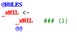

A rule has the form 'X <-- Y Z ... @@', which means: 'nodes that match the **phrase** Y Z ... will get a new dominating node named X.' In the default rule, _xNIL is the **suggested element** and _xNIL (on the right hand side) is a phrase of only one element. **`_xNIL`** is a **special** rule element that represents the empty token, or 'nothing', by convention. Another special token, _xALPHA, matches any alphabetic token in the parse tree.

The @@ symbol marks the end of a rule.

 Hand-edit the @RULES Region of the **NP** pass file as below:

```
@CODE
```

```
L("hello") = 0;
```

```
@@CODE
```

```
@NODES _ROOT
```

```
@RULES
```

```
_NP <-
```

```
_det
```

```
_xWHITE
```

```
_adj
```

```
_xWHITE
```

```
_adj
```

```
_xWHITE
```

```
_noun
```

```
@@
```

| Note: You can copy and paste from the Help documentation into your analyzer. However, note that formatting and colors may be lost when you paste the copied text into the analyzer pass file. Saving the file after you have copied the text, closing the pass file and then opening the pass file again can restore some of the formatting. |
| --- |

Make sure you use a lowercase x when writing _xWHITE in your rules.

 Save the NP pass file. (Though running the analyzer will automatically save the pass file, it is a good idea to get into the habit of saving edited pass and text files often.)

The rule we've added says that a phrase consisting of a determiner followed by two adjectives followed by a noun, with intervening blank spaces, will suggest or reduce to a noun phrase (NP). Such a match is searched for in the nodes directly under the _ROOT node.

The initial underscore character "_" is an NLP++ convention marking nonterminal or internal nodes, as opposed to terminal (also called literal or leaf) nodes, which represent words, numbers, and punctuation.

You have just written a rule in VisualText standard rule format, in which each element is on its own line. The Pass File Popup menu, which provides handy tools for editing rules, assumes that rules are in standard format. See [Standard Rule Format](../../VisualText_Basics/Standard_Rule_Format.md) for more information.

We have now finished creating our first hand-built pass file.

## Run Analyzer

Now we are ready to run the analyzer again to see what kind of parse tree we get after the addition of our NP pass file. For this tutorial deselect the toggles for Generate Logs 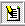, Verbose Mode 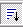, and Page Mode 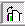.

To run the analyzer sequence on the text,

 Select eg1.txt in the Text Tab and click the Run button. 

## Inspect Log Window

When the analyzer is run, a report is generated in the Log Window. The left side of the report will contain the name of the analyzed file and the right side of the report will show the passes and the total time needed to process the pass.

## View Parse Tree

Now we can look at the resulting parse tree as we did in Tutorials 1 and 2.

 Select eg1.txt in the Workspace, right click and select View > Parse Tree. Don't forget that you can also use the View Parse Tree button. 

Notice how the new parse tree has inserted the node _NP under _ROOT.

 Expand the first _NP node. It contains the nodes _det _adj _adj _noun corresponding to The quick brown and fox:

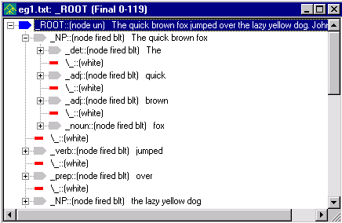

When the analyzer encountered the determiner ("the"), followed by two adjectives ("quick", "brown") and a noun ("fox"), the rule within the NP pass file was matched. The default reduce action was executed, yielding the NP subtree whose root is highlighted above. The same reduce action was executed to create the noun phrase 'the lazy yellow dog.'

 Close the parse tree display.

## Adding Multiple Rules to a Pass

Not all noun phrases have two adjectives like 'quick' and 'brown' in the phrase 'the quick brown fox'. Some noun phrases may have only one adjective, such as 'the quick fox' and some may not have any adjectives at all, as in the noun phrase 'the fox'. We can modify the NP pass file so that we can catch these types of cases, too.

 Modify the NP pass file to add the three new rules to the RULES Region as follows:

```
@CODE
```

```
G("hello") = 0;
```

```
@@CODE
```

```
@NODES _ROOT
```

```
@RULES
```

```
_NP <-
```

```
_det
```

```
_xWHITE
```

```
_adj
```

```
_xWHITE
```

```
_adj
```

```
_xWHITE
```

```
_noun
```

```
@@
```

```
_NP <- _det _xWHITE
 _adj _xWHITE _noun
 @@
```

```
_NP <- _det _xWHITE
 _noun @@
```

```
_NP <- _noun @@
```

This demonstrates multiple rules in a single pass.

There are four rules, all operating in the same context node _ROOT. (We could have written the first rule, which now occupies 9 lines, on a single line like the other rules in the file.) We have now expanded the NP rules so that it can "catch" noun phrases that have one, two or no adjectives contained in it.

 Run the analyzer again. 

 Click on the View Parse Tree button to see the new parse tree. 

Notice how the new parse tree has inserted the _NP for 'the book'.

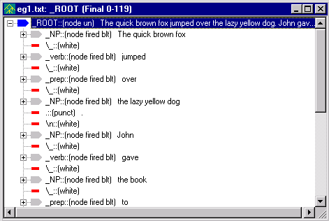

## Bleeding and Feeding

The ordering of rules within a pass file, as well as the ordering of passes in an analyzer sequence, can create, hide or destroy parse tree structure available for later rules and passes. The analyzer engine attempts to match rules as they are presented in a pass file. That is, it starts from the first rule written in the file and goes down the list of rules. Therefore, the longest rule expansion in the example above is tried first.  If we had ordered the rules with the shortest expansion (_NP <- _noun) first, the noun 'Fox' would get an _NP node label, hiding the 'structural description' (the right hand side of the rule) for application of the longer expansion rules. In other words, we would short-circuit the rules.

When a pass creates a structural description used by later passes, it is said to be 'feeding.' When it removes the structure, it is said to be 'bleeding.' A large part of developing a text analyzer is figuring out the right bleedings and feedings.

 Close the parse tree display.

## Create a Possessive Pass (Escape Characters)

Now we will write a rule to handle possessives, as in baby's.

Use the procedure you just used to create the NP pass to create a new pass:

 Select the Ana Tab. Left click on end_words in the pass sequence then right-click to pull up the popup menu. (This will add a new pass BEFORE the NP pass).

 Select Add > New Pass.

 Name the pass POSS (for 'possessive') and leave Type: Pattern.

 Click OK.

Your Ana Tab should look like this:

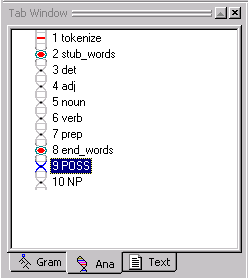

 Double-click on the POSS pass to open it in the Workspace and edit the RULES Region so that it looks like this:

```
@CODE
```

```
L("hello") = 0;
```

```
@@CODE
```

```
@NODES _ROOT
```

```
@RULES
```

```
_adj <- _noun \'
 s @@
```

| Note: There isn't a space after the backslash in the rule. |
| --- |

The use of the backslash \ here is to 'escape' the apostrophe.  Other escaped characters include all the punctuation characters as well as space, tab ('\t'), and newline ('\n'). (To display blank spaces visibly in the parse tree, VisualText uses '\_', but this is just an artifact.)

 Save the POSS pass file.

Now, let's run the analyzer.

 Select the text file and click the Run button. 

 Right-click on eg1.txt in the Workspace and select View > Parse Tree to view the parse tree for eg1.txt.

 Scroll down to the phrase 'the little baby's cheek' to check the parse tree. Expand the parse tree. It should look like this:

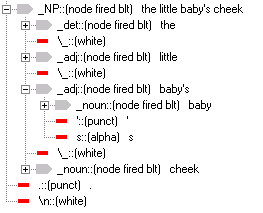

 Close the parse tree display.

Now let's add a PP (prepositional phrase), VP (verb phrase), and Sentence (sentence) pass to the analyzer sequence. For these passes, go ahead and add them one at a time to the end of the sequence. (Unlike the POSS rule added above, where you inserted the POSS pass before the NP pass, the passes below should be added one after the other at the end of the analyzer sequence.)

Here is a procedure to add these passes:

 To create a pass in the Ana Tab:

- Select the last pass in the analyzer sequence.

- Right click and select Add > New Pass.

- Add the name of the pass, PP, in the Pass Properties. Leave Type as Pattern. Click OK.

To modify the pass file double click on the pass in the sequence to open it in the Workspace and modify the rules accordingly. Make sure to save your file after editing it.

Your prepositional phrase pass file (PP) should look like this:

```
@CODE
```

```
L("hello") = 0;
```

```
@@CODE
```

```
@NODES _ROOT
```

```
@RULES
```

```
_PP <- _prep _xWHITE
 _NP @@
```

And the verb phrase pass file (VP) should look like this:

```
@CODE
```

```
L("hello") = 0;
```

```
@@CODE
```

```
@NODES
 _ROOT
```

```
@RULES
```

```
_VP <- _verb _xWHITE
 _NP _xWHITE _PP
 @@
```

```
_VP <- _verb _xWHITE
 _PP _xWHITE _NP
 @@
```

```
_VP <- _verb _xWHITE
 _NP @@
```

```
_VP <- _verb _xWHITE
 _PP @@
```

```
_VP <- _verb @@
```

Finally, the sentence pass file named Sentence should look like this:

```
@CODE
```

```
L("hello") = 0;
```

```
@@CODE
```

```
@NODES
 _ROOT
```

```
@RULES
```

```
_S <- _NP _xWHITE
 _VP @@
```

Take a moment to go through and "read" each of the pass files. Each file specifies what nodes should be analyzed (in this case the nodes under _ROOT) and further what should be done (specified in RULES Region) when a match is found.

The resulting analyzer sequence should look like this:

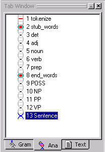

If your analyzer sequence does not match this sequence, use the yellow arrows on the Tab Toolbar to move the pass to the correct location in the analyzer sequence.

We are now finished hand-building our rules. By using these rules, our analyzer will be able to find not only noun phrases, verb phrases, prepositional phrases but even sentences.

## Inspect Final and Intermediate Parses

Now, let's run the analyzer with the new pass sequence on eg1.txt. This time before we run the analyzer we will use the Generate Logs button. Turning the Generate Logs button on will allow us to view the cumulative parse tree for each pass in the sequence, called the intermediate parse tree. You'll see how this works in a moment.

 Select the Generate Logs button. 

 Click the Run button. 

Let's take a look at the parse tree for the Sentence pass.

 Select the Sentence pass in the analyzer sequence.

 Click the View Parse Tree button. 

The Parse Tree should look like this (NOTE: The lines pass is obsolete):

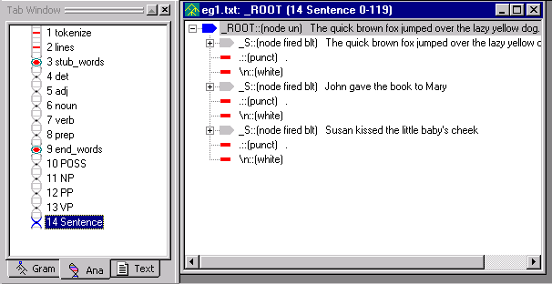

The rule in our Sentence pass file says, if you find a node with the label _NP followed by a _VP, rename the node _S. As you can see, the analyzer was able to identify our three sentences.

Note that the name of the pass, Sentence, is shown at the top of the tree display window. Also notice the number 13 before Sentence. This let's you know that you are looking at the intermediate parse tree for the 13th pass (Sentence) in the analyzer sequence.

| Note: If you don't see the parse tree for each of the passes, make sure the Toggle Generate Logs button is selected before you run the analyzer. If you run the analyzer with the logs turned off, you will see a zero in the title bar of the parse tree. |
| --- |

 If you select another pass in the analyzer sequence, like VP, and then View Parse Tree button, you should see the following:

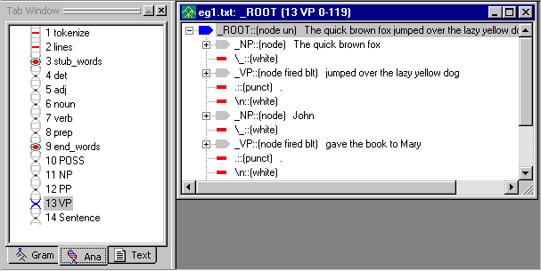

Notice that the parse tree window is labeled VP, and that it displays the result of applying the rules in the VP pass file.

The pass you select in the analyzer sequence determines which intermediate parse tree is displayed. Being able to easily inspect the intermediate parses is useful when you're trying to create and debug your analyzer.

 Close the open files in your Workspace.  (You can use Window > Close All from the main menu.)

 Exit the analyzer. From the Main Menu, select File > Exit.  (If asked to save the analyzer, click Yes).

 Save a copy of c:\apps\myAnalyzerFolder\myAnalyzer as myAnalyzer3.  You will need this in order to run Tutorial 6 later on.

## Summary

In this third tutorial, we created new passes for the analyzer sequence by hand, edited the default settings, ran the modified analyzer, and viewed the resulting parse trees.  We then created additional rules, one of them requiring an escape character \ for handling apostrophes.  We then used the Toggle Generate Logs button, ran the analyzer, and viewed the intermediate parse trees.
