[← Help Contents](../../index.md) | [📘 NLP++ Textbook](../../NLP++_Textbook.md)

# Tutorial 4 - Input/Output

In this tutorial we create and read input files, add more rule concepts and associate concepts with the input files. We extract text from specific parts of the parse tree and write such information to an output file.  We also take a closer look at rule syntax. Finally, we introduce some navigation shortcuts and a useful debugging tool in VisualText®.

We'll start with the analyzer from Tutorial 3.

 Launch VisualText.

 From the Main Menu, select **File > Recent Analyzers** and then select **c:\apps\myanalyzerfolder\myanalyzer**.

If you want to start with the ready-made analyzer in the docs folder, unzip the contents of:

```
C:\Program Files\TextAI\VisualText\docs\tutorial3\myAnalyzer.zip
```

and place the **myAnalyzer** folder in the working directory:

```
C:\apps\myAnalyzerFolder
```

## Add Top Level Folder

In Tutorial 2, you learned how to sample words in a file in order to generate rules. You took each word individually and manually placed it in the appropriate concept, noun, verb, adjective, etc.

Sometimes it is more convenient to add sample data to the rule generation component of VisualText by importing a text file with data that is already of a certain type. For example, suppose you had a list of company names that you wanted to train an analyzer to recognize. To do this, you need to tell the system where the input file is and then give it a label.

To keep things organized, we'll store files containing our lists to be sampled in a new folder called **dictionary**.

 Create a folder in the **Text Tab** by right-clicking in the window and selecting **Add > Top Level > Folder**:

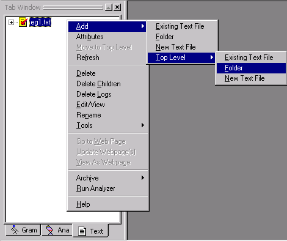

 Name the folder **dictionary** and click **OK**.

This is where we'll store the file containing our company names.

Your **Text Tab** should look like this:

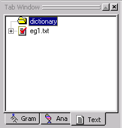.

## Create Input Files for Storing Lists

Since we don't have a text file of company names created yet, we will have to generate one now.

 In the** Text Tab**, select the new folder you just created,** dictionary**.

 Right click to bring up the popup menu, and select **Add >  New Text File.**

 **Name the new file companies and click OK.

A blank text file with the titlebar 'companies.txt (dictionary)' will pop up in your workspace. "dictionary" appears in the titlebar of the file to indicate that your text file, companies is part of the dictionary folder.

 Enter the following company names into your file:

```
Lambsoft
```

```
Fencetech
```

```
IBM
```

```
Cisco
```

```
GM
```

```
GE
```

 Save the file by right-clicking on companies.txt and selecting Save from the menu.

 Close and double-click on the file to open it.  (VisualText converts carriage return plus line feed to carriage return, which will affect the offsets and automated rule generation, so this step needs to be done for each new or saved file.)

The file companies.txt is now contained in the dictionary directory. (If you don't see it in the Text Tab, choose Refresh from the Text Tab Popup Menu)

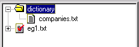

Rather than creating and typing in the contents of the file in VisualText, we could also have copied an existing file from some other source directly into the dictionary folder:

```
C:\apps\myAnalyzerFolder\myAnalyzer\input\dictionary
```

## Create New Concept for Input Data

Now that we have this data saved in our dictionary folder, we're going to create a new rule concept and read the data into the concept from this new file. We'll follow the same procedure we used in Tutorial 2 when we created the rule concepts for det, adj, noun etc. This time however, we will populate the concepts with the data contained in the companies.txt you just created.

 In the Gram Tab, select the pos folder. (Make sure the pos folder opens up.)

 Right click, and select Add > Rule:

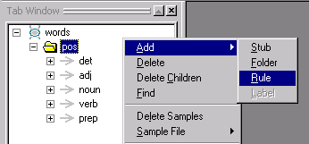

 Type in the concept name companies and click OK.

The new rule concept is added to the pos folder. (If the rule concepts in your pos folder are expanded, scroll down to see the newly added rule concept, companies.)

Your Gram Tab should look like this:

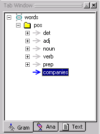

## Associate File with Concept

Now we are ready to import the content of our companies.txt file into our new concept companies.

 In the Gram Tab, select companies, then right click and select Sample File > Import from the menu.

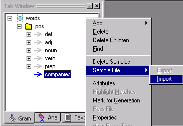

VisualText will warn you that importing samples will delete whatever sample data you have in the concept rule.


Since we don't have any sample data that can be deleted, we don't have anything to worry about.

 Click Yes to the warning popup.

The Open dialog box will take us to the analyzer input directory.

 Open the dictionary directory and select the companies.txt file.


 Click Open.

The samples in companies.txt have been added to our new concept.

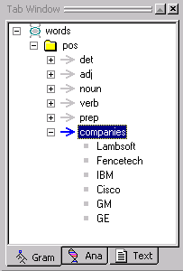

While we built the companies.txt file by hand, any list of phrases can be used in this manner, as long as there is one phrase per line in the text file. Although we named the concept companies and the input text file companies.txt, this name matchup is not required.

## Generate Rules

Now we are ready to have VisualText generate our new rule.

 From the Main Menu, select Analyzer > Generate Rules > All.

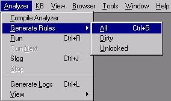

 Click on the Ana Tab and look at the analyzer sequence. A new 'bead' or link has been added to our analyzer sequence as the last item in the words stub region. The pass companies has been added.

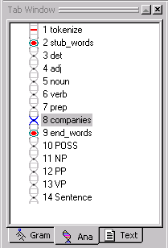

Now let's take a look at the rule in our new pass file.

 Double-click on the companies pass to display the automatically generated rule:

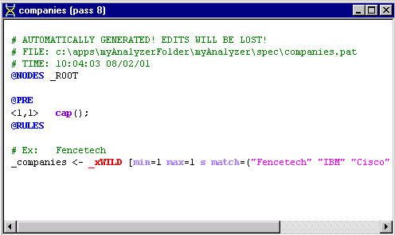

Since companies was the last "child" concept of pos in the Gram Hierarchy, its pass becomes the last pass in the words stub.

If you didn't make companies the last child concept when you created it, you can move it around in the Gram Tab using the yellow arrows. If you do move the pass around however, remember that you'll need to regenerate the rules in order to update the analyzer sequence. (From the Main Menu, select Analyzer > Generate Rules > All).

| Note: The order of generated passes should not be changed via the Ana Tab. |
| --- |

## More on Rule Syntax

Let's take a closer look at the structure of the companies pass file.

First, look at the first line that has been commented out. It reads: AUTOMATICALLY GENERATED! EDITS WILL BE LOST!. This warning is letting you know that any edits you make to an automatically generated pass will not 'stick' the next time you try to automatically generate the rule. For example, you can't edit your companies pass file and then try to automatically regenerate the file. Your edits will be lost. The only way to modify the automatically generated files is to add or edit samples in the Gram Tab and regenerate the passes. You can, of course, copy the contents of a pass into a hand-built pass (outside of a stub region) -- this is a way to have VisualText build rules for you. Our other type of pass, the hand-built type, can always be hand-edited.

The next line in the comment section of the pass file, tells you where the .pat file 'resides':

c:\apps\myAnalyzerFolder\myAnalyzer\spec is the directory, and the file name is companies.pat.  All pass (.pat) files reside in the spec directory.

The last line in the comment section of our automatically generated pass file contains a timestamp indicating when the pass file was created.

Now let's take a look at the rest our pass file.

Again, `@NODES`` _ROOT` means that the rules in the pass file are applied to the list of nodes directly dominated by a node named _ROOT.

The line starting with the @PRE marker indicates a region of constraints (or PRE Actions) that parts of a rule (or rule elements) must satisfy in order to match. In this case, the condition requires that the first element of each subsequent rule match a capitalized word. Here you can see how VisualText performed some rule generalization.  It looked at all the samples and deduced a pattern in the text, that is, that all the words in the samples started with capital letters and added this condition to the rule file.

The <1,1> syntax means that the PRE action applies from element 1 through element 1 of the phrase on the rule's right hand side.  The first element of our rule is _xWILD. The condition placed on this rule, is that whatever _xWILD turns out to be, it must be a capitalized word. If we had <1,2> instead of <1,1> then both the first and second elements in the rule's phrase would need to be capitalized, and so on.

The region marker @RULES indicates where rules occur. We've introduced the basic syntax of a rule earlier in this set of tutorials.

Now, let's take a look at the rest of our pass file.

The 'variable' _xWILD is a wildcard match and matches anything within the constraints placed on it.  In this case, the conditions of the wildcard match are given following the wildcard in square brackets [ ].  The conditions min=1 max =1 mean that` _xWILD` must match a minimum of one node and a maximum of one node.  If max = 2, then the rule will match one or two nodes of the parse tree. (max=0 means an unconstrained maximum. min=0 means that the wildcard can optionally match zero elements.)

The s modifier stands for singlet.  It tells the rule matching engine to search a node's descendants for a match, but stop looking 'down' in the tree when a node has more than one child (i.e., it branches into more than one node) or when a node has its BASE attribute set.  Singlet and base allow syntactic and semantic features to be layered into the parse tree.  If a series of passes had applied that only operated on single elements, building up a 'stack' of node labels for that element, this rule could still match against a lower node in the stack of labels. In brief, the singlet mechanism allows attributes to be placed and matched directly within the parse tree. The subtree of attribute nodes is called a singlet chain.

The final section of the conditions is the match list of tokens that _xWILD must match, corresponding to the items in the input sample file.

## Create Another Input Example

Now, let's create some text that exercises the new companies pass.  First, let's create a new folder in the Text Tab to hold our example file. Again, folders are used to help you organize your text files.

 In the Text Tab window, right click and select Add > Top Level > Folder:

 Name the folder examples.

 Select the examples folder.

 To create a new file, right click and select Add > New Text File.

 Name the file eg2 (again omitting the .txt extension).

Notice that the folder name "examples" is part of the titlebar of the eg2.txt file.

 Now, type the following text in the body of the text file:

```
Lambsoft jumped over Fencetech.

Cisco gave GE the yellow book.
```

 Close and open the file to make sure VisualText converts it.

Now let's run the analyzer on eg2.txt.

Since the eg2.txt file is already selected in the Text Tab:

```
 Click the Run button. 
```

```
 View the parse tree, by right clicking on eg2.txt in the Workspace, and selecting View > Parse Tree.
```

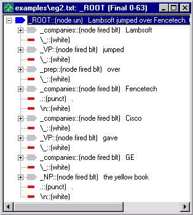

At first glance, it may look like our Sentence pass is not working here, since we don't have any _S nodes. (Remember that the rule in our Sentence pass says, if you find a NP followed by a whitespace and then a VP, reduce them to the new node _S.) In fact, the Sentence pass is working fine. It is just that the rules in the Sentence pass file require a noun phrase before a verb phrase and since the names in companies file are reduced to _companies and not _noun, the conditions set in the Sentence pass are not met. We'll have to go in and create a new concept to get this done.

## Alter Existing Rules to Handle New Concept

Now let's create a new pass in our analyzer sequence that will rename a _companies node to be a _noun node. (*Developer's note*: another way, not shown here, uses the Properties dialog in the Gram Tab to add the layered label _noun when automatically generating the rules for _companies.)

 In the Ana Tab, select end_words. We want our pass to be inserted before the POSS pass.

 Right click and select Add > New Pass.

 Name the new pass company2noun.

 Leave Type as Pattern.

 Double-click the newly created company2noun pass, and edit the RULES Region so that it looks like the following:

```
@CODE
```

```
L("hello") = 0;
```

```
@@CODE
```

```
@NODES
 _ROOT
```

```
@RULES
```

```
_noun <- _companies [s]
 @@
```

Now that we have this pass in our analyzer sequence, company names can be treated as regular nouns.

 Run the analyzer on eg2.txt. 

Now, let's take a look at the new parse tree.

 (Select the Sentence pass in the Ana Tab if the Generate Logs toggle is on.)

 Select eg2.txt in the workspace, right click and select View > Parse Tree. Expand the first _S and look at the parse tree.

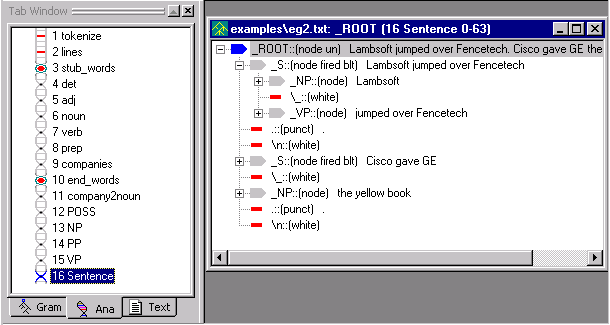

That worked pretty well, except notice that in the second sentence, the second noun phrase wasn't included. Instead of the sentence, 'Cisco gave GE the yellow book.', our analyzer parsed 'Cisco gave GE' as a complete sentence.  The structure of the sentence, 'Cisco gave GE the yellow book.' is a noun phrase (Cisco) followed by a verb phrase (gave) followed by two noun phrases, 'Cisco' and 'the yellow book.' It appears as if our VP pass file does not account for "verb + NP + NP".

Let's take a look at the VP pass file.

 Double click on the VP pass in the analyzer sequence. Notice that our rules do not cover this case.

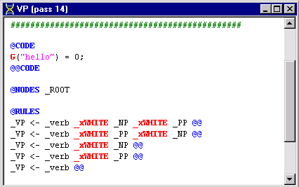

Let's edit the VP pass file to allow a verb phrase to be formed from a "verb + NP + NP".

 Add the following rule as the first rule in the RULES Region:

_VP <- _verb _xWHITE _NP _xWHITE _NP @@

 Run the analyzer again on eg2.txt with the Generate Logs button on.

 Select eg2.txt and view the parse tree.

The parse tree should look like this:

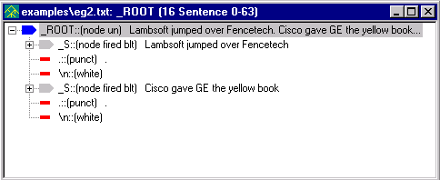

(Select the Sentence pass in the Ana Tab to see the parse tree.)

## Print Something To Output File

One of the helpful features of VisualText, is the ability to extract specific parts of the parse tree and write the extracted information out to a file. Up until now, we have viewed our results using the parse tree. Now we will learn how to direct the results to an output file. We can do this by adding a POST Region to the relevant pass file.

 Double click on the company2noun pass in the Ana Tab to open up the pass file.

 Add the POST Region to the file so that it looks like this:

```
@CODE
```

```
G("hello") = 0;
```

```
@@CODE
```

```
@NODES
 _ROOT
```

```
@POST
```

```
 "output.txt"
 << "Found company: "
 << N("$text") << "\n";
```

```
 single();
```

```
@RULES
```

```
_noun <- _companies [s]
 @@
```

You are already familiar with the NODES and RULES part of the rule file. @POST is the marker for the POST Region.  This region contains code (the two lines between @POST and @RULES) that will be executed if a rule in the subsequent RULES Region matches.

Let's take a closer look at the code in the POST Region.

If you are familiar with C++ programming, you'll notice that the code to write to an output file is similar.

The first line of code can be broken down into two parts: what is to the left of the output operator (<<) and what is to the right of the operator. The left side of the operator specifies the name of the output file, in this case 'output.txt', and the right side specifies what should be written to the output file and how. We'll go over the code in more detail below.

The first item to the right of the output operator is "Found company: ". This basically says, print the text "Found company: " in the output file. Material enclosed in double quotes is printed literally.

The next thing that gets printed to the output.txt is indicated by `N("$text")`. This means 'get the text in the last node element' (i.e., the text contained in _companies) and append it to the output file.  (If there were more than one element in the right hand side of the rule, you could specify which element to extract the text from with a second argument to N, for example, the second element's text could be extracted with the expression `N("$text",2)`.)

Our last item, is `"`\n". This adds a newline.

The last item on our first line of code is the semicolon, analogous to the statement terminator of other programming languages.

The second line, `single``()`;, instructs the rule engine to perform a single-tier, or default, reduction. This is described below.

## Single

*(Advanced section. Primarily for the programmer or computational linguist.)*

A reduction rule is one which takes one or more elements, such as the sequence _NP _VP, and reduces the matched phrase of nodes to one node, such as _S. For historical reasons, the default reduce action is called a single-tier reduction.  The default reduction can be superseded in the POST Region.  That is, the rule _S <- _NP _VP will perform a `single``()`; reduction by default.  If you do write a non-empty POST Region, however, you must specify the type of reduction you want, *else the default is** *`noop`.  `noop` is an action that does nothing (i.e., "no op" or "no operation"). Two other reduction types include `group` and `excise`.

`group` is used when you have a structural description such as 'A B C D' but you only want to create a node from B and C, leaving A and D alone. A pass such as

```
@POST

group(2,3,"_foobar");

@RULES

_xNIL <- A B C D @@
```

creates a structure like A _foobar(B C) D.

`excise` deletes structure from the parse tree, and `noop` causes no reduction to be performed. For a summary of the different types of Post Actions available, see [POST Actions](../../NLP_PP_Stuff/AT-POST_Actions.md). For now, we need to include the default reduction type for the purposes of the current example.

| Note: Omitting `single``()`;in the POST Region is a common error. |
| --- |

## Inspect Output File

Now that we have edited our company2nouns pass file to print information to an output file, we are ready to run the analyzer.

 Click on the Run button. (You can also run the analyzer by right clicking on eg2.txt in the Workspace and selecting, Run.)

There are a couple of methods to view output files. The easiest is:

 Select the View Output File button  located on the Debug Toolbar.

The output.txt file will open up in the Workspace. The result looks like this:


The output file output.txt is written to a system-created directory. The path to the file is:

```
C:\apps\myAnalyzerFolder\myAnalyzer\input\examples\eg2.txt_log\output.txt
```

Another way to view the output file is from the Text Tab Window.

 In the Text Tab, open the examples folder. Expand eg2.txt.

 Double click on the output.txt file.

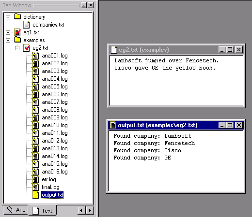

| Note: The ana~.log files here let you know the analyzer was run with the Generate Logs button on. |
| --- |

Notice that the output file is placed into directories created by the system corresponding to the input file name.  You can see this in the titlebar of the output file. This makes working with multiple input files convenient. (The other files in the folder are the intermediate log files.)

Note that the main output file, named output.txt by default, is special and is bound to the View Output File button. If you had named the output file something like foo.txt, with a print statement like

```
"foo.txt" << "found companies : " << N("$text") << "\n";
```

then the View Output File button would not display the file foo.txt.

To view such an output file, use the View Dump Files button. 

This will list all the files with a .txt extension in the current log folder, or default output folder associated with an input file. If you were to have two output files created by:

```
"foo.txt" << "found companies : " << N("$text") << "\n";

"foo2.txt" << "found companies : " << N("$text") << "\n";
```

then you could use the View Dump Files pulldown list to choose between them:

## 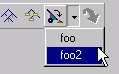

## Navigate Input Files

There are many shortcuts in VisualText to help you navigate among files. One of these navigation shortcuts uses the Previous Text and Next Text buttons on the Debug Toolbar.


For example, if you want to run the analyzer on the next file in the currently selected folder in the Text Tab, you can use these buttons to quickly get the file.

 First close all the open files in the Workspace.  (You can use Window > Close All in the main menu).

 Create another file in the examples folder. (Double click to open the examples folder, right click and select, Add > New Text File.)

 Name the file eg3.txt. In the eg3.txt file, add the following text:

```
John kissed the dog.

Mary gave the book to John.
```

 Save eg3.txt.

 Select the Page Mode Toggle button  in order to enable the Next Text and Previous Text buttons.

Notice how the two horizontal arrows to the right on the toolbar are enabled:

Next Text

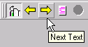

Previous Text

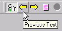

 Click on the Previous Text button. Notice eg2.txt is yellow in the Text Tab, and that eg2.txt is the name of the file displayed in the workspace.

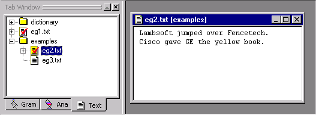

 Now click on the Next Text button.  Notice that eg3.txt in the Text Tab is now selected (it turned yellow), and the file displayed in the Workspace is eg3.txt.

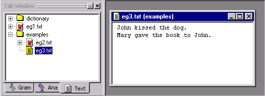

 Clicking the Previous Text button operates the selection display in reverse.

## Highlight Matched Concepts

Another one of VisualText's many shortcuts is a debugging tool used to highlight concepts.

The Toggle Highlight Mode button 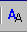 highlights regions of text in an analyzed file that match rules in a selected pass of the analyzer. This tool lets you quickly see whether and where a pass has a rule that has applied.

An alternative to using Toggle Highlight Mode, is to inspect the parse tree, but this can be a slower process (although it gives you more information). To use this highlighting feature, you must have the Toggle Generate Logs button selected. (Information on the Toggle Generate Logs button is given below.)

Let's see how the Toggle Highlight Mode works.

 Select the Toggle Generate Logs button.  (Toggle Generate Logs is next to Toggle Highlight Mode on the toolbar.)

 Double click on the eg1.txt to open it in the Workspace.

 Run the analyzer on eg1.txt. 

 Select the det pass in the Ana Tab, then click on the Toggle Highlight Mode button :

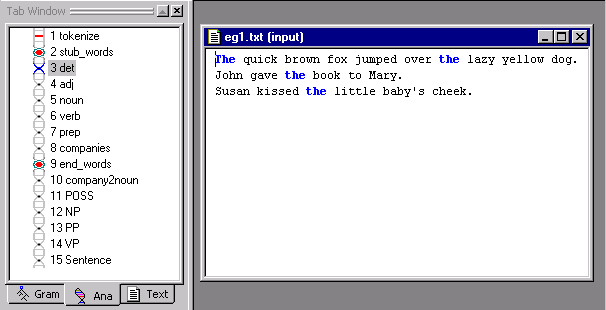

Notice how the text matching the det pass turns blue.

 Now select a later pass in the analyzer sequence, for example the noun pass. Notice how the text changes to now match the noun pass file.

If you prefer using pulldown menus, the same function can be accessed by selecting Highlight Matches from either the Gram Tab or the Ana Tab popup menus.

 Close the open files in the Workspace.

 (If available) save your analyzer. (File > Save Analyzer.)

 (If available) answer Yes at the confirmation prompt.  And the same for saving the knowledge base.

 Exit the analyzer. From the Main Menu, select File > Exit.

## Summary

In this tutorial we created an input file to store lists of items in a concept, created a new top concept for the item and imported the file's samples into the concept.   We generated the rules and ran the analyzer against the input data.  We discussed some features of the automatically generated rules, then created another hand-built rule to utilize the automatically generated rules in the analyzer logic.  Finally, we printed some data to an output file and explored some navigation and debug tools.
