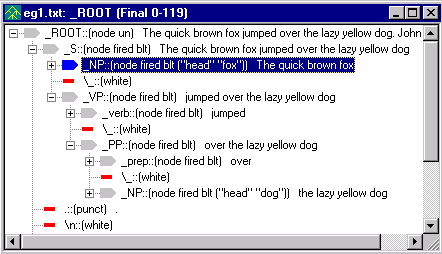

# Tutorial 5 - NLP++

In the last several tutorials, you have learned how to create pass files in VisualText™. The pass files you have seen so far contain NLP++™ code and rules.

NOTE: This tutorial does not discuss NLP++ user-defined functions and local variables (**L**).  The user can find these in the Help sections dealing with NLP++.

## About NLP++

NLP stands for Natural Language Processing. NLP++ is a general purpose programming language combined with a grammar. Text Analysis International's NLP++ allows you to concentrate on the conceptual aspects of building a text analyzer. In other words, it simplifies the programming task involved in building the analyzer.

NLP++ is tightly bound to the parse tree used in VisualText-style text analyzers, and also to the Conceptual Grammar™ knowledge base management system, or KBMS. Conceptual Grammar is a knowledge representation framework consisting of concepts, attributes and phrases, combined into knowledge hierarchies and graphs. The hierarchy of samples in the Gram Tab is implemented as a hierarchy within the Conceptual Grammar KBMS.

A key feature of NLP++ is the ability to access and augment parse tree information dynamically during text analysis. That is, it creates and uses information during the text analysis process itself. NLP++ uses a special syntax for variables that simplifies the manipulation of information in parse trees. In this tutorial, we introduce five special variable types and show how they can help us with two classic linguistic parsing problems common to text analysis: extracting the head noun in a noun phrase, and determining the subject and object of a sentence.

## Five Variable Types

We'll briefly introduce the five special types of NLP++ variables here. We'll go into more detail later on as we start to edit our rule files. (For more information on variables see [About NLP++ Variables](../../NLP_PP_Stuff/About_NLP++_Variables.md).)

The five types of variables are: **G** (global), **N** (node), **X** (context), **S** (suggested), and **L** (local). The **N**, **X**, and **S** variables assume a rule context (that is, they apply only in regions where a rule has matched, such as @POST).  The **G** and **L** variables are independent of the rule matching machinery.

- **G** = **G**lobal variable: not associated with rules or parse tree nodes.

- **N** = **N**ode variable: attached to nodes that match the right-hand-side of a rule, that is the part of rule to the right of the redirect arrow '<-' .

- **X** = Conte**x**t variable: attached to nodes that dominate the phrase that matched a rule.

- **S** = **S**uggested variable: attached to the rule reduction node built for the left-hand-side of a rule.

- **L** = **L**ocal variable: local to a function or region such as @POST and @CODE; also used as function parameters.

Some operations on these variables include: assignment, printing, arithmetic and string manipulation. These operations will also be discussed below.

In this tutorial, we will use the zipped version of the analyzer in Tutorial 4. If VisualText has myAnalyzer from the myAnalyzerFolder accessed, you'll have to close the analyzer. (Select **Close Analyzer** from the **File Menu**.)

 First, navigate to:

```
C:\apps\myAnalyzerFolder
```

and rename the **myAnalyzer** folder **myAnalyzer4**.

 Unzip the **myAnalyzer4.zip** file located in:

```
C:\Program Files\TextAI\VisualText\docs\tutorial4\myAnalyzer4.zip
```

and place the **myAnalyzer** folder in the working directory:

```
C:\apps\myAnalyzerFolder
```

## Load with Recent Analyzers

Here is a shortcut for loading an analyzer.

 Double-click the VisualText icon to launch VisualText.

 Select** File > ****Recent Analyzers** and open:

```
c:\apps\myanalyzerfolder\myanalyzer
```

This will automatically load the .ana file in the myAnalyzer folder.

## Global Variables

To illustrate the Global variable (**G**), we will use the **company2noun** pass file.

In Tutorial 4, you added a POST Region directing your analyzer to create an output file with the text "Found Company: company name". We will add rules to count the total number of companies in a file and write this information to the output file.

 Double click on the **company2noun pass in the Ana Tab.**

 Edit the **company2noun** pass file so that it looks like this:

```
@CODE
```

```
  G("companyCount") =
 0; # Set to
 0 (the default).
```

```
@@CODE
```

```
@NODES
 _ROOT
```

```
@POST
```

```
  #
 Increment count of companies.
```

```
  if(G("companyCount"))
```

```
    G("companyCount") = G("companyCount") + 1;
```

```
  else
```

```
    G("companyCount") = 1;
```

```
  #
 Print the text from the last node matched (_companies), and the count.
```

```
  "output.txt"
 << "Found company: "
 << N("$text") << ".
 Found "
```

```
    <<
 G("companyCount")
 << " companies so far\n";
```

```
  single();
 # Do the standard rule reduction.
```

```
@RULES
```

```
_noun <- _companies [s]
 @@
```

| Note: Include the extra spaces as they appear in the pass file. This will make your output file easier to read. |
| --- |

Let's take a closer look at the rules you just added.

There are three regions of our pass file, NODES, POST and RULES. It is generally easiest to start an analysis of a pass file by looking at the RULES Region first.

The rule in the RULES Region

```
_noun <- _companies @@
```

tells the analyzer that any node in the parse tree named _companies is rewritten with a new dominating node _noun. The new node, _noun is layered on top of the existing node within the parse tree. The node _companies attached to the company name "Fencetech", for example, will have the node _noun layered on top of it.

The line `@`NODES` _ROOT` specifies the context in which the rule is applied by the rule engine. In this case, the rule is applied only to nodes which are dominated by the node named _ROOT. Recall that the nodes dominated by _ROOT are underneath and indented to the right of _ROOT in the parse tree.

Finally, the POST Region contains code "actions" that will be applied whenever there is a match in the RULES Region. The first part of our POST Region,

```
G("companyCount")
```

creates a new global variable (G) named companyCount, if one has not been previously created.  There is no need to declare the variable in advance.

The first four lines of the POST Region track the count of companies in a file. The global variable companyCount is incremented by one for every company found.

The next part of the POST Region specifies printing to an output file. The code prints the company count to the output file "output.txt". It also specifies a format for printing to the output file. Generally, where and how something should be printed is controlled by the output operator <<. In this example, we output to the file 'output.txt' in the following format:

"Found Company: Company Name. Found n companies so far."

Note that expressions to the right of the output operator can be variables such as G("companyCount"), literal text surrounded by double quotes (e.g. "Found company: ") or formatting characters ("\n" for newline or "\t" for a tab space). Note also that it is possible to chain together a series of operations within a single NLP++ statement, as we did here using multiple output operators.

The last part of the POST Region, `single``()`; as we learned in Tutorial 4, is an instruction to the rule engine to perform a standard (or "single-tier") reduction.

## Node Variables

We first saw the variable N in [Tutorial 4](../tutorial4/tutorial4.md#N__$text__). The node variable is associated with nodes that match elements on the right hand side of rules and is written in the following way

```
N("variable-name", position-on-right-hand-side-of-rule).
```

A related form is, for example, N(3), which evaluates to the first parse tree node matching rule element 3.

The positions are from 1 to N, and if there is only 1 then the position reference can be omitted as it has been in our rule statement. The $ prefix in the argument `N``(`"$text"`)`, indicates this is a special NLP++ variable name, and is reserved. There are a number of reserved variables that return useful information. See the [Special NLP++ Variables](../../NLP_PP_Stuff/Special_Variables.md) for a complete list of special reserved variables.

N`(`"$text"`)` in our statement extracts the text under the last node of the right hand side of the rule, i.e., whatever is in _companies. In short, the expression

```
"output.txt" << N("$text")
```

extracts whatever is in _companies and puts it into the output.txt file.

The text could also be assigned to another variable associated with the node, such as:

```
N("string",1) = N("$text",1);
```

and that text could be sent to an output file with the expression:

```
"output.txt" << N("string",1);
```

Note the difference between the node variables `N``("string")` and `N``("$text")`. Variables prefixed with the $ are special reserved variables that act like functions.

 Highlight eg2.txt in the Text Tab and run the analyzer. 

 Double click on the output.txt file in the examples folder to see the results. It should look like this:


If there are any errors in formatting, for example not enough spaces between text, open the company2noun pass file and edit accordingly. Run the analyzer again until output.txt resembles the one above.

Now, let's look at a neat way to simplify the counting code in the POST Region. We will do this by using the '++' operator.

 Edit the company2noun pass file to simplify it as shown here:

```
@CODE
```

```
L("hello") = 0;
```

```
@@CODE
```

```
@NODES
 _ROOT
```

```
@POST
```

```
#increment count of companies
```

```
++G("companyCount");
```

```
# print out the text from the node of the
 last
```

```
# matching rule element and the count
```

```
    "output.txt"
 << "Found company: "
 << N("$text") << ".
 Found "
```

```
 <<
 G("companyCount")
 << " companies so far\n";
```

```
#do a single tier reduce
```

```
single();
```

```
@RULES
```

```
_noun <- _companies [s]
 @@
```

Notice that the "if" and "else" statements have been replaced by the single statement: "++G("companyCount"). The  ++ operator means 'increment the value of the variable by one'.  To decrement something, you can use the decrement operator, --.  When a variable is first used, its value is set to 0 by default.

In addition to the increment and decrement operators, NLP++ also supports the standard arithmetic operators, add(+), substract(-), multiply(*), and divide(/), as well as the logical operators AND(&&), OR(||), and NOT(!). One of the text operators include the concatenation operator (+). You'll see how the + operator works in the next section. For a complete list of NLP++ operators see the [Operators and Expressions](../../NLP_PP_Stuff/Operators_and_Expressions.md) topic.

## Build A List from the Input

Suppose we wanted to build a list of the companies that have been mentioned in our text file. To illustrate one way this can be done, we will make an output file which concatenates the names of the companies in a file and puts them together on a single line.

 Now edit the company2noun file so that it looks like the following:

```
@CODE
```

```
L("hello") = 0;
```

```
@@CODE
```

```
@NODES
 _ROOT
```

```
@POST
```

```
#
 increment count of companies
```

```
++G("companyCount");
```

```
# print out
 the text from the node of the last
```

```
# matching rule element and the count
```

```
"output.txt"
 << "Found company: "
 << N("$text") << ".
 Found "
```

```
  <<
 G("companyCount")
 << " companies so far: ";
```

```
# concatenate the company names
```

```
if
 (G("outputString"))
```

```
  G("outputString") = G("outputString") + ",
 " + N("$text");
```

```
else
```

```
  G("outputString") = N("$text");
```

```
# print out
 the list of companies found so far
```

```
"output.txt"
 << G("outputString") << "\n";
```

```
# do a single
 tier reduce
```

```
single();
```

```
@RULES
```

```
_noun <- _companies [s]
 @@
```

Here's some pseudo code that describes how to concatenate the company names:

```
If outputString has been declared, then

    concatenate it with the text from the first node element

otherwise, (if it has not been declared)

    initialize it with the text from the first node element
```

 Select eg2.txt and run the analyzer. 

 Open output.txt and look at the results. You should get the following:


The above output shows the results of applying the NLP++ string catenation operator ("+") to build lists.

## Variables of  Suggested and Context Nodes

Now, let's take a look at our third variable S, the suggested variable. S denotes a variable associated with the left hand side of a rule (the element to the left of the <-), the suggested node or the structural change. The suggested node is built if a reduce action such as single is executed, else it is not built. (If the suggested node is not built, then its S variables are removed when the rule actions have finished executing.)

Earlier in this tutorial we said that we would be extracting the 'head' noun of a noun phrase. The S variable is going to help us do that. But first, let's review what a head noun is.

A *head noun* is a technical linguistic term, like *subject*, or *indirect object*. *Head noun* refers to the main, or 'head' word in a noun phrase.  For example, in the phrase 'The man from Philadelphia', 'man' is the head noun, and determines a number of parameters associated with the noun phrase, such as whether it is single or plural. Whether a noun phrase is singular or plural is important for number agreement with the verb. For example, 'The man from Philadelphia is...' vs. 'The men from Philadelphia are...' Since the agreement between the head noun and the verb takes place over unpredictably long distances, some process is needed to extract the value.

 Double click on the NP pass in the Ana Tab.

 Modify the NP pass to look like this:

```
@CODE
```

```
L("hello") = 0;
```

```
@@CODE
```

```
@NODES _ROOT
```

```
@POST
```

```
  # the variable named
 "head" in the suggested node
```

```
  #
 gets the text of the LAST node matched by a rule below.
```

```
  S("head") = N("$text");
```

```
  single();
```

```
@RULES
```

```
_NP <-
```

```
_det
```

```
_xWHITE
```

```
_adj
```

```
_xWHITE
```

```
_adj
```

```
_xWHITE
```

```
_noun
```

```
@@
```

```
_NP <- _det _xWHITE
 _adj _xWHITE _noun
 @@
```

```
_NP <- _det _xWHITE
 _noun @@
```

```
_NP <- _noun @@
```

Basically, what we are doing here is extracting the 'head' noun of a noun phrase and putting it in a variable named "head". Since we are using the S variable, 'head' is associated with the left hand side of the rule, the _NP.

The POST Region applies to all four rules in the subsequent RULES Region. Since `N``("$text")` without a rule element number fetches the text of the node matching the LAST element of a rule, this same action can apply to all four rules, since they all happen to end with a _noun element.

The net effect of the rules is to extract the text from the _noun element on the right hand side of each rule, and write the text to a variable named head which is associated with the suggested node, named _NP, on the left hand side of each rule. Each parsed noun phrase will now have an associated head noun. A global variable wouldn't work in this instance, because there would only be one, and we need a separate variable 'head' for each noun phrase.  S variables can also serve as "local" variables, since they are visible only in the context of the current suggested node of a rule. (Whereas global variables are available anywhere, anytime.)

 Select the eg1.txt file in the Text Tab and run the analyzer. (Select the Generate Logs button, so that you can see the intermediate parse tree information.)

 Open eg1.txt in the Workspace and right click on the text to view the resultant parse tree. Click the Toggle Node Variables button  to see the variable name (head) and the value assigned to the variable for each noun phrase.



Now is a good time to present some other labels you will see attached to nodes in parse tree displays. In addition to fired and blt, you may also see the labels dsem, un and b attached to nodes. These labels are summarized in the following table.

| Label | Description |
| --- | --- |
| dsem | The node has some 'semantic' variables set. |
| un | The node is unsealed. A sealed node does not expose its internal structure to the rule engine, so additional rules cannot apply and alter it. If a node is set to unsealed, its structure is available for taking part in later rules. |
| b | "b" is for "base" and tells the rule matcher to stop looking down singlets in this node. A singlet is a node label that dominates (contains) another single node. For example, in (NP (N John)) there is only one node, labeled N, having the text *John*, contained in the node NP. The NP node is a singlet, and so is the N. The N is available (exposed) to match the structure description (right hand side) of later rules. If the NP node's base attribute is set, the N will not be available to later rules. |
| sem | Used for internal semantic data structures that the user doesn't have access to. |

Now that we are extracting the head nouns from noun phrases, let's extract the head noun of the direct object from the elements of the verb phrase and associate it with the verb phrase node.

 Double click the VP pass in the Ana Tab and edit it so that it looks like this:

```
@CODE
```

```
L("hello") = 0;
```

```
@@CODE
```

```
@NODES _ROOT
```

```
@POST
```

```
  S("directObject") = N("head",5);
```

```
  S("indirectObject") = N("head",3);
```

```
  single();
```

```
@RULES
```

```
_VP <- _verb _xWHITE
 _NP _xWHITE _NP
 @@
```

```
@POST
```

```
  S("directObject") = N("head",3);
```

```
  single();
```

```
@RULES
```

```
_VP <- _verb _xWHITE
 _NP _xWHITE _PP
 @@
```

```
@POST
```

```
  S("directObject") = N("head",5);
```

```
  single();
```

```
@RULES
```

```
_VP <- _verb _xWHITE
 _PP _xWHITE _NP
 @@
```

```
@POST
```

```
  S("directObject") = N("head",3);
```

```
  single();
```

```
@RULES
```

```
_VP <- _verb _xWHITE _NP @@
```

```
@RULES
```

```
_VP <- _verb _xWHITE
 _PP @@
```

```
_VP <- _verb @@
```

The line

```
S("directObject") = N("head", 5);
```

handles sentences like "John gave Mary the book" where "the book" is the direct object, i.e. the 5th element, _NP. The rule takes the value of a variable named head associated with the 5th element (an NP) of the right hand side of the following syntactic rule, and copies it to a variable named directObject associated with the suggested node on the left hand side of the syntactic rule (the VP).  The value of the variable head was assigned in the preceding NP pass.

The multiple POST and RULES sections are matched to extract the correct arguments (5, 3, 5, 3), i.e. the element corresponding to _NP in each rule.  The last two rules do not have direct objects, so the value of the variable directObject is left alone (i.e., it will default to zero). Note that the lone @RULES specifier resets the subsequent rules to have the default POST Action, i.e. the implicit single reduce action.

 Run the analyzer on the eg1.txt and view the resultant parse tree.

## Find Grammatical Roles: X Variables

Having extracted head nouns and figured out which NPs are direct objects, we're ready to complete the analysis of major syntactic categories. Also, we're ready to introduce the last of the five special variable types in NLP++, the context, or X variables. To do this, we need to add another pass to our analyzer sequence.

 Click on the Sentence pass in the Ana Tab. Right click and select Add > New Pass.

 Name the new pass, roles.

 Leave Type as Pattern and click OK.

The purpose of the roles pass is to extract the subject and object of a sentence.

 Double-click the roles pass and edit so that it looks like this:

```
@CODE
```

```
L("hello") = 0;
```

```
@@CODE
```

```
@PATH
 _ROOT _S
```

```
@POST
```

```
  X("subject",2) = N("head");
```

```
  noop();
```

```
@RULES
```

```
_xNIL
 <- _NP @@
```

```
@POST
```

```
  X("object",2) = N("directObject");
```

```
  # noop();
```

```
@RULES
```

```
_xNIL
 <- _VP @@
```

The structure of this pass file is a little different than the other pass files we have been editing in this tutorial. Let's take a closer look at each section of the file.

## @PATH Selector

The line

```
@PATH _ROOT _S
```

is different from what we've seen before. Earlier, we only made references to the SELECT Region

```
@NODES _ROOT 
```

The `@PATH ``_ROOT _S` syntax instructs the rule matching engine to look only at a path from the root of the parse tree, _ROOT, down to its direct child _S when trying to match the rules of the current pass.  This means that not any old NP will match, but only NPs that are dominated by _S, which in turn are dominated by _ROOT.  Similarly, not any old VP will match, but only those dominated by _S dominated by _ROOT.

X(variable-name,position) is the prototype of the fourth variable type. The line

```
X("subject",2) = N("head");
```

assigns to the second context node in the @PATH list, that is, _S, a variable named subject. The rule engine copies into that variable the value of the variable named head which is associated with the (default) first element of the syntactic rule (i.e., _NP).

The line `noop()`; means 'no operation', and means that no reduction should take place in the syntactic rule.  That is, do not place an _xNIL on top of the _NP.  This is a method for finding a node to match without modifying the parse tree.

The second rule set matching against a _VP extracts the value of directObject associated with the _VP and copies it into a variable named object associated with the context node _S. Note that we don't need to explicitly add a `noop` action. Once a POST Region is non-empty, the default single action is displaced. The commented `noop` action reminds us that there is no implicit reduce action in a non-empty POST Region.

## Print Out the Results

Finally, let's create another pass file to print out the subject and object roles for each of the sentences in eg1.txt.

 In the Ana Tab, highlight the roles pass.

 Right click and select Add > New Pass.

 Name the new pass printRoles. Leave Type as Pattern and click OK.

 Double-click the printRoles pass and edit so that it looks like this:

```
@CODE
```

```
L("hello") = 0;
```

```
@@CODE
```

```
@NODES
 _ROOT
```

```
@POST
```

```
  "output.txt"
 << "sentence: " <<
 phrasetext() <<
 "\n";
```

```
  if
 (N("subject"))
```

```
    "output.txt"
 << "subject: " <<
 N("subject")
 << "\n";
```

```
  if
 (N("object"))
```

```
    "output.txt"
 << "object: " <<
 N("object")
 << "\n";
```

```
  "output.txt"
 << "\n";
```

```
@RULES
```

```
_xNIL
 <- _S @@
```

This pass looks for a node labeled _S dominated by _ROOT. If it finds one, it prints out the text of all the nodes that matched the right hand side, using the predefined function `phrasetext`. Then it prints the value of _S's variables named subject and object. Finally, it terminates the output for each sentence with a blank line.

 Run the analyzer on eg1.txt.

 Open the output.txt file located under eg1.txt. Output.txt should look like this:


If your results are different, go back to the last three pass files we edited, printRoles (pass 17), roles (pass 16) and VP (pass 14) to make sure the code is the same.

 Now open the examples folder and run the analyzer on eg2.txt.

The results in the output.txt file should look like this:


Notice that the information generated from the printRoles pass has been appended to the output.txt file.

 Close the open files in the Workspace.

 Exit the analyzer (File > Exit.) and save whatever is asked to be saved.

## Summary

In this tutorial, we introduced five types of NLP++ variables:

- global (G) variables;

- variables attached to rule element nodes (N) associated with the structural description (right hand side) of a rule;

- variables associated with context (X), or the dominating nodes of the structural description of a rule;

- variables associated with the suggested (S), or structural change (left hand side) of rule.

- L, or variables local to a scope or region

One way to think of these four types of variables is to remember that a global variable can be anywhere, but with only one instance. For the other three, imagine an abstract NLP++ pass:

```
@NODES
 X
```

```
@RULES
```

```
S
 <- N ... @@
```

Variables of type X are associated with the context of a rule, variables of N are on the right side and variables of type S on the left.

Operations on the variables introduced were:

- printing;

- arithmetic; and

- string manipulation.

We also introduced a new type of context selector, the PATH selector, which specifies a more constrained context for the application of rules than the NODES selector introduced earlier.
