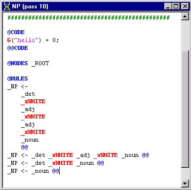
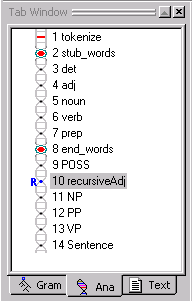
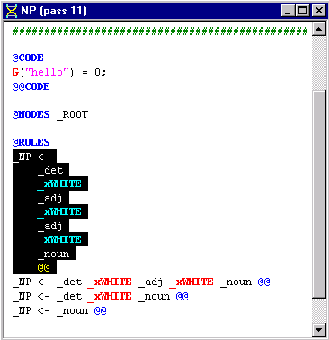
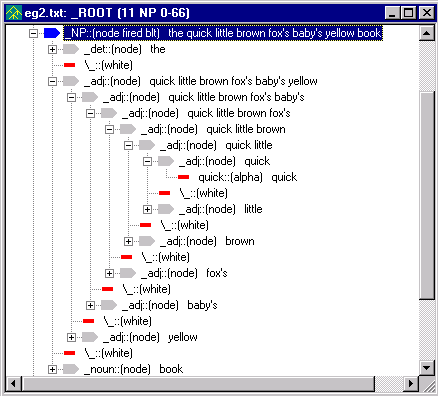
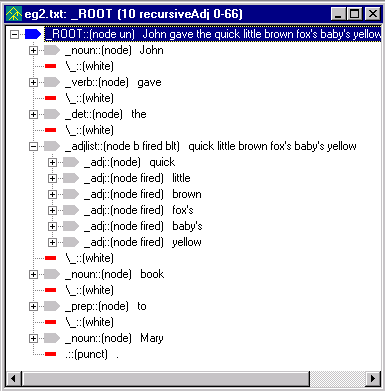
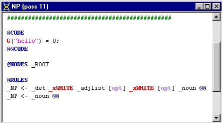
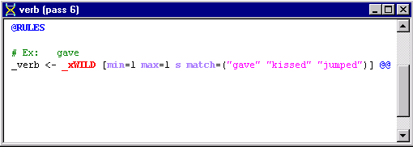
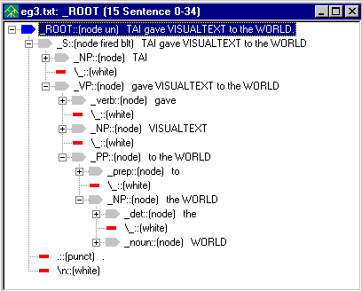

# Tutorial 6 - More on Rules

In this tutorial we will cover more details of rule construction.  We will review rule element conditions, special rule elements and some code region rule conditions.

The analyzer we will start with in the this tutorial, is the one that you created in Tutorial 3. If you are taking Tutorial 6 directly after Tutorial 5, you will have to close myAnalyzer before going through the steps below. (Select **Close Analyzer** from the File Menu.)

 Rename the **myAnalyzer** folder in:

```
C:\apps\myAnalyzerFolder
```

to **myAnalyzer5**.

 If you saved myAnalyzer3 at the end of Tutorial 3, you can copy that and rename it to myAnalyzer.

 OR, if available, do the following. (If not available, you'll need to go through Tutorials 1, 2, and 3, executing the yellow arrow instructions.)  Unzip the **myAnalyzer3.zip** located in the release directory:

```
C:\Program Files\TextAI\VisualText\docs\tutorial3\myAnalyzer3.zip
```

and place the **myAnalyzer** folder in the working directory:

```
C:\apps\myAnalyzerFolder
```

## Recursion

 Launch VisualText and open the **myanalyzer.ana** file located in

```
C:\apps\myAnalyzerFolder\myAnalyzer
```

or select **File > Recent Analyzers > c:\apps\myanalyzerfolder\myanalyzer**

 In the **Ana Tab**, double-click on the **NP** pass to open it in the Workspace.

Here are the NP rules created by the end of Tutorial 3:



Our current NP pass file will work for sentences in which we have a maximum of two adjectives preceding a noun. However, for sentences in which there are more than three adjectives in succession, such as ''He's a big brown friendly dog." the rules in our NP file are insufficient. Of course, if we wanted to, we could add another rule to our NP pass file to account for this. But since there are many possibilities, our rule file would get extremely bulky. A more efficient way to handle cases like this is to use a 'recursive' pass.

The recursive algorithm will apply the rules within each context node (i.e., each node found by a NODES or PATH selector) until no more matches are found. Let's create a recursive pass now to see how this works.

We will create a new pass just after the **POSS** pass in the analyzer sequence.

 **In the Ana**** Tab**, click on **POSS**, right-click and select **Add > ****New**** Pass**. (You'll see why we are placing a new pass file at this point in the analyzer sequence in a moment.)

## Set Pass Properties

 In the **Pass Properties** dialog, name the pass **recursiveAdj**

 For Type, **select Recursive. Click OK.

Notice the R next to the new pass in the Ana Tab. This lets you know that it as a recursive pass.

 Double click recursiveAdj pass (pass #10) to open it in the Workspace.

 Edit the pass file so that it looks like this:

```
@CODE
```

```
L("hello") = 0;
```

```
@@CODE
```

```
@NODES
 _ROOT
```

```
@RULES
```

```
_adj <- _adj _xWHITE
 _adj @@
```

Your Ana Tab should look like this:



This rule will recursively join adjacent adjectives (separated by a single space), so that the dominating _adj built by one instance of this rule matching becomes element one the next time this rule is matched.  The recursion stops when no rules match.

The recursiveAdj pass is placed after the POSS pass so that possessives can be collected into lists of adjectives. It precedes the NP pass so that adjective lists can be collected into noun phrases. This illustrates that multi-pass text analyzers are sensitive to the ordering of passes.

The rule matcher looks for context (that is, the dominating node, in this case _ROOT ) and then tries to match rules in the phrase of children under the context nodes.  In this case, the rule matcher finds _ROOT, then finds the first instance of '_adj _xWHITE _adj'.  It reduces this to a single _adj and then continues looking within the _ROOT context node for another match of the pattern.  It uses the newly created _adj node as the first element of the rule and searches for an _xWHITE _adj to complete the rest of the rule.  As you will see below in the tree structure, the leftmost '_adj _xWHITE _adj' becomes the most deeply embedded phrase.

When the recursive pass can no longer match rules in a phrase, the rule matcher tries to find (i.e. select via NODES or PATH) another context node that matches. If there is another string of adjectives later, the same algorithm applies.  When this finishes, the rule matcher looks for another context node.  In this case, there is only one context node _ROOT in the parse tree, so the algorithm stops here.  In a slightly different situation, where the context node was not _ROOT but rather a node name that appeared more than once in the parse tree, the recursive algorithm would apply to each of those context nodes. (This selection mechanism is also used by the nonrecursive pat algorithm.)

What happens with a noop rule, i.e., one that does consume a phrase of nodes to build a new dominating node? The recursive algorithm pretends that a noop rule has failed and keeps looking in the phrase for a "real" rule match, i.e., one that modifies the parse tree. Had the noop rule match been counted a success, the recursive algorithm would fail to terminate (i.e., it would be in an infinite loop) whenever it matched a noop rule. (There are several other ways to get into an infinite grammar loop, as you may discover!)

## Simplify NP Rule

Look at the sequence of passes in our analyzer. Notice that recursiveAdj occurs before the NP pass. Since the analyzer goes from pass to pass along the chain, instances of multiple adjectives occurring together will be handled by the recursiveAdj pass making some of the rules in our NP pass file redundant.

 Edit the NP pass file so that the first rule (the rule highlighted below) is deleted from the file:



To test our recursive adjective rule, let's create a new text file with lots of adjectives.

 In the Text Tab window, right click and select Add > New Text File.

 Name the file eg2.txt. Add the following sentence:

```
John gave the quick little brown fox's baby's yellow book to Mary.
```

 Click the Run button to run the analyzer.

 Right click on eg2.txt in the Workspace and select View > Parse Tree.

 Under the second _NP node, expand the _adj node to see the effect of the recursive algorithm:



## A Better List

There's a way to build a more efficient and compact list, such as the list of adjectives that we have built up to this point. Also, to reflect the difference between a lone adjective and an adjective list, we'll create a new nonliteral, or abstract name, called _adjlist.

 Edit the recursiveAdj pass file to look like:

```
@CODE
```

```
L("hello") = 0;
```

```
@@CODE
```

```
@NODES
 _ROOT
```

```
@RULES
```

```
#_adj
 <- _adj _xWHITE _adj @@
```

```
_adjlist [base]
 <- _adj @@
```

```
@POST
```

```
  listadd(1,3,
 "false");
```

```
@RULES
```

```
_xNIL
 <- _adjlist _xWHITE
 _adj @@
```

The first rule (_adjlist [base] <- _adj) builds an adjective list from one adjective. The second rule (_xNIL <- adjlist _xWHITE _adj) uses a special reduce action called listadd in order to extend an adjective list with one adjective node. Rather than building a new list node, listadd places the new _adj node under the list of nodes already collected under the _adjlist node. The arguments to listadd are

listadd(<element number of the list node>, <element number of the new element to add to list>, <true/false to also collect nodes between the list node and new element node.)

The base attribute in the first rule keeps the recursive algorithm from finding _adj within _adjlist and getting stuck in an infinite loop. It's not strictly necessary in the rule as written, but would be necessary if written as

_adjlist [base] <- _adj [s] @@

where the element action s (for singlet) leads to finding _adj even when it is buried *under* _adjlist.

 If not enabled, select the Toggle Generate Logs button on the toolbar.

 Run the analyzer on eg2.txt.

 Select the recursiveAdj pass in the analyzer sequence. Then right click on eg2.txt in the Workspace and View > Parse Tree. Notice how all of the adjectives are now part of _adjlist.



This version of the adjective list is more practically useful than the first form we built. It's more compact, easier to read, faster and easier to traverse. The philosophy underlying NLP++ is to support similar engineering of text analyzers in enhanced ways wherever feasible.

 To integrate _adjlist into the analyzer, edit the first _NP rule in the NP pass file to use _adjlist instead of _adj.

The first rule in your NP pass file should look like this:

```
_NP <- _det _xWHITE _adjlist
 _xWHITE
 _noun @@
```

## Optional Rule Elements

You just learned how to create a recursive pass file. We made the recursiveAdj pass file so that we could account for multiple adjectives such as 'the big brown friendly dog' without having to write individual rules to cover the number of different possible ways adjectives can be used in sentences. One other way to optimize rules is by using the optional element modifier [opt]. Though it is possible to specify every variant of the same basic rule, we can cut down on the number of rules in a pass file by using [opt]. Some might argue that optional rule elements make the rules less comprehensible. Nevertheless, they can be useful for development, and in some situations may even help to clarify the rules.

For example, the first rule of our NP pass file has two optional elements, _adjlist (an adjective) and _xWHITE (a white space). You can rewrite the rule to indicate that these two elements are optional like this:

```
NP <- _det _xWHITE _adjlist
 [opt] _xWHITE
 [opt] _noun @@
```

 Edit the first rule of your NP pass file using the [opt] element modifier.

 While we are at it, go ahead and eliminate the second rule in the NP pass file since the rule is now redundant with the first rule. That is, the rule _NP <- _det _xWHITE _noun is now contained or covered by the first rule.

Your NP pass file should look like this:



Optional elements that place conditions on rule elements such as [opt] must be contained in square brackets. See [Phrase Element Modifiers](../../NLP_PP_Stuff/Phrase_element_modifiers.md) for more information on [opt]  and other modifiers that can be used with rule elements.

## Special Rule Elements - Variables

We've already seen some of the conditions that the automatic rule generator uses.

For example, in the verb rule below:



there's a list of conditions in the square brackets.

_xWILD is a special rule element, and very useful.  It behaves like any other rule element, such as _NP or _verb, in the sense that the text of that element can be extracted, or the node operated on, but special rule elements have properties that make writing rules easy.

The rule element _xWILD is an unrestricted wildcard and will match zero or more tokens.  For example, in a rule like

```
_foo <- four _xWILD seven @@
```

a phrase of nodes in the parse tree corresponding to 'four five six seven' would match and the new node _foo would be created.

In the rule

```
_verb <- _xWILD [min=1 max=1 s match=("gave" "jumped" "kissed")] @@
```

what _xWILD can match is specified in a match list. The list of possible matches for _xWILD are gave, jumped and kissed.

_xWILD is a unique rule element in that what it matches depends on the element following it in a rule. By contrast, _xANY (which matches any single node) in the following rule

```
_ABC <- PQR _xANY [min=1
 max=5]
 XYZ @@
```

will *greedily* gobble up any XYZ node that it encounters, possibly failing though it "could" have matched. Only _xWILD knows how to "back up" to make such a rule match succeed.

## Match List

If the match list were absent, this rule would match any single node.  Items in the match list can be literals, as is the case in this rule, but they can also be nonliterals, such as _NP or _noun.  min=1 means match a minimum of 1 element. min=0 would mean the current element is optional, and is the same as using opt. max=1 means match a maximum of 1 element. max=0 means the current element can match an indefinite number of nodes.  In addition to the match list, there is also a fail list, which uses the same syntax ('fail=("X", "Y", "Z")') but means fail to match the rule if any of the listed items are present in the input. The element modifiers fail and match are further discussed in the [Phrase Element Modifiers](../../NLP_PP_Stuff/Phrase_element_modifiers.md) topic.

## Special Rule Elements

Here is a list of the special rule elements in NLP++.

| Rule Element | Description |
| --- | --- |
| _xWILD | Matches any nodes and any number of nodes. An intelligent matcher that is "back up aware." |
| _xANY | Matches any single token. A dumb or greedy matcher that can't "back up" the way _xWILD can. |
| _xALPHA | Matches an alphabetic token. |
| _xNUM | Matches a numeric token. |
| _xPUNCT | Matches a punctuation token. |
| _xWHITE | Matches a whitespace token, including newline. |
| _xBLANK | Matches a whitespace token, excluding newline. Equivalent to _xWILD [match=(\ \t)] |
| _xCAP | Matches an alphabetic with uppercase first letter. |
| _xEOF | Matches the end of file. |
| _xSTART | Matches if at the start of a phrase in the parse tree. |
| _xEND | Matches if at the end of a phrase in the parse tree. |

We'll use _xALPHA in our next example.

## Pass Regions

In the previous tutorials, you were introduced to some of the different regions of a pass file, namely POST and RULES. We also briefly saw what the PRE Region does in Tutorial 4. These different regions are used to control the application of rules in a pass file. Here we will summarize these three regions and also introduce a new region, the CHECK Region. These are the main regions used in pass files.

- PRE - Additional conditions on the matching of individual rule elements.

- CHECK - When a rule has matched, these actions check self-consistency and/or build semantic data. These actions can be used to reject a rule match.

- POST  - Actions that operate once a rule match has been accepted. Parse tree modifications (e.g., reduce actions) are typically performed here.

- RULES -  Subregion containing the actual rules that are subject to immediately preceding PRE,CHECK, and POST subregions.

Each region has a set of begin and end markers for it: @PRE and @@PRE, @CHECK and @@CHECK, @POST and @@POST, @RULES and @@RULES. You may wonder why we have not been using the end markers in the pass files we have been editing. The use of end markers is optional when writing pass files. Some people like using the end markers to make the pass file easier to read. This is a matter of personal preference.

In the next example, we will use the PRE Region to control the application of a rule. The PRE Region along with CHECK, POST and RULES make up the Grammar Region of a pass file. See the [Grammar Region](../../NLP_PP_Stuff/Grammar_Region.md) topic for more information.

## Finding Unknown Acronyms - PRE Region

The PRE Region places conditions on individual rule elements and operates during the rule matching of a rule. Suppose we want to add to our system the capability to categorize unknown words.  Given the sentence, 'The XZY took the QRS to LMNO" we might infer that the capitalized phrases, XZY, QRS and LMNO were nouns.  (Basically, any uppercase word of a certain size is likely to be an acronym, and a noun.) We can set up the conditions in the PRE Region so that words in all capital letters are identified as nouns. To illustrate this, we will have to create another pass in the analyzer sequence. We'll place it before the POSS pass, since we're building nouns that can potentially be used in possessive constructs (e.g., "IBM's software").

 In the Ana Tab, create a new pass just before the POSS pass. (Select end_words. Right click, Add > New Pass)

 Name the pass, Acronyms. Leave Type: as Pattern and click OK.

 Double click the Acronym pass and edit so that it looks like this:

```
@CODE
```

```
L("hello") = 0;
```

```
@@CODE
```

```
@NODES
 _ROOT
```

```
@PRE
```

```
  <1,1>
 uppercase();
```

```
  <1,1>
 lengthr(3,10);
```

```
@RULES
```

```
_noun <- _xALPHA
 @@
```

Let's look at the conditions in the PRE Region.

`<1,1>`` ``uppercase``();` means 'from the first element to the first element of the rule, the elements must be all uppercase in order for this rule to match.' ` <1,1> l``engthr``(3,10);` means from the 'first element to the first element, the element must be a minimum of three characters long and a maximum of 10.'

In other words, if _xALPHA (the first element of our rule) is composed of uppercase letters, and is between three and ten characters long, create a dominating node named _noun.

Both `uppercase` and `lengthr` are special NLP++ functions and are called "PRE Actions". You'll learn more about these later.

 Running the analyzer on the sentence

```
TAI gave VISUALTEXT to the WORLD.
```

produces a parse tree like:



Notice how TAI, WORLD and VISUALTEXT have been identified as nouns.

The PRE Region handles only special functions (called PRE Actions). It does not yet understand NLP++ expressions and statements.

 Close the files in the workspace and exit the analyzer.

## Summary

In this tutorial we introduced the recursive pass-algorithm and showed that it could handle an indefinitely long list (e.g., of adjectives).  We looked at other features of rule construction, such as making elements optional [opt].  We reviewed special rule elements, showing _xWILD and _xALPHA in action, and finished with some conditions placed on rule elements in the PRE Region.
