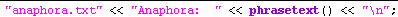

[← Help Contents](../../index.md) | [📘 NLP++ Textbook](../../NLP++_Textbook.md)

**Using Dump Files**

To debug your analyzer it is often helpful to output information to **dump files**.  Dump files are created by inserting a line of code in the desired pass file indicating where to output the information.

**To create a dump file:**

1. In the** Ana Tab**,** **right-click on a pass file to open it in the Workspace.

1. In the pass file, add a printing statement using the "<<" operator in the following form: "dump_file_name.txt" << content_to_print.  Below is a rule from the corporate analyzer that dumps the matched rule text into a dump file called "anaphora":

**To view a dump file:**

1. On the **Debug Toolbar**,** **click on the** **arrow next to the **View Dump Files **  icon.

1. Select a dump **file** from the pulldown menu.

| Note: Dump files are created and housed in a system-created directory with a name corresponding to the name of the text file in the project directory. The blue arrow icon  on the Debug Toolbar is reserved for output files with the name "output.txt" only. Dump files that do not include a .txt extension will not show up in View Dump Files pulldown menu. See the NLP++ section for other ways to redirect data to output files. |
| --- |
