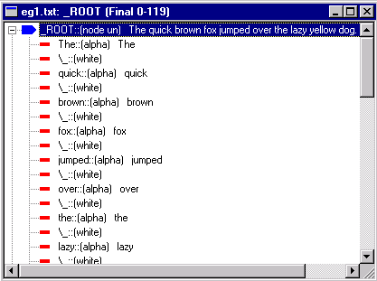

# About Parse Trees

VisualText analyzers build and use a single **parse tree** (or **tree,** for short) which is a data structure that tracks the patterns that have matched within the input text. Building parse trees is similar to the sentence diagramming taught in elementary school. The first pass of every analyzer tokenizes the text, that is, it converts a stream of characters to a parse tree in which alphabetic, numeric, whitespace, and punctuation are grouped into units called **nodes**. Below is a tokenized parse tree as displayed in the Parse Tree View.

## Parse Tree Terminology

Each line in the display above corresponds to one node of the parse tree. The **root**, or top-level node of the parse tree, is named _ROOT and appears at the top of the display. The remaining nodes are **children** of the root, and the root is their **parent**. Generations, or **levels**, of nodes in the parse tree are indicated by indentation. The **phrase** or **list** of children are all in a **sibling** relationship to each other. In general, a parse tree has more levels than shown above. We speak of ancestors and descendants to describe the relationships between nodes at different levels of the parse tree.

A **token**, **literal**, **leaf**, or **terminal** node, represents a literal text. Tokens are drawn with red dashes, as above. A **nonterminal** (or **abstract**) node is one with descendants. We say that a nonterminal node **dominates** its descendant nodes. Nonterminal nodes are drawn with a grey pentagon. The root node is the only nonterminal in the above tree. When selected, a node's color changes to blue.

## Terminal Nodes

A terminal node is a token and represents words, numbers, whitespace, and punctuation. The format for terminal nodes is as follows: nodename::(node_type info1 info2.. ("var1" "val")...) text-associated-with-node

The node type identifies the type of token. It is one of **alpha** (for alphabetic), **num** (for number), **white** (for whitespace), or **punct** (for punctuation). Information about the node follows the node type. Flag settings such as **unsealed** (or **un**), **built**, and **fired** may be shown in abbreviated form. Variables and values attached to the node may be displayed on the node line as well. Each variable and value-list is a parenthesized list of the form ("varname" "value1" "value2" ... ).

## Nonterminal Nodes

A nonterminal node is a node with descendants. An underscore is normally the first character in the name of a nonterminal. The format for nonterminal nodes in the parse tree is as follows:

_nodename::(node info1 info2) text-associated-with-node

For example, a non-terminal node *_company* created when the rule matcher encountered the company name "Text Analysis International" in a text might look like:

_company::(node un) Text Analysis International

The information following the node type is as described for terminal nodes above.

## Distinguishing Terminal and Nonterminal Nodes

You can distinguish between terminal and nonterminal nodes by the symbols used in the parse tree display.

1.  denotes a nonterminal node, and

1.  denotes a terminal node.

When a node is selected in a parse tree view, the icon for the selected node turns blue. A nonterminal is blue when selected and grey otherwise. A terminal is blue when selected and red otherwise. You can collapse and expand nodes by clicking on the + and - symbols.

## Final Parse Tree

The **final parse tree** is the tree produced by fully analyzing a text with a text analyzer.

## Intermediate Parse Tree

VisualText enables you to view the parse tree after each pass has executed. Each such **intermediate parse tree** records the patterns found in the input text by the analyzer passes up to and including the current pass.

## Concept Tree

The **concept tree** is a parse tree that contains only nodes that have been built for the selected pass in the analyzer sequence.  The concept tree view lets you quickly check which nodes were created in order to step through your analyzer.
