# Working with Debugging Tools

VisualText provides a number of debugging tools to make building text analyzers easier. Screen shots from this section are from the VisualText Sample "Corporate" analyzer.

**Debug Structure: Trees**

Almost all debugging tools in VisualText are based on parse trees. VisualText analyzers build parse trees, which organize information into meaningful chunks. You can debug an analyzer pass-by-pass, by setting the [Generate Logs](../VisualText_Interface/Toolbars/Workspace_Toolbar.md#Toggle_Generate_Logs) button and running the analyzer:

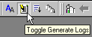  followed by 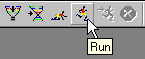

This will generate analyzer log files that contain trees for each text processed. Each text will have its own set of trees. The log files are displayed in the Text Tab under (indented and below) the corresponding text file. (A red checkmark in a file indicates the file has been analyzed.) You can see each of the log files generated for a file by clicking on the plus sign in front of the text file. Log files for each pass in the analyzer sequence have the name 'ana###.log' where ### is the number of the pass in the analyzer sequence:

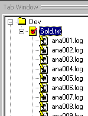

**Debug Context: Ana Tab**

The Ana Tab provides the context for what tree is displayed during debugging. There is a tree built for every pass and when a pass is chosen in the Ana Tab, all subsequent trees will be built from the selected pass.

## Highlighting

Highlighting is the quickest way to see which rules in a pass have fired. It operates on the text in the text file you are analyzing. Highlighting is activated by clicking the [Toggle Highlight Mode](../VisualText_Interface/Toolbars/Workspace_Toolbar.md#Toggle_Highlight_Mode) button on the toolbar. It must be turned on before you run the analyzer.

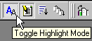

Within the trees generated for each pass in the analyzer, VisualText records which nodes were matched and which nodes were built in the pass. Built nodes are highlighted in blue. Green highlighting indicates other nodes that matched rules in the pass.

**Blue Highlighting**

If a pass has rules that match a text and a tree is constructed or modified, the highlighting appears in blue. Below, the rule for "dollars" builds a new concept "_money" in the tree and therefore highlights the text in blue.

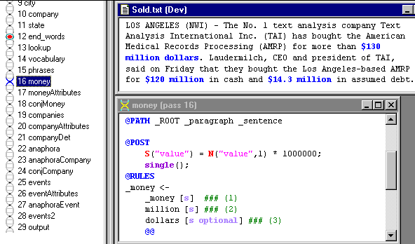

**Green Highlighting**

For rules that do not construct or modify a tree, highlighting is green. Below, the rule containing the concept "_company" matches and constructs a concept in the Knowledge Base but does not change the parse tree, therefore the text is highlighted in green:

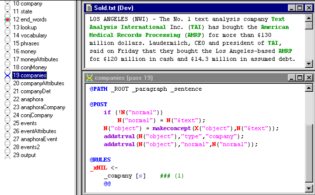

## Dump Files

**Dump files** are a convenient aid to debugging. They record information useful in debugging the analyzer. Dump files can be displayed by using the "Wheelbarrow" icon in the Debug Toolbar with a pulldown menu:

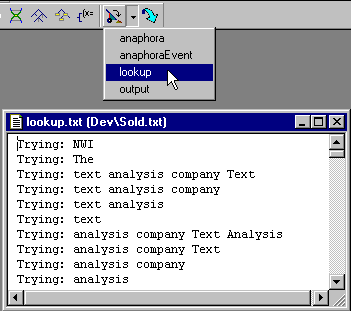

Dump files are created by printing output to any file with a "txt" extension using the piping printout operator "<<". Below is the NLP++ code for printing out to the above "lookup.txt" dump file:

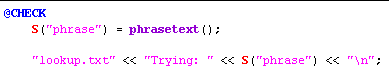

One convenient Right-Click menu function will get you started in printing to a dump file. It printouts out a line to a "txt" file with the same name as the pass file. In this case, we clicked on the "lookup" pass in our corporate analyzer and the Right-Click menu adds the line above the menu as shown below:

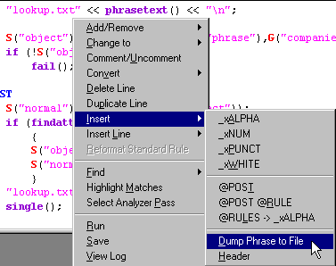

## Page Mode

Page Mode is used to see changes in parse trees between passes in the Ana Tab, or between text files themselves.  Page Mode is activated by selecting the Toggle Page Mode button on the Debug Toolbar:

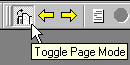

**Page Mode: Between Passes**

Page Mode provides a convenient way to shuffle among sets of views.  For example, selecting pass 16 below causes the parse tree for that pass to display in the parse tree view.  Selecting pass 17 causes that parse tree view to *automatically* display the parse tree for pass 17.

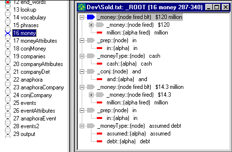

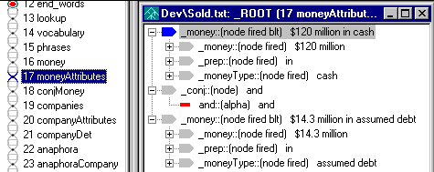

**Page Mode: Moving Among Texts**

A second use for Page Mode is to look at changes across text files. With the Page Mode turned on, text files (including dump files), parse tree windows, and browser windows will update their content with the current text selected. The arrows next to the Page Mode will move the text selection in the Text Tab either up or down:

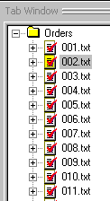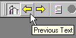

## Syntax Errors

VisualText informs you of syntax errors via the Log Window. If a syntax error is detected, you can often go directly to the line in the pass file to locate the problem by double-clicking on the error in the Log Window. Below, we forgot an opening parenthesis and by double-clicking on the error, VisualText opens up the correct pass file and moves the cursor to the line containing the error:

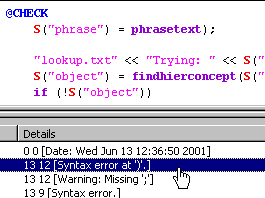

## Searching in Text

VisualText's [Find in Files](../VisualText_Interface/Windows/Find_in_Files_Dialog.md) dialog is handy for finding words and concepts in an analyzer project. One can search for a word or phrase in only the word files, text files, or even in other analyzers in the user's analyzer area:

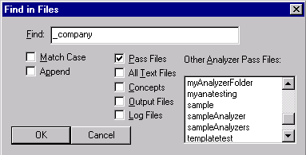

Search results are displayed in the [Find Window](../Find_Window.md).  By double-clicking on a search result line, you can go immediately to the file and line containing an instance of the search string:

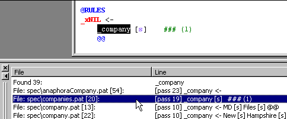
