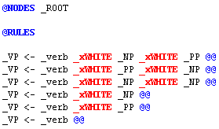
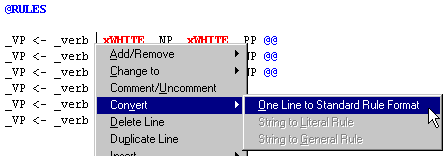
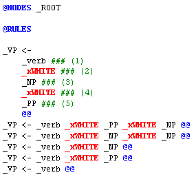
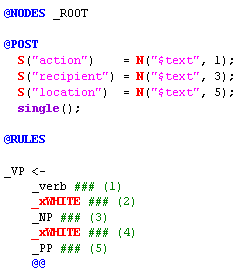
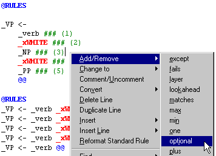
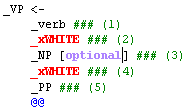

[← Help Contents](../index.md) | [📘 NLP++ Textbook](../NLP++_Textbook.md)

# Standard Rule Format

To facilitate the editing of rules in pass files, we've developed a convention called the **standard rule format**. Its main requirement is that each element of a rule occupy a separate line of text.  If is possible to write rules such that all rule elements are on the same line.  When referencing nodes however, it is often helpful to have elements written on separate lines.

The rules below are not in standard rule format. Notice that the elements (_VP, _verb, _xWHITE, etc.) in each rule are all on the same line.

## Converting to Standard Form

Rules written on a single line can be converted using the Pass File Popup Menu item [One Line to Standard Rule Format](../VisualText_Interface/Popups/Pass_File_Popup.md#pass_file_popup_convert_line_to_srf):

This results in a rule in standard rule format:

where each rule element (_VP, _verb, _xWHITE, _NP, _xWHITE, _PP) appears on its own line.

Standard rule format has three distinctive features. Rule elements are indented by a tab space, numbered with comments and displayed one per line.

## Indentation

Indentation is for readability.

## Rule Element Numbering

Numbering rule elements with comments makes for a convenient reference when using NLP++™ node functions or functions that reference individual elements in a rule. To see how this works, some NLP++ functions have been added to the rule given above:

The NLP++ node function N("$text",1) refers to the text for rule element 1, N("$text",3) the text for rule element 3, and N("$text",5) the text for rule element 5. In standard rule format, if a person deletes a rule element with the right-click menu, the rule elements will be renumbered automatically to facilitate the user in renumbering of the NLP++ node function "N" by hand. In the future, node function renumbering will be automatic with such edits.

## One-Per-Line and Element Editing

Having one rule element per line allows for the use of right-click menu items for quick editing. In standard rule format, users can quickly change, convert, and delete rule elements and rule element attributes. In the example below, a rule element is made optional by clicking anywhere on the rule element of interest, and selecting the Add/Remove attribute "optional".

Doing the above yields:

## See Also

[Rule Syntax](../NLP_PP_Stuff/Rule_syntax.md)
