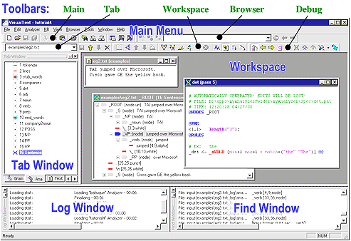

[← Help Contents](../index.md) | [📘 NLP++ Textbook](../NLP++_Textbook.md)

# Overview

The major components of the VisualText™ user interface (or Main Window) are called out below.

Apart from the Main Menu, you can resize and "undock" (i.e., move about) the components shown.

## Interface Components

A short description of each of the interface components is given below.

| **Interface** | **Description** |
| --- | --- |
| Main Menu | Functions accessed via pulldown menus. The Main Menu includes the following menus: File, Edit, Analyzer, KB, View, Browser, Parse Tree, Tools, Window, Help. |
| Tab Window | Controls access to the sample hierarchy, analyzer sequence and text data files. |
| Log Window | Displays processing information and error messages. |
| Find Window | Displays search information. |
| Workspace | Area where input and output files, the knowledge base and tree structures are displayed and manipulated. |
| Main Toolbar | Commonly used functions accessed by buttons. |
| Tab Toolbar | Iconic functions for the Tab Window. |
| Browser Toolbar | World Wide Web access and browser control. |
| Workspace Toolbar | Iconic access to the Analyzer, Knowledge Base, and more. |
| Debug Toolbar | Functions to examine parse trees, intermediate files, and output files. |

In addition to these objects, popup menus appear when you select a window and right-click the mouse. See [Popup Menus](Popups/Popup_Menus.md) for detailed description of available functions from popup menus.
