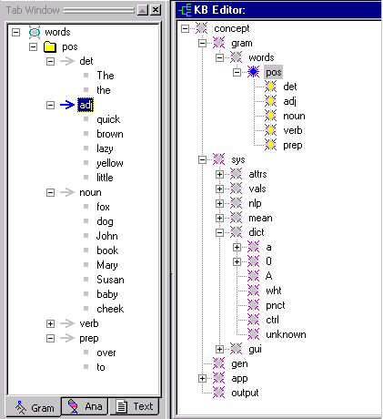
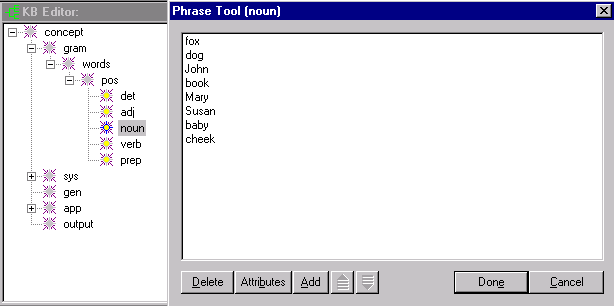
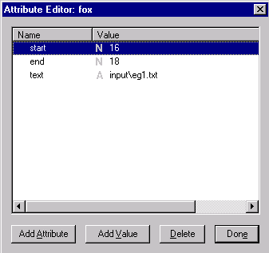

[← Help Contents](../index.md) | [📘 NLP++ Textbook](../NLP++_Textbook.md)

# Introduction to the Knowledge Base

The Conceptual Grammar (CG) Knowledge Base Management System (KBMS) provides a permanent store for linguistic, conceptual, and domain knowledge. The KBMS serves as a flexible "vanilla" framework in which users may implement arbitrary representation schemes. Users can manage the KB manually, while text analyzers can automatically access and update information in the KB. The KB can be used to collect information across multiple texts, for example, in training a categorizer or in managing an electronic chat.

## Concepts and Attributes in the Knowledge Base

The basic unit of knowledge in the KB is called a **concept**, which is analogous to an **object** in an object-oriented representation. A concept has **attributes**, which consist of a **key** (or **slot**) and zero or more **values**. The major organizing principle in the KB is a **hierarchy** of concepts. Concepts can also refer to other concepts via attributes, yielding a rich graph of knowledge.

A unique feature of our Conceptual Grammar KBMS is that each concept may optionally "own" a **phrase**, which is a data structure that represents sequential information in a convenient way. A phrase is composed of **nodes**, which differ from concepts in that they are not attached to the hierarchy. A node is a **proxy** or **instance** of a concept in the hierarchy. Most NLP++™ functions that operate on concepts also operate on nodes. The main data structures in the KB are:

| Data Structure | Description |
| --- | --- |
| **CONCEPT** | Organizing unit of knowledge in the KB. |
| **ATTR** | Attribute key or slot. |
| **VAL** | Value of an attribute. |
| **PHRASE** | Sequence of nodes attached to a concept. |
| **NODE** | A proxy or instance of a concept. |

Attributes may take on three types of values: integer, string, or concept. A single attribute may mix values with any or all of these types, as desired.

Phrases can be used to implement idioms, patterns, samples, rules, and other sequential information. In the Gram Tab, the phrase associated with a rule concept is used to represent user-highlighted samples. Each node represents a single sample, with the name of the node doubling as the sample's text.

## NLP++ Functions for the Knowledge Base

See [Table of KB Functions](../Table_of_Knowledge_Base_Functions.md) for a listing of the available NLP++ functions for managing the KB.  These functions are also treated individually in the Knowledge Base Functions section.

## Concept Hierarchy

The backbone of the KB is a knowledge hierarchy. Each concept therefore has hard-coded parent and child links for efficiency.

VisualText utilizes part of the concept hierarchy to implement the [Gram Tab](Tab.md#Gram_Tab). The **Gram hierarchy** (also called the **sample hierarchy**) displayed in the Gram Tab is embedded directly in the concept hierarchy. The KB as a whole is accessible in the [KB Editor](Tools/KB_Editor.md):

When users highlight samples and add them to the Gram Tab, they are modifying the KB. The left panel above shows the sample hierarchy within the Gram Tab, while the right panel shows the same hierarchy as it appears within the KB. In the KB Editor, a concept that contains a phrase is colored yellow. For example, the adj concept contains a phrase, where each node of the phrase represents one of the samples "quick", "brown", etc. Therefore det, adj, noun, verb, and prep are all colored yellow. To view a concept's phrase from the KB Editor, right click on the concept and select **Phrase Tool** from the menu.

## Phrases

A phrase is a sequence of nodes "owned" by a concept, and is not visible from the concept hierarchy. For example, the concept "noun" has the phrase shown below, consisting of the nodes "fox", "dog", "John", and so on. (In the present example, the ordering of nodes in the sequence is not important. But, in other uses of phrases, for example to represent grammar rules, ordering is important.) A concept can only have one phrase, with no restriction on the number of nodes. The Phrase Tool, shown below, enables you to view a concept's phrase. Each line in the Phrase Tool displays the name of one node, which can be an arbitrary string.

## Phrase Tool

The phrase belonging to a concept can be viewed in the KB Editor by highlighting a ***yellow*** concept in the hierarchy, right clicking and selecting Phrase Tool from the Popup Menu. This displays the nodes of the phrase, one per line. In the example below, we selected the concept 'noun' and then selected Phrase Tool in the menu to display the phrase associated with 'noun'. In this example, each node in the phrase represents a noun sample in the Gram Tab.

## Nodes

A node is an instance of a concept, and does not appear in the concept hierarchy. Nodes occur only as components of phrases in the KB. The nodes belonging to the noun concept happen to be instances of the KB dictionary concepts for "fox", "dog", etc.

You can access the attributes for a particular node by highlighting the node in the Phrase Tool and selecting Attributes, or by double clicking on a line. This launches the [Attribute Editor](Tools/Attribute_Editor.md), where the attributes and values for the node can be viewed and edited. In the graphic below, the attributes for the selected node, 'fox', are displayed.

| **WARNING**: The Gram Tab is the only safe way to edit the Gram hierarchy. Editing the **gram** or **sys** hierarchies manually can easily corrupt the KB, so please make a backup copy of your analyzer project before experimenting. |
| --- |

## Accessing the Knowledge Base

The KB may be managed in many ways. The [KB Editor,](Tools/KB_Editor.md) Gram Tab, Attribute Editor, and Phrase Tool provide interactive means for accessing the KB. NLP++ function calls and C++ API function calls provide more direct access to the internals of the knowledge base. (For more information on accessing the KB, see the [Table of KB Functions](../Table_of_Knowledge_Base_Functions.md) and the page-per-functions in the Knowledge Base Functions section .)
