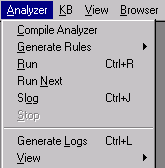
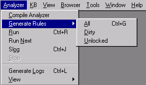
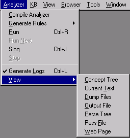

# Analyzer Menu

The Analyzer Menu controls the actions of an analyzer.  It is also used in generating rules.

The Analyzer Menu corresponds to some elements in the [Workspace Toolbar](Toolbars/Workspace_Toolbar.md).

When there is a corresponding element, the toolbar button is shown in the following table:

| **Button** | **Menu Item** | **Description** |
| --- | --- | --- |
|  | **Compile Analyzer** | Turning on this toggle, followed by loading an analyzer, results in compiling the analyzer while it is being loaded. This results in the creation of a RUN.DLL library, which can be called from an external program. Currently, VisualText does not load the compiled analyzer library. The Compile Analyzer toggle is turned off after an analyzer is loaded. |
|   | **Generate Rules** | Submenu for generating rules. (See below.) |
|  | **Run** | Runs the analyzer on the currently selected input file. (Analyzers cannot be run on files with a .log extension.) |
|  | **Run Next** | Runs the analyzer on the next file in the directory after the currently selected file. |
|  | Slog | Does a Generate Rules All, followed by a Run on the currently selected input. |
|  | **Stop** | Stops the current analyzer. |
|  | Generate Logs | When selected, enables generation of intermediate logs for each pass in the analyzer sequence. Must be enabled before an analyzer is run over text. This function gives you the ability to display and inspect the intermediate parse trees, one for each pass, and the final tree. It may slow the parse substantially in many-pass analyzers, since all intermediate trees are written to disk. If the function is not enabled, only the final tree is available for display. |
|   | **View** | Submenu for viewing text analyzer information such as input files, output files, pass files, and parse trees. (See below.) |

## Generate Rules Submenu

| **Button** | **Menu Item** | **Description** |
| --- | --- | --- |
|   | **All** | Exhaustively generates all rules as specified by samples in the Gram Tab. Depending on the number of samples in the Gram Tab, this can be slow. However, to assure that rule generation is correct and complete, this option should be used whenever feasible. |
|  | **Dirty** | Generates rules only for those rule concepts in the Gram Tab that have the **Dirty** attribute set. This attribute is set by the system, for example, when new sample data is added to the concept. This is a "quick-and-dirty" rule generation that most often works well, but may not always agree with the Generate Rules > All option. It is used for rapid prototyping. See Mark for Generation in the Gram Tab Popup Menu, where the Dirty attribute can be set. |
|   | **Unlocked** | Generates rules only for those concepts in the Gram Tab that have the **unlocked** attribute set. Locking concepts should only be done by the expert user. A concept's attributes can be viewed and hand edited via the Attribute Editor. |

## Analyzer View Submenu

| **Button** | **Menu Item** | **Description** |
| --- | --- | --- |
|  | **Concept Tree** | Displays the concept tree of a parsed document in the Workspace. |
|  | **Current Text** | Displays the currently selected input data file in the Workspace. |
|  | **Dump Files** | Displays the output files associated with a parsed document in the Workspace. When there are multiple files, a pulldown tab to the right of the button lists available files. |
|  | **Output File** | Displays output.txt file associated with parsed input document in the Workspace. This icon is reserved for files with the name output.txt only. |
|  | **Parse Tree** | Displays the full parse tree of a parsed document in the Workspace. |
|  | **Pass File** | Displays selected pass file in the Workspace. |
|  | **Web Page** | Displays selected html page in a browser window in the Workspace. |
